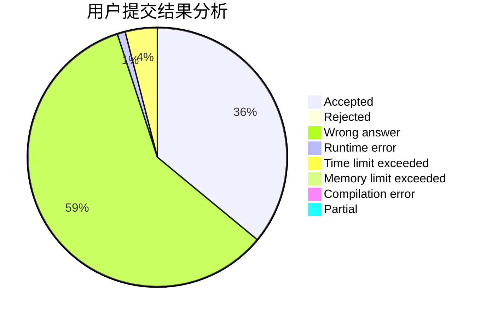
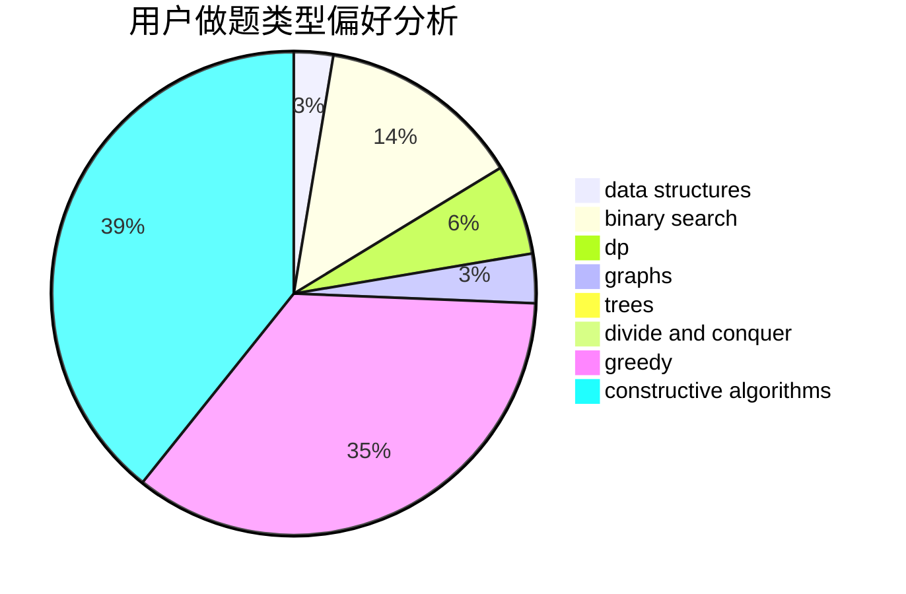
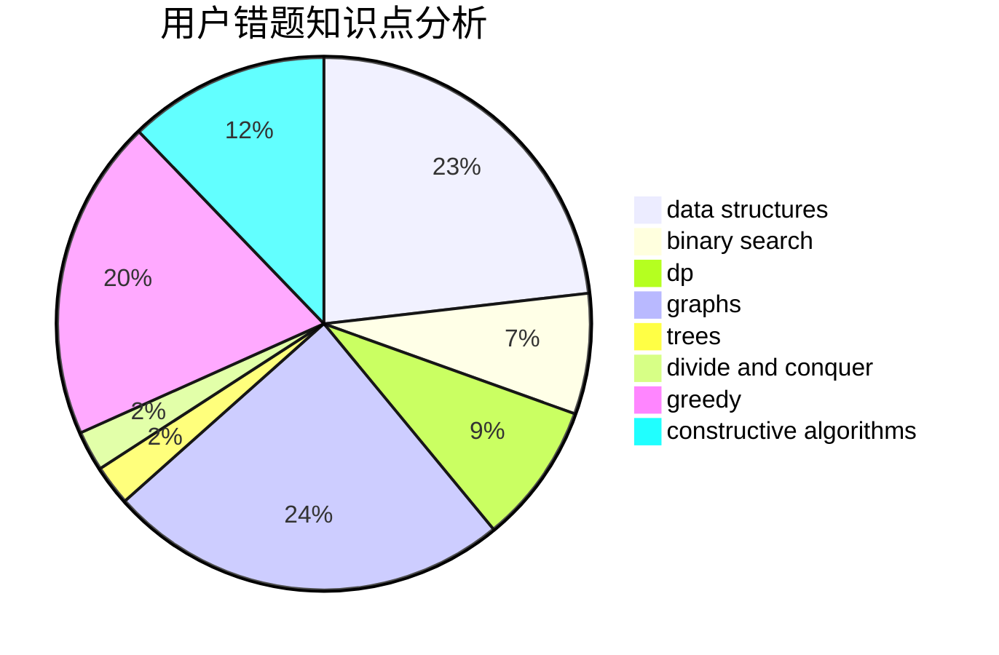

# chenshouao

<!-- tabs:start -->

#### **用户提交结果分析**

#### **用户做题类型偏好分析**

#### **用户错题知识点分析**

<!-- tabs:end -->
# 推荐题目
[1025G](https://codeforces.com/contest/1025/problem/G)		constructive algorithms,
                        math		  
[946G](https://codeforces.com/contest/946/problem/G)		data structures,
                        dp		  
[771D](https://codeforces.com/contest/771/problem/D)		dp		  
[1188E](https://codeforces.com/contest/1188/problem/E)		combinatorics		  
[957E](https://codeforces.com/contest/957/problem/E)		dsu,graphs,sortings,trees		  
[430C](https://codeforces.com/contest/430/problem/C)		dsu,graphs,sortings,trees		  
[781C](https://codeforces.com/contest/781/problem/C)		dsu,graphs,sortings,trees		  
[187C](https://codeforces.com/contest/187/problem/C)		dfs and similar,
                        dsu		  
[993C](https://codeforces.com/contest/993/problem/C)		bitmasks,
                        brute force,
                        geometry		  
[924E](https://codeforces.com/contest/924/problem/E)		nan		  
