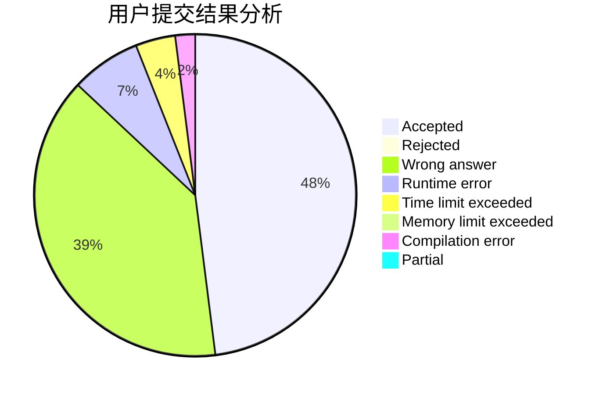
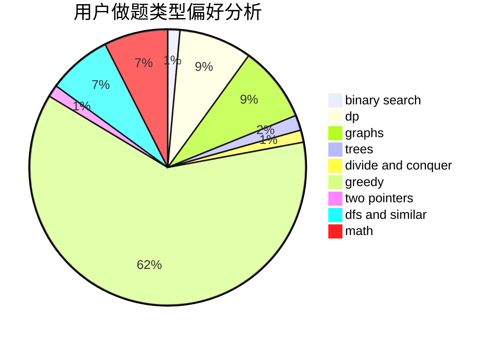

# chenyewei_1234

<!-- tabs:start -->

#### **用户提交结果分析**

#### **用户做题类型偏好分析**

<!-- tabs:end -->
# 推荐题目
[810B](https://codeforces.com/contest/810/problem/B)
[51A](https://codeforces.com/contest/51/problem/A)
[43A](https://codeforces.com/contest/43/problem/A)
[11301](https://codeforces.com/contest/1130/problem/1)
[521C](https://codeforces.com/contest/521/problem/C)
[1151C](https://codeforces.com/contest/1151/problem/C)
[999D](https://codeforces.com/contest/999/problem/D)
[1374C](https://codeforces.com/contest/1374/problem/C)
[280B](https://codeforces.com/contest/280/problem/B)
[991A](https://codeforces.com/contest/991/problem/A)
