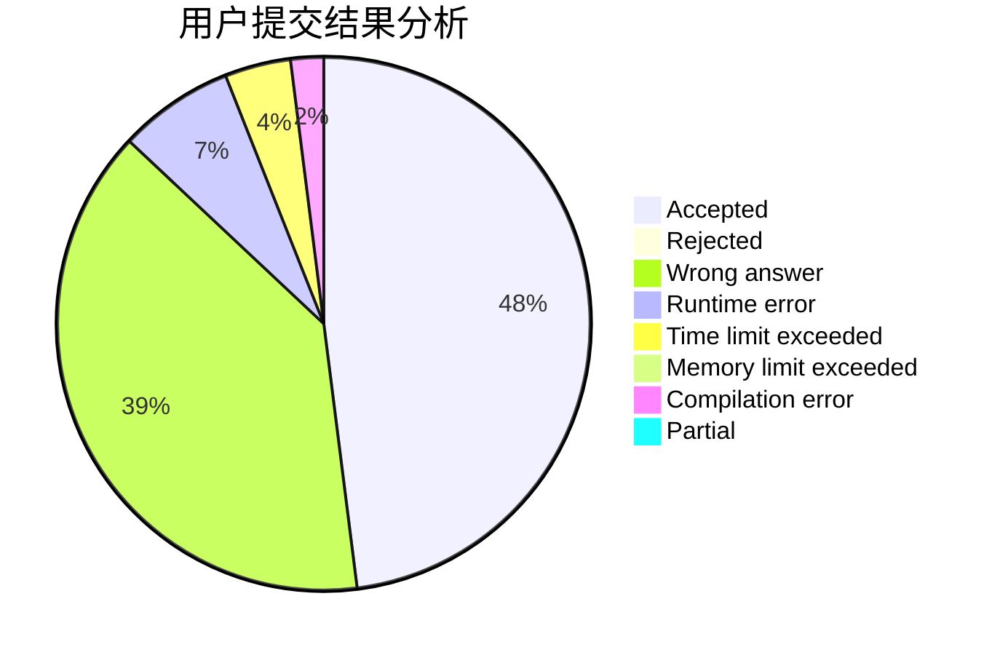
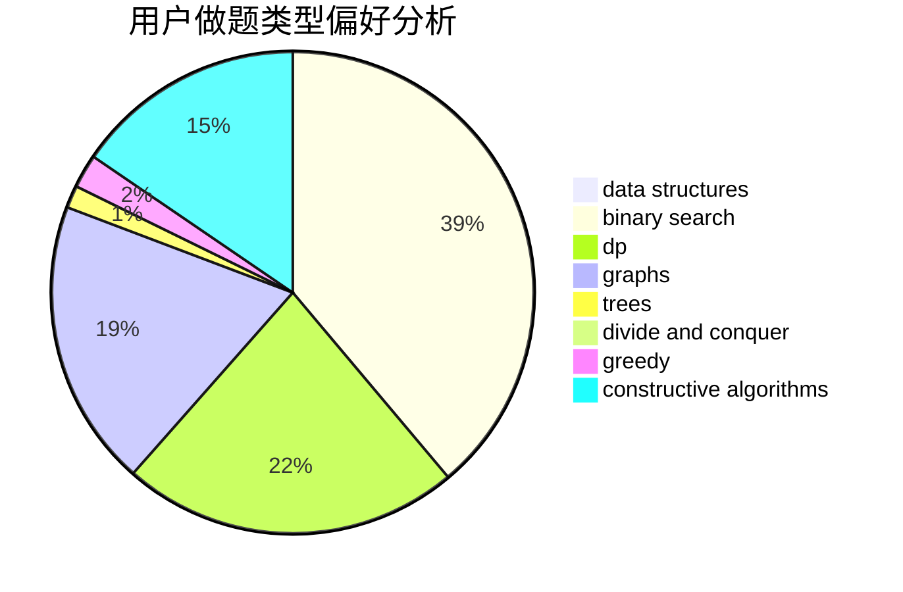
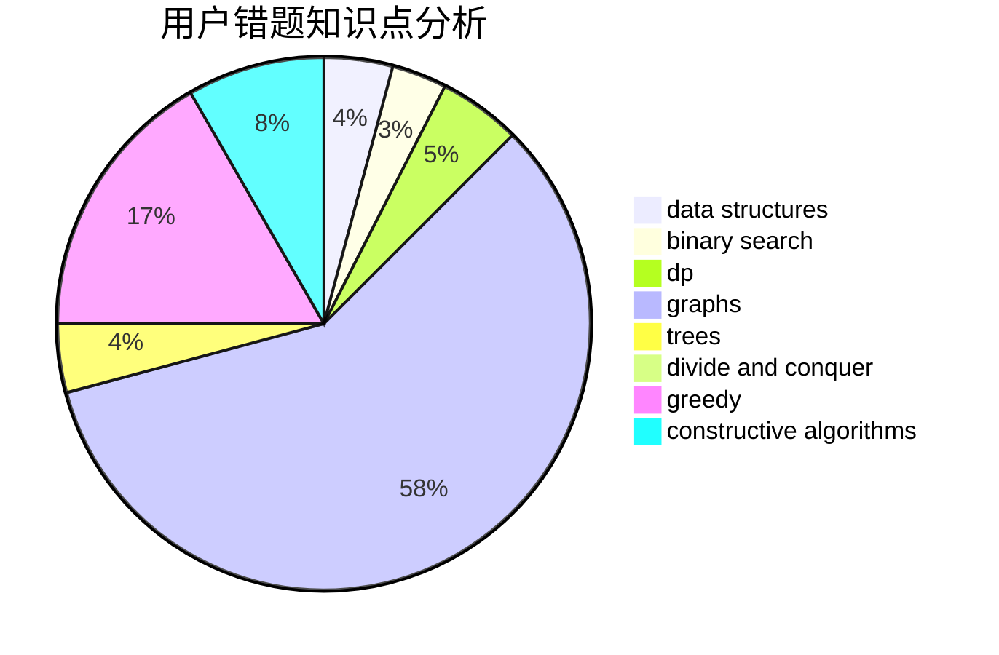

# chenyewei_1234

<!-- tabs:start -->

#### **用户提交结果分析**

#### **用户做题类型偏好分析**

#### **用户错题知识点分析**

<!-- tabs:end -->
# 推荐题目
[796A](https://codeforces.com/contest/796/problem/A)		brute force,
                        implementation		  
[499C](https://codeforces.com/contest/499/problem/C)		dsu,graphs,sortings,trees		  
[414D](https://codeforces.com/contest/414/problem/D)		binary search,
                        data structures,
                        greedy,
                        trees,
                        two pointers		  
[1120D](https://codeforces.com/contest/1120/problem/D)		dfs and similar,
                        dp,
                        dsu,
                        graphs,
                        greedy,
                        trees		  
[500C](https://codeforces.com/contest/500/problem/C)		constructive algorithms,
                        greedy,
                        implementation,
                        math		  
[1149E](https://codeforces.com/contest/1149/problem/E)		games,
                        graphs		  
[983E](https://codeforces.com/contest/983/problem/E)		binary search,
                        data structures,
                        trees		  
[1367F1](https://codeforces.com/contest/1367F/problem/1)		dp,
                        greedy,
                        two pointers		  
[264B](https://codeforces.com/contest/264/problem/B)		dp,
                        number theory		  
[977C](https://codeforces.com/contest/977/problem/C)		sortings		  
