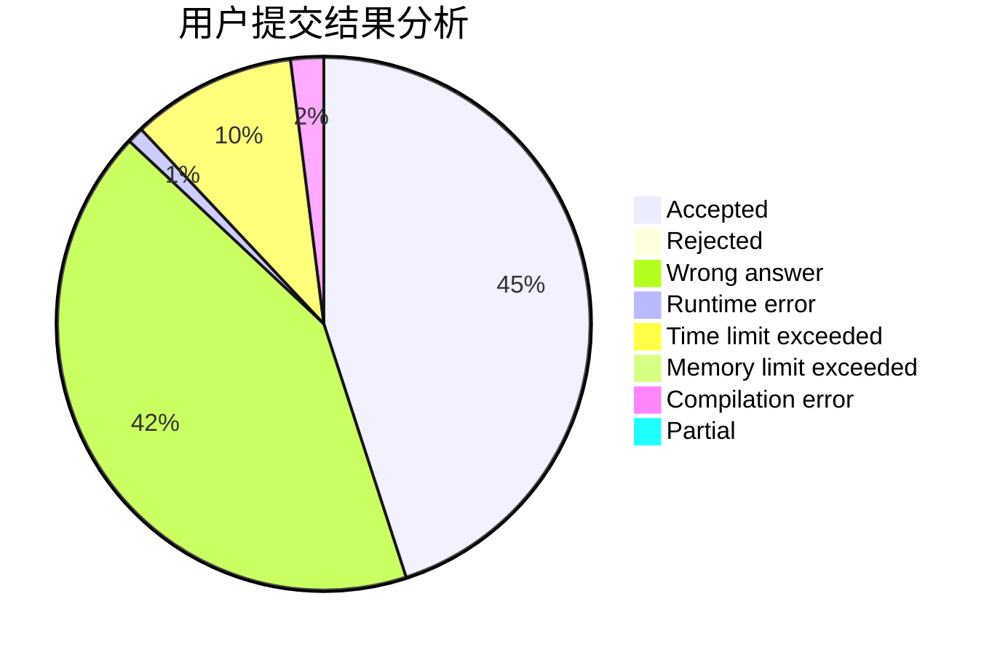
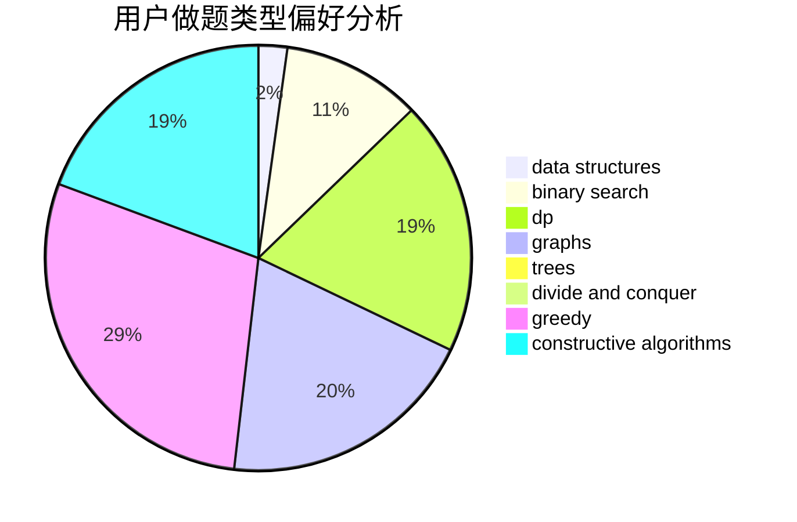
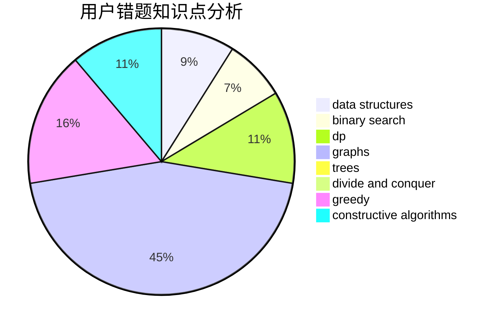

# cherish.

<!-- tabs:start -->

#### **用户提交结果分析**

#### **用户做题类型偏好分析**

#### **用户错题知识点分析**

<!-- tabs:end -->
# 推荐题目
[450B](https://codeforces.com/contest/450/problem/B)		implementation,
                        math		  
[908A](https://codeforces.com/contest/908/problem/A)		brute force,
                        implementation		  
[444D](https://codeforces.com/contest/444/problem/D)		binary search,
                        hashing,
                        strings,
                        two pointers		  
[1249C1](https://codeforces.com/contest/1249C/problem/1)		brute force,
                        greedy,
                        implementation		  
[314C](https://codeforces.com/contest/314/problem/C)		data structures,
                        dp		  
[286B](https://codeforces.com/contest/286/problem/B)		implementation		  
[103D](https://codeforces.com/contest/103/problem/D)		brute force,
                        data structures,
                        sortings		  
[639F](https://codeforces.com/contest/639/problem/F)		data structures,
                        dfs and similar,
                        graphs,
                        trees		  
[913B](https://codeforces.com/contest/913/problem/B)		implementation,
                        trees		  
[1045J](https://codeforces.com/contest/1045/problem/J)		data structures,
                        strings,
                        trees		  
