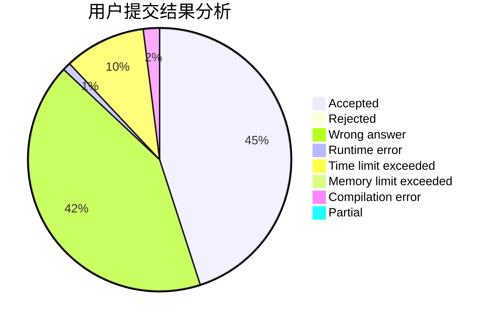
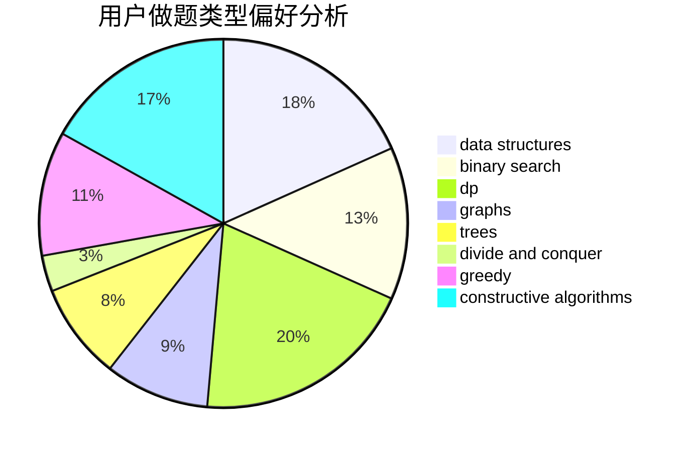
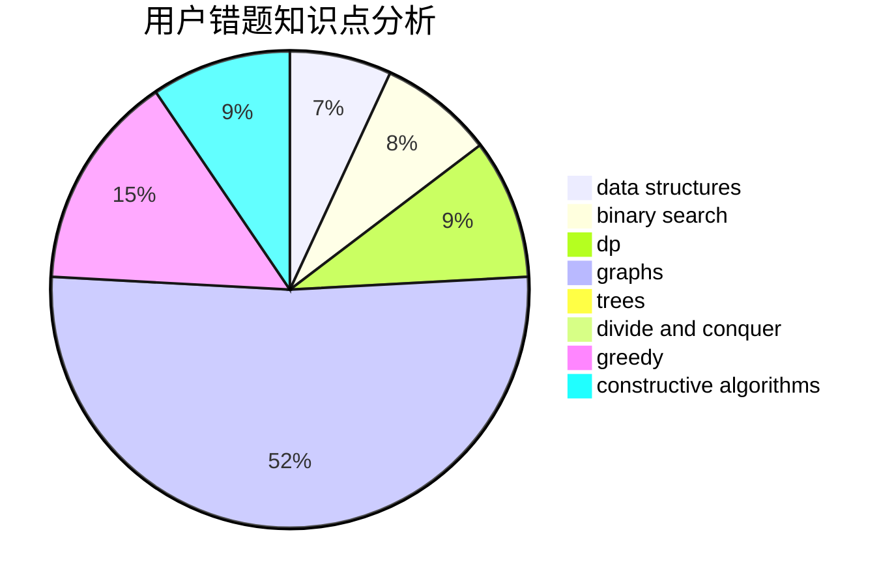

# cherish.

<!-- tabs:start -->

#### **用户提交结果分析**

#### **用户做题类型偏好分析**

#### **用户错题知识点分析**

<!-- tabs:end -->
# 推荐题目
[472C](https://codeforces.com/contest/472/problem/C)		greedy		  
[922B](https://codeforces.com/contest/922/problem/B)		brute force		  
[464C](https://codeforces.com/contest/464/problem/C)		dp		  
[1252L](https://codeforces.com/contest/1252/problem/L)		flows,
                        graphs		  
[339B](https://codeforces.com/contest/339/problem/B)		implementation		  
[300C](https://codeforces.com/contest/300/problem/C)		brute force,
                        combinatorics		  
[1040B](https://codeforces.com/contest/1040/problem/B)		dp,
                        greedy,
                        math		  
[669D](https://codeforces.com/contest/669/problem/D)		dsu,graphs,sortings,trees		  
[931F](https://codeforces.com/contest/931/problem/F)		dsu,graphs,sortings,trees		  
[1046I](https://codeforces.com/contest/1046/problem/I)		geometry		  
