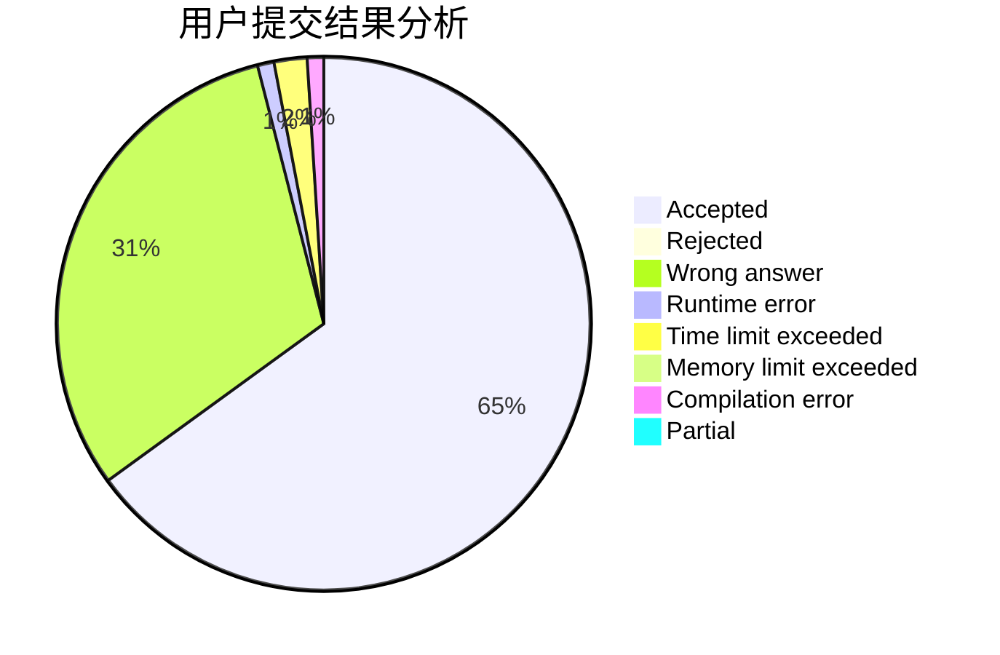
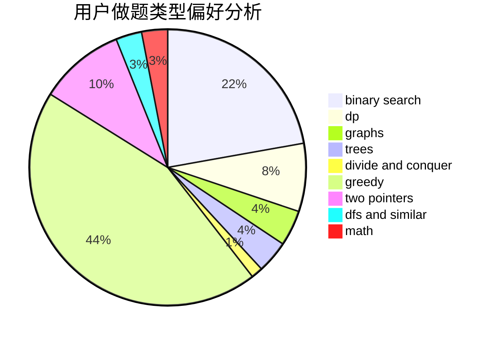

# cherish_lin

<!-- tabs:start -->

#### **用户提交结果分析**

#### **用户做题类型偏好分析**

<!-- tabs:end -->
# 推荐题目
[1481C](https://codeforces.com/contest/1481/problem/C)
[1437A](https://codeforces.com/contest/1437/problem/A)
[1157B](https://codeforces.com/contest/1157/problem/B)
[835B](https://codeforces.com/contest/835/problem/B)
[1023A](https://codeforces.com/contest/1023/problem/A)
[715C](https://codeforces.com/contest/715/problem/C)
[1146B](https://codeforces.com/contest/1146/problem/B)
[780F](https://codeforces.com/contest/780/problem/F)
[32A](https://codeforces.com/contest/32/problem/A)
[551B](https://codeforces.com/contest/551/problem/B)
