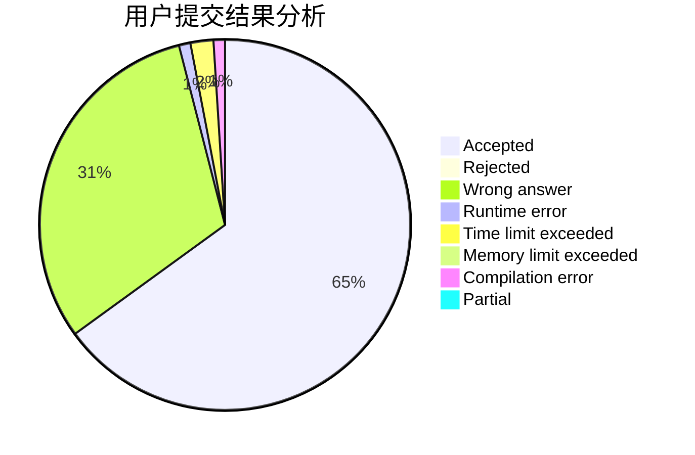
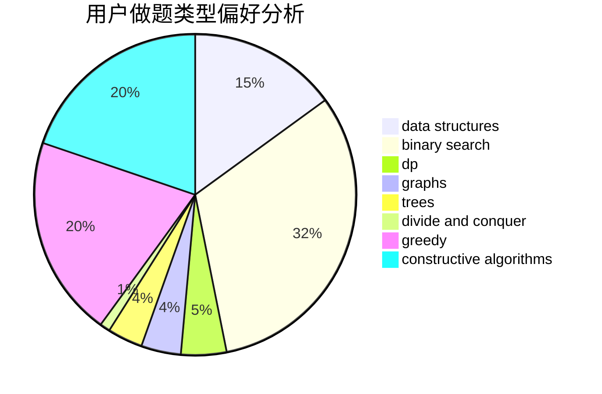
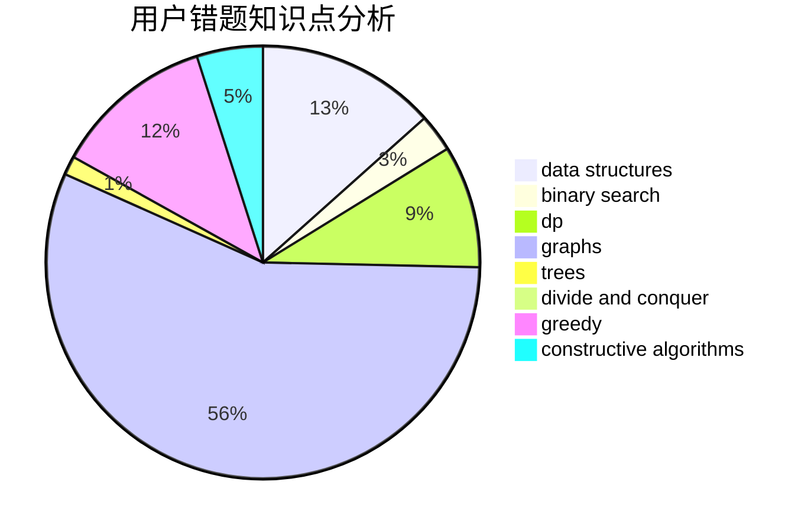

# cherish_lin

<!-- tabs:start -->

#### **用户提交结果分析**

#### **用户做题类型偏好分析**

#### **用户错题知识点分析**

<!-- tabs:end -->
# 推荐题目
[1481C](https://codeforces.com/contest/1481/problem/C)		brute force,
                        constructive algorithms,
                        greedy		  
[1437A](https://codeforces.com/contest/1437/problem/A)		brute force,
                        constructive algorithms,
                        greedy,
                        math		  
[1157B](https://codeforces.com/contest/1157/problem/B)		greedy		  
[835B](https://codeforces.com/contest/835/problem/B)		greedy		  
[1023A](https://codeforces.com/contest/1023/problem/A)		brute force,
                        implementation,
                        strings		  
[715C](https://codeforces.com/contest/715/problem/C)		dfs and similar,
                        divide and conquer,
                        dsu,
                        trees		  
[1146B](https://codeforces.com/contest/1146/problem/B)		implementation,
                        strings		  
[780F](https://codeforces.com/contest/780/problem/F)		bitmasks,
                        dp,
                        graphs,
                        matrices		  
[32A](https://codeforces.com/contest/32/problem/A)		brute force		  
[551B](https://codeforces.com/contest/551/problem/B)		brute force,
                        constructive algorithms,
                        implementation,
                        strings		  
