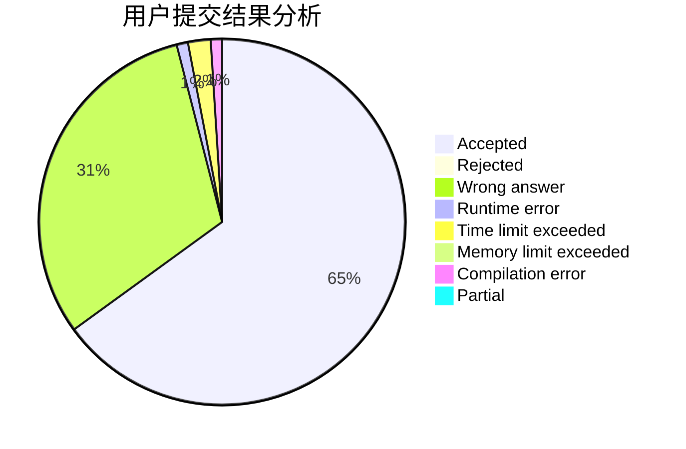
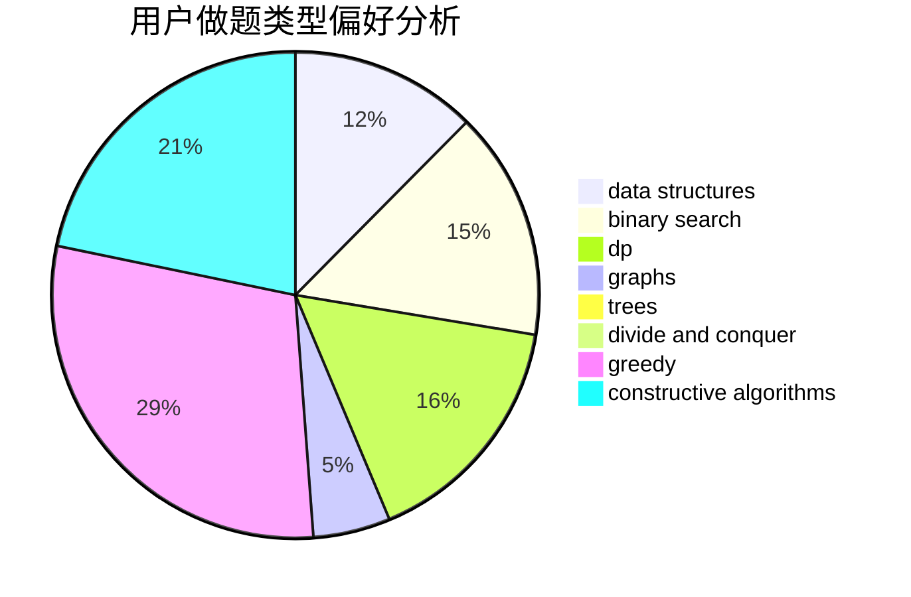
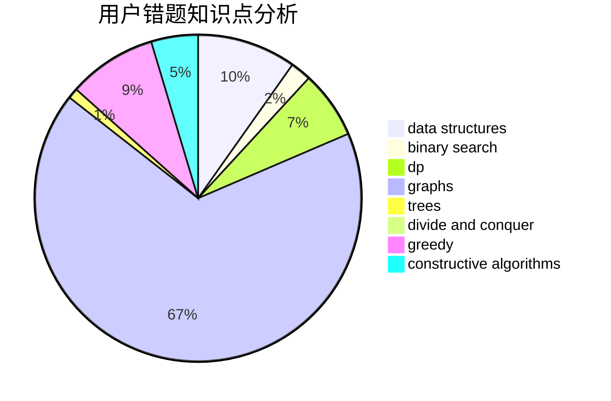

# cherish_lin

<!-- tabs:start -->

#### **用户提交结果分析**

#### **用户做题类型偏好分析**

#### **用户错题知识点分析**

<!-- tabs:end -->
# 推荐题目
[1472G](https://codeforces.com/contest/1472/problem/G)		dfs and similar,
                        dp,
                        graphs,
                        shortest paths		  
[1428A](https://codeforces.com/contest/1428/problem/A)		math		  
[1155D](https://codeforces.com/contest/1155/problem/D)		brute force,
                        data structures,
                        divide and conquer,
                        dp,
                        greedy		  
[816A](https://codeforces.com/contest/816/problem/A)		brute force,
                        implementation		  
[1020C](https://codeforces.com/contest/1020/problem/C)		dsu,graphs,sortings,trees		  
[698F](https://codeforces.com/contest/698/problem/F)		combinatorics,
                        number theory		  
[1144A](https://codeforces.com/contest/1144/problem/A)		implementation,
                        strings		  
[762B](https://codeforces.com/contest/762/problem/B)		greedy,
                        implementation,
                        sortings,
                        two pointers		  
[309B](https://codeforces.com/contest/309/problem/B)		dp,
                        two pointers		  
[527B](https://codeforces.com/contest/527/problem/B)		greedy		  
