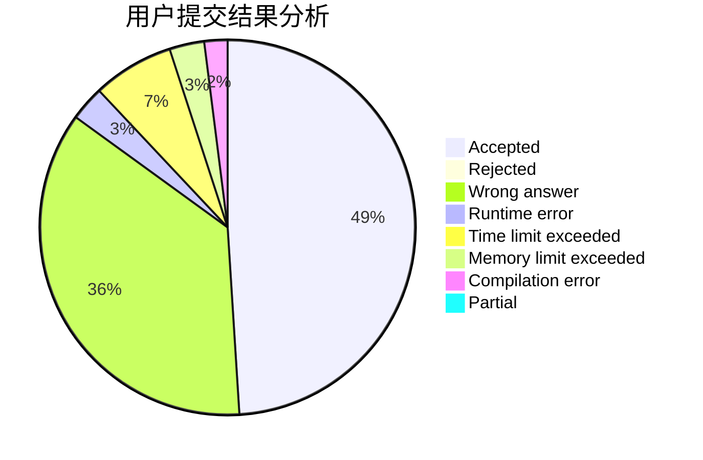
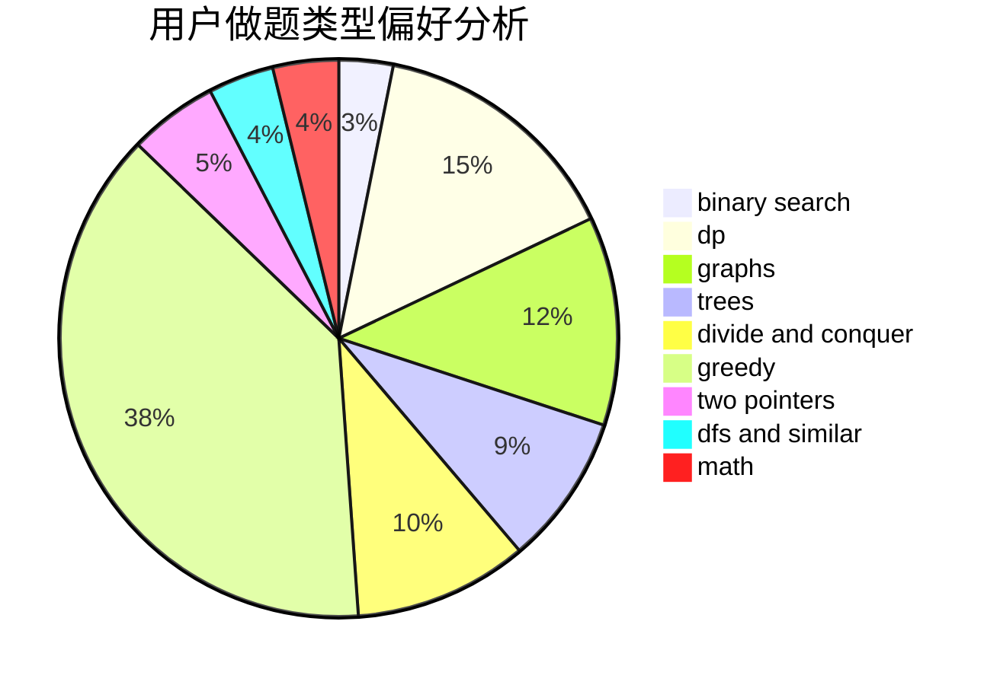

# chielo

<!-- tabs:start -->

#### **用户提交结果分析**

#### **用户做题类型偏好分析**

<!-- tabs:end -->
# 推荐题目
[1292E](https://codeforces.com/contest/1292/problem/E)
[630R](https://codeforces.com/contest/630/problem/R)
[1361B](https://codeforces.com/contest/1361/problem/B)
[1106E](https://codeforces.com/contest/1106/problem/E)
[1197E](https://codeforces.com/contest/1197/problem/E)
[567F](https://codeforces.com/contest/567/problem/F)
[522C](https://codeforces.com/contest/522/problem/C)
[853A](https://codeforces.com/contest/853/problem/A)
[574D](https://codeforces.com/contest/574/problem/D)
[11571](https://codeforces.com/contest/1157/problem/1)
