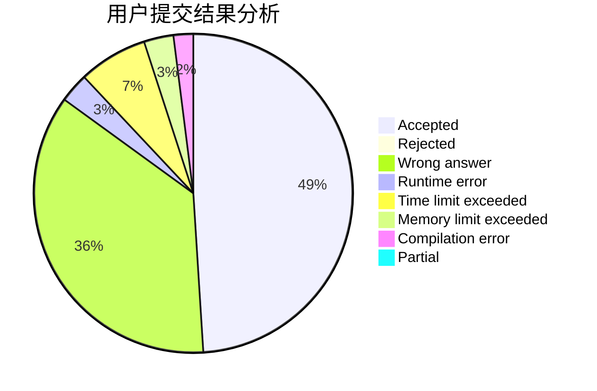
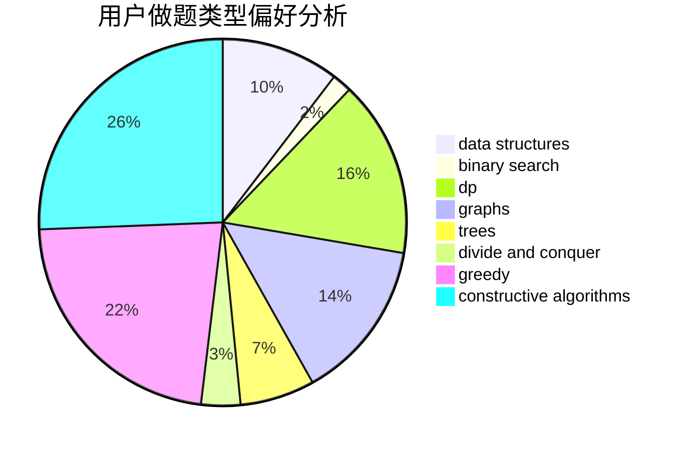

# chielo

<!-- tabs:start -->

#### **用户提交结果分析**

#### **用户做题类型偏好分析**

#### **用户错题知识点分析**

<!-- tabs:end -->
# 推荐题目
[1285D](https://codeforces.com/contest/1285/problem/D)		bitmasks,
                        brute force,
                        dfs and similar,
                        divide and conquer,
                        dp,
                        greedy,
                        strings,
                        trees		  
[611G](https://codeforces.com/contest/611/problem/G)		geometry,
                        two pointers		  
[1354E](https://codeforces.com/contest/1354/problem/E)		dfs and similar,
                        dp,
                        graphs		  
[1106B](https://codeforces.com/contest/1106/problem/B)		data structures,
                        implementation		  
[1191F](https://codeforces.com/contest/1191/problem/F)		dsu,graphs,sortings,trees		  
[543D](https://codeforces.com/contest/543/problem/D)		dp,
                        trees		  
[500F](https://codeforces.com/contest/500/problem/F)		divide and conquer,
                        dp		  
[835C](https://codeforces.com/contest/835/problem/C)		dp,
                        implementation		  
[549F](https://codeforces.com/contest/549/problem/F)		data structures,
                        divide and conquer		  
[1155A](https://codeforces.com/contest/1155/problem/A)		implementation,
                        sortings,
                        strings		  
