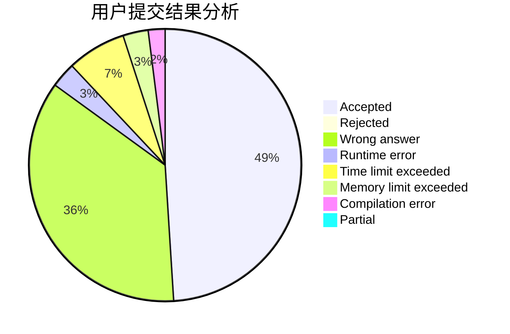
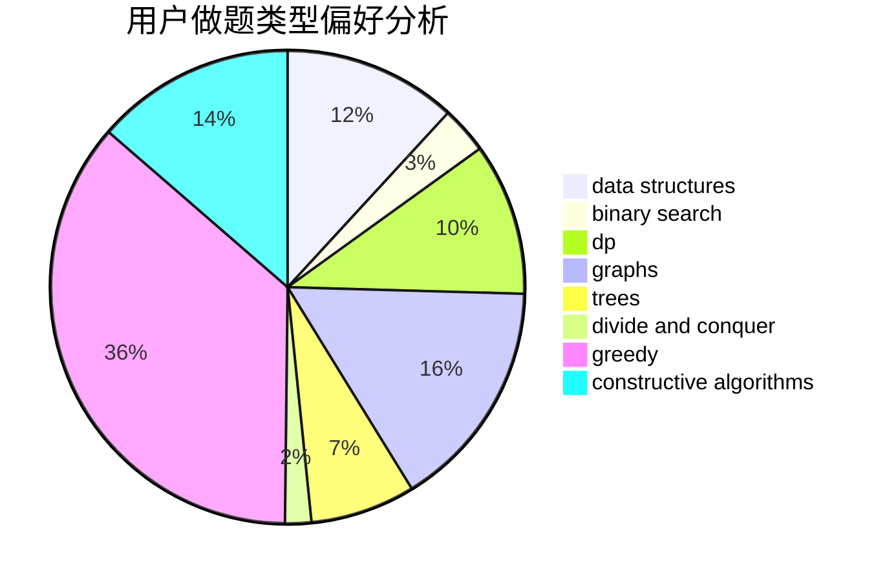

# chielo

<!-- tabs:start -->

#### **用户提交结果分析**

#### **用户做题类型偏好分析**

#### **用户错题知识点分析**

<!-- tabs:end -->
# 推荐题目
[1292E](https://codeforces.com/contest/1292/problem/E)		constructive algorithms,
                        greedy,
                        interactive,
                        math		  
[630R](https://codeforces.com/contest/630/problem/R)		games,
                        math		  
[1361B](https://codeforces.com/contest/1361/problem/B)		greedy,
                        implementation,
                        math,
                        sortings		  
[1106E](https://codeforces.com/contest/1106/problem/E)		data structures,
                        dp		  
[1197E](https://codeforces.com/contest/1197/problem/E)		binary search,
                        combinatorics,
                        data structures,
                        dp,
                        shortest paths,
                        sortings		  
[567F](https://codeforces.com/contest/567/problem/F)		dp		  
[522C](https://codeforces.com/contest/522/problem/C)		greedy		  
[853A](https://codeforces.com/contest/853/problem/A)		greedy		  
[574D](https://codeforces.com/contest/574/problem/D)		dsu,graphs,sortings,trees		  
[11571](https://codeforces.com/contest/1157/problem/1)		dsu,graphs,sortings,trees		  
