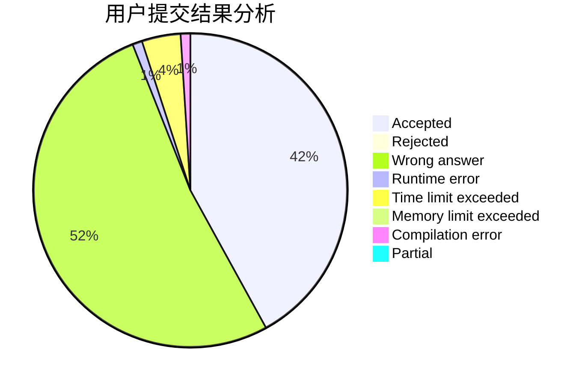
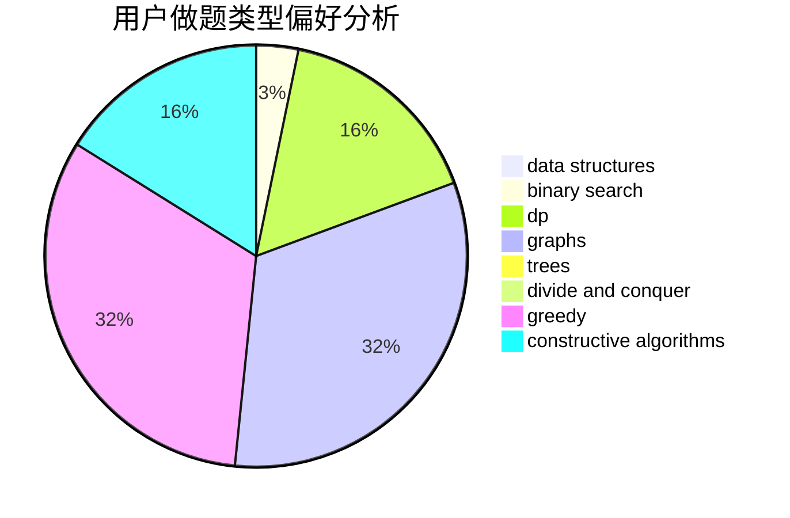
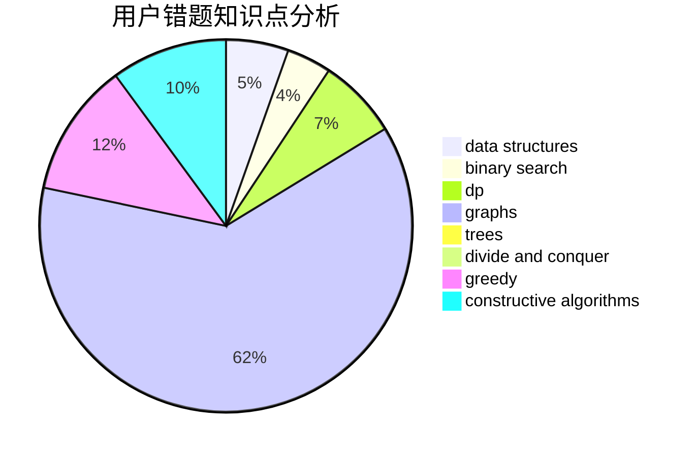

# chinajxy

<!-- tabs:start -->

#### **用户提交结果分析**

#### **用户做题类型偏好分析**

#### **用户错题知识点分析**

<!-- tabs:end -->
# 推荐题目
[976B](https://codeforces.com/contest/976/problem/B)		implementation,
                        math		  
[1375I](https://codeforces.com/contest/1375/problem/I)		geometry,
                        math,
                        matrices,
                        number theory		  
[1358E](https://codeforces.com/contest/1358/problem/E)		constructive algorithms,
                        data structures,
                        greedy,
                        implementation		  
[52A](https://codeforces.com/contest/52/problem/A)		implementation		  
[581F](https://codeforces.com/contest/581/problem/F)		dp,
                        trees,
                        two pointers		  
[1490C](https://codeforces.com/contest/1490/problem/C)		binary search,
                        brute force,
                        brute force,
                        math		  
[1497B](https://codeforces.com/contest/1497/problem/B)		constructive algorithms,
                        greedy,
                        math		  
[1491C](https://codeforces.com/contest/1491/problem/C)		brute force,
                        data structures,
                        dp,
                        greedy,
                        implementation		  
[1484C](https://codeforces.com/contest/1484/problem/C)		dsu,graphs,sortings,trees		  
[1480A](https://codeforces.com/contest/1480/problem/A)		games,
                        greedy,
                        strings		  
