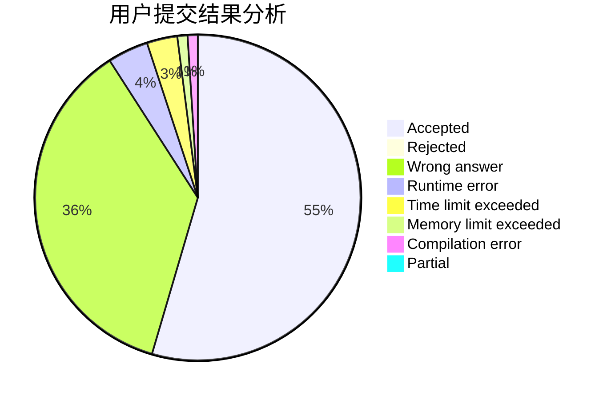
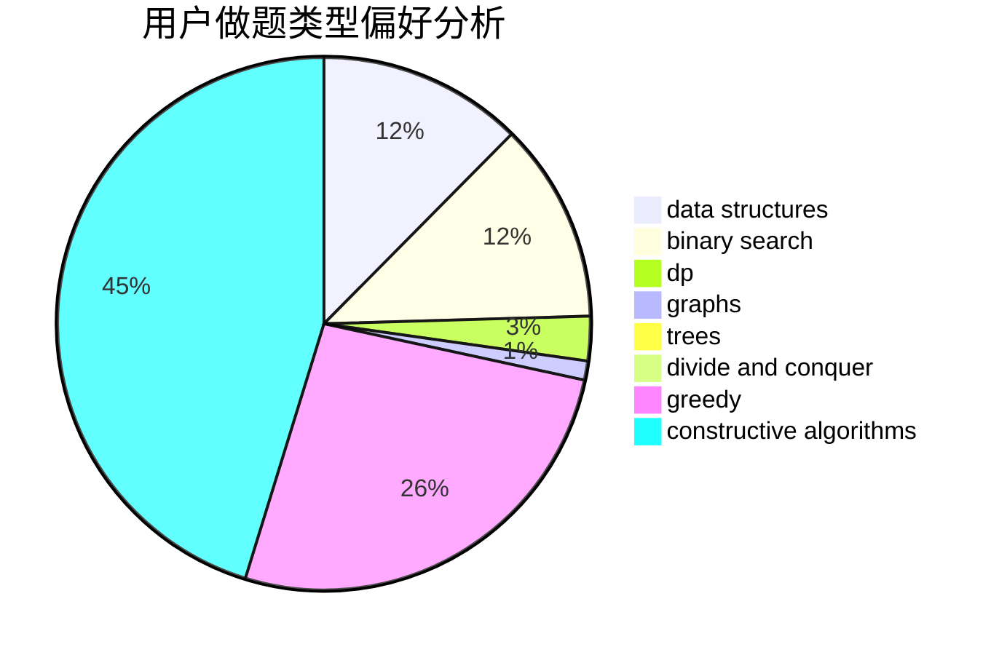

# chinawhboy

<!-- tabs:start -->

#### **用户提交结果分析**

#### **用户做题类型偏好分析**

#### **用户错题知识点分析**

<!-- tabs:end -->
# 推荐题目
[1413C](https://codeforces.com/contest/1413/problem/C)		binary search,
                        brute force,
                        dp,
                        implementation,
                        sortings,
                        two pointers		  
[522D](https://codeforces.com/contest/522/problem/D)		*special problem,
                        data structures		  
[1054C](https://codeforces.com/contest/1054/problem/C)		constructive algorithms,
                        implementation		  
[795D](https://codeforces.com/contest/795/problem/D)		dsu,graphs,sortings,trees		  
[1181C](https://codeforces.com/contest/1181/problem/C)		brute force,
                        combinatorics,
                        dp,
                        implementation		  
[360A](https://codeforces.com/contest/360/problem/A)		greedy,
                        implementation		  
[8D](https://codeforces.com/contest/8/problem/D)		binary search,
                        geometry		  
[1073A](https://codeforces.com/contest/1073/problem/A)		implementation,
                        strings		  
[888B](https://codeforces.com/contest/888/problem/B)		greedy		  
[96B](https://codeforces.com/contest/96/problem/B)		binary search,
                        bitmasks,
                        brute force		  
