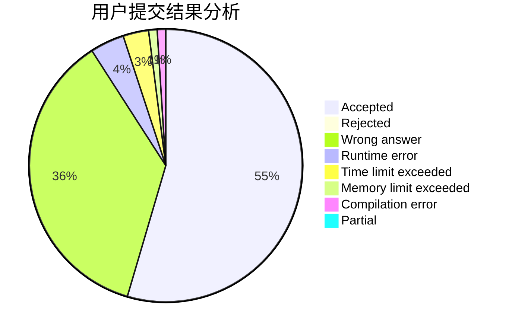
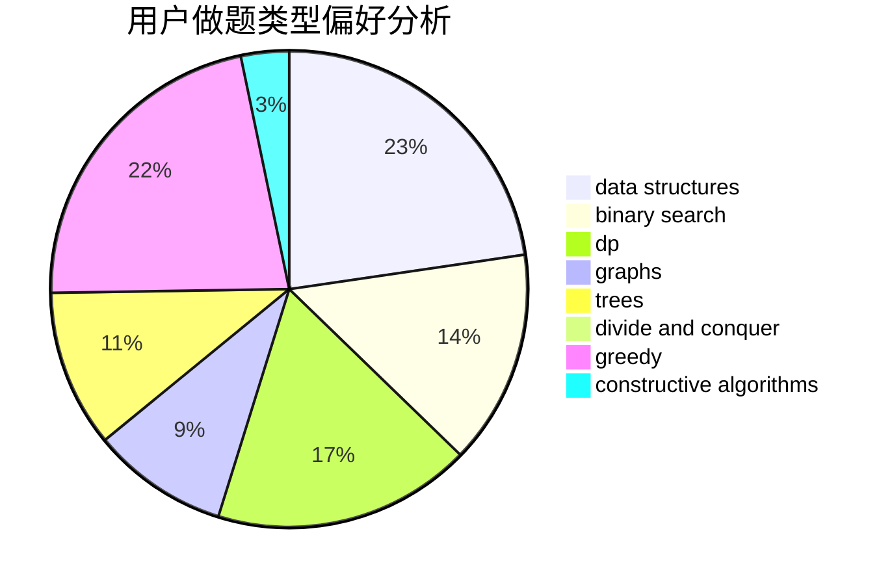

# chinawhboy

<!-- tabs:start -->

#### **用户提交结果分析**

#### **用户做题类型偏好分析**

#### **用户错题知识点分析**

<!-- tabs:end -->
# 推荐题目
[1422E](https://codeforces.com/contest/1422/problem/E)		dp,
                        greedy,
                        implementation,
                        strings		  
[548A](https://codeforces.com/contest/548/problem/A)		brute force,
                        implementation,
                        strings		  
[1054G](https://codeforces.com/contest/1054/problem/G)		constructive algorithms,
                        greedy,
                        math		  
[80B](https://codeforces.com/contest/80/problem/B)		geometry,
                        math		  
[1183H](https://codeforces.com/contest/1183/problem/H)		dp,
                        strings		  
[388B](https://codeforces.com/contest/388/problem/B)		bitmasks,
                        constructive algorithms,
                        graphs,
                        implementation,
                        math		  
[916B](https://codeforces.com/contest/916/problem/B)		bitmasks,
                        greedy,
                        math		  
[1073D](https://codeforces.com/contest/1073/problem/D)		binary search,
                        brute force,
                        data structures,
                        greedy		  
[907D](https://codeforces.com/contest/907/problem/D)		dsu,graphs,sortings,trees		  
[989D](https://codeforces.com/contest/989/problem/D)		binary search,
                        geometry,
                        math,
                        sortings,
                        two pointers		  
