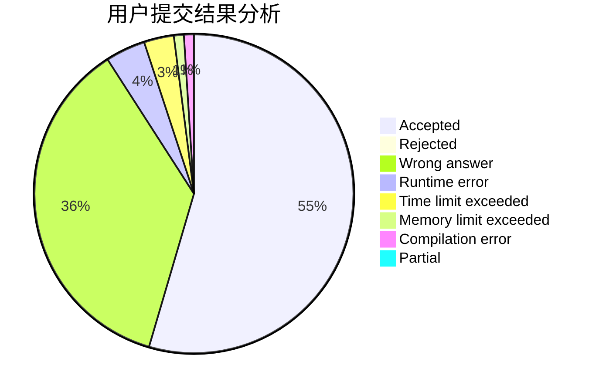
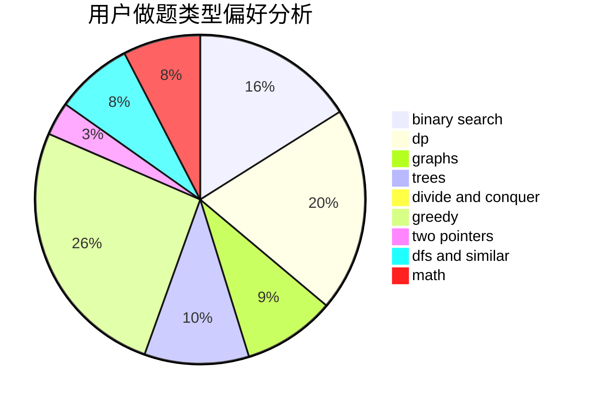

# chinawhboy

<!-- tabs:start -->

#### **用户提交结果分析**

#### **用户做题类型偏好分析**

<!-- tabs:end -->
# 推荐题目
[1422E](https://codeforces.com/contest/1422/problem/E)
[548A](https://codeforces.com/contest/548/problem/A)
[1054G](https://codeforces.com/contest/1054/problem/G)
[80B](https://codeforces.com/contest/80/problem/B)
[1183H](https://codeforces.com/contest/1183/problem/H)
[388B](https://codeforces.com/contest/388/problem/B)
[916B](https://codeforces.com/contest/916/problem/B)
[1073D](https://codeforces.com/contest/1073/problem/D)
[907D](https://codeforces.com/contest/907/problem/D)
[989D](https://codeforces.com/contest/989/problem/D)
