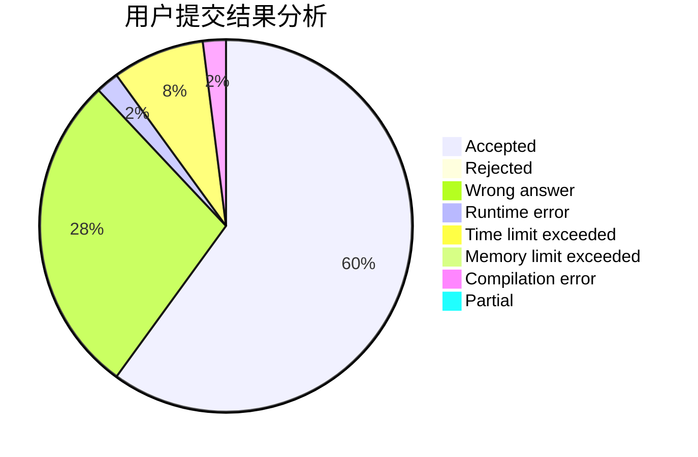
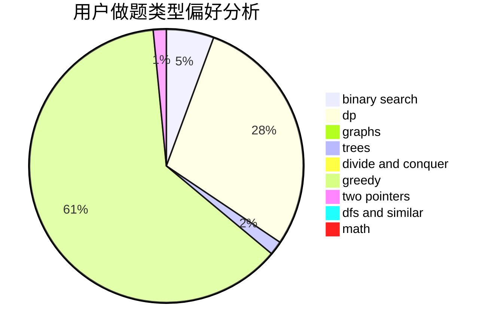

# chinaxjh

<!-- tabs:start -->

#### **用户提交结果分析**

#### **用户做题类型偏好分析**

<!-- tabs:end -->
# 推荐题目
[1353B](https://codeforces.com/contest/1353/problem/B)
[1286D](https://codeforces.com/contest/1286/problem/D)
[917A](https://codeforces.com/contest/917/problem/A)
[1408H](https://codeforces.com/contest/1408/problem/H)
[499C](https://codeforces.com/contest/499/problem/C)
[632D](https://codeforces.com/contest/632/problem/D)
[397E](https://codeforces.com/contest/397/problem/E)
[1270I](https://codeforces.com/contest/1270/problem/I)
[859C](https://codeforces.com/contest/859/problem/C)
[460B](https://codeforces.com/contest/460/problem/B)
