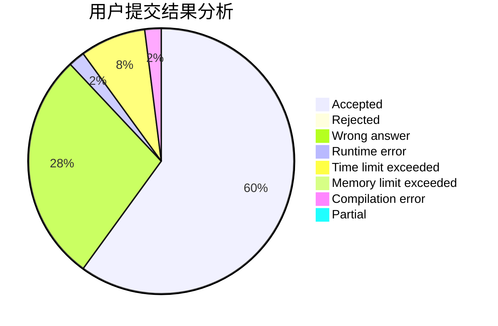
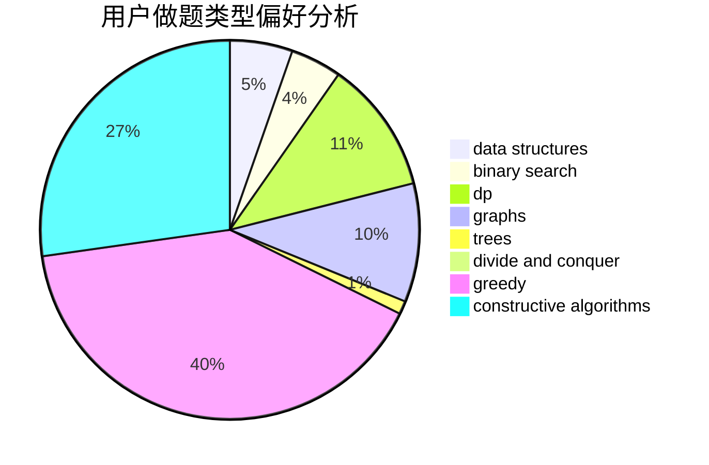

# chinaxjh

<!-- tabs:start -->

#### **用户提交结果分析**

#### **用户做题类型偏好分析**

#### **用户错题知识点分析**

<!-- tabs:end -->
# 推荐题目
[1346A](https://codeforces.com/contest/1346/problem/A)		*special problem,
                        math		  
[1280C](https://codeforces.com/contest/1280/problem/C)		dfs and similar,
                        graphs,
                        greedy,
                        trees		  
[900C](https://codeforces.com/contest/900/problem/C)		brute force,
                        data structures,
                        math		  
[1399F](https://codeforces.com/contest/1399/problem/F)		data structures,
                        dp,
                        graphs,
                        sortings		  
[479A](https://codeforces.com/contest/479/problem/A)		brute force,
                        math		  
[613A](https://codeforces.com/contest/613/problem/A)		binary search,
                        geometry,
                        ternary search		  
[367A](https://codeforces.com/contest/367/problem/A)		data structures,
                        implementation		  
[1265D](https://codeforces.com/contest/1265/problem/D)		dsu,graphs,sortings,trees		  
[83B](https://codeforces.com/contest/83/problem/B)		binary search,
                        math,
                        sortings		  
[438D](https://codeforces.com/contest/438/problem/D)		data structures,
                        math		  
