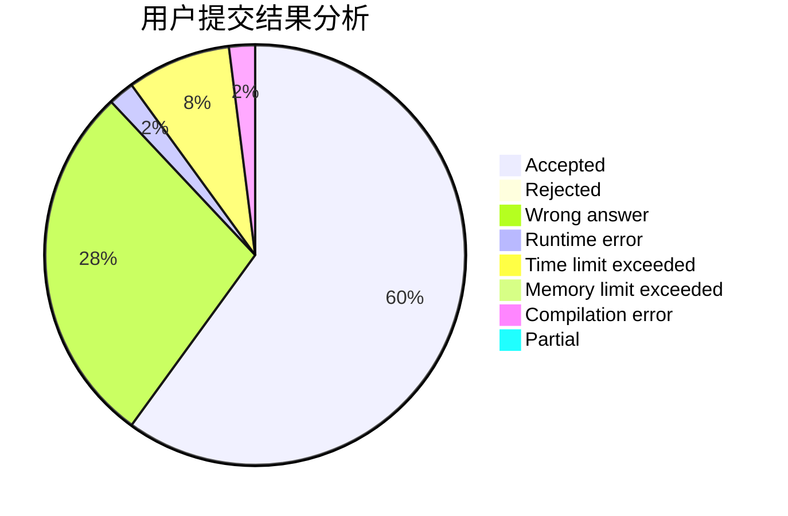
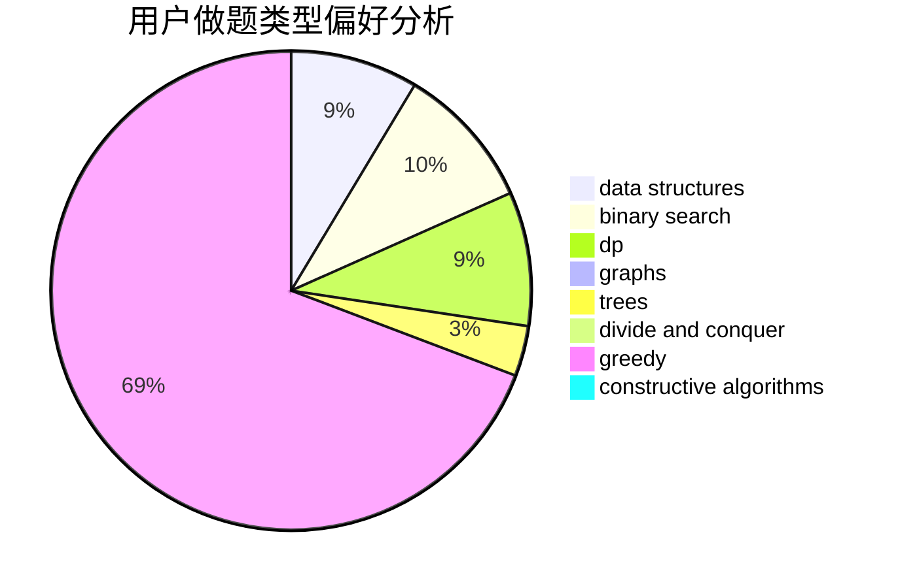

# chinaxjh

<!-- tabs:start -->

#### **用户提交结果分析**

#### **用户做题类型偏好分析**

#### **用户错题知识点分析**

<!-- tabs:end -->
# 推荐题目
[1353B](https://codeforces.com/contest/1353/problem/B)		greedy,
                        sortings		  
[1286D](https://codeforces.com/contest/1286/problem/D)		data structures,
                        math,
                        matrices,
                        probabilities		  
[917A](https://codeforces.com/contest/917/problem/A)		dp,
                        greedy,
                        implementation,
                        math		  
[1408H](https://codeforces.com/contest/1408/problem/H)		binary search,
                        data structures,
                        flows,
                        greedy		  
[499C](https://codeforces.com/contest/499/problem/C)		dsu,graphs,sortings,trees		  
[632D](https://codeforces.com/contest/632/problem/D)		brute force,
                        math,
                        number theory		  
[397E](https://codeforces.com/contest/397/problem/E)		dsu,graphs,sortings,trees		  
[1270I](https://codeforces.com/contest/1270/problem/I)		constructive algorithms,
                        fft,
                        math		  
[859C](https://codeforces.com/contest/859/problem/C)		dp,
                        games		  
[460B](https://codeforces.com/contest/460/problem/B)		brute force,
                        implementation,
                        math,
                        number theory		  
