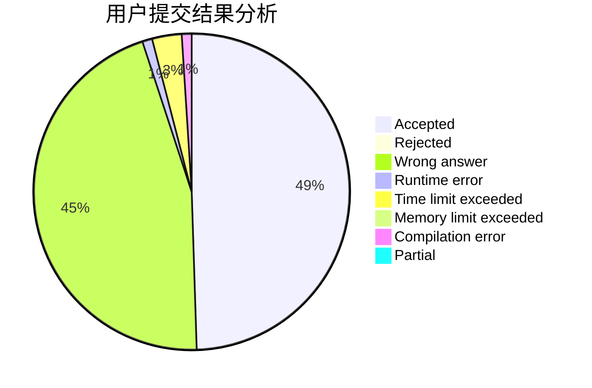
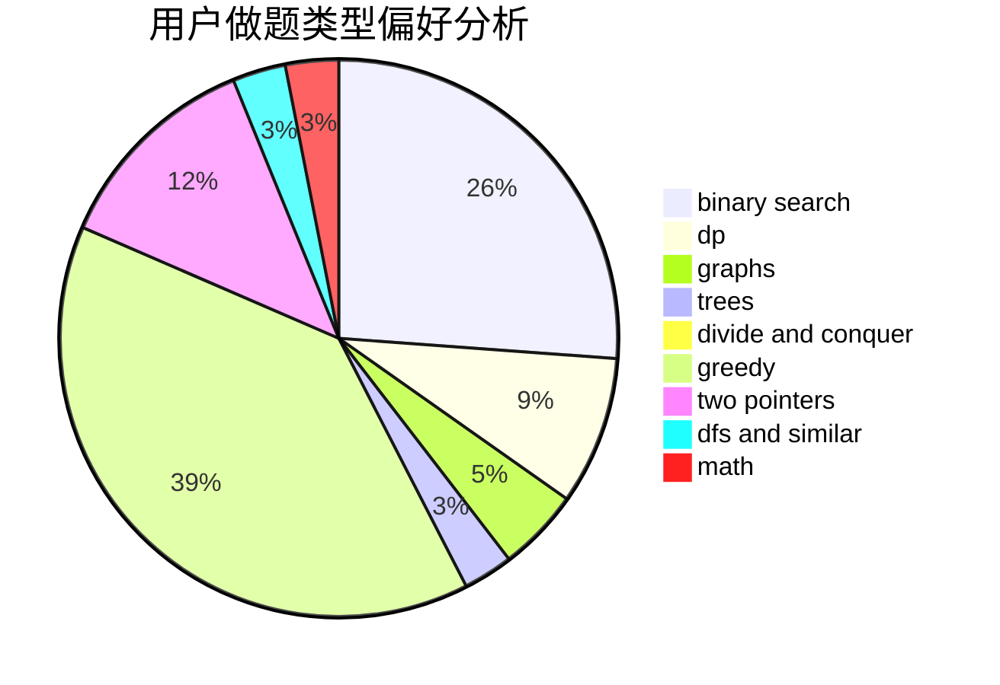

# chino123

<!-- tabs:start -->

#### **用户提交结果分析**

#### **用户做题类型偏好分析**

<!-- tabs:end -->
# 推荐题目
[437B](https://codeforces.com/contest/437/problem/B)
[525C](https://codeforces.com/contest/525/problem/C)
[1046C](https://codeforces.com/contest/1046/problem/C)
[1109E](https://codeforces.com/contest/1109/problem/E)
[1090D](https://codeforces.com/contest/1090/problem/D)
[317B](https://codeforces.com/contest/317/problem/B)
[707E](https://codeforces.com/contest/707/problem/E)
[294D](https://codeforces.com/contest/294/problem/D)
[1166C](https://codeforces.com/contest/1166/problem/C)
[1331E](https://codeforces.com/contest/1331/problem/E)
