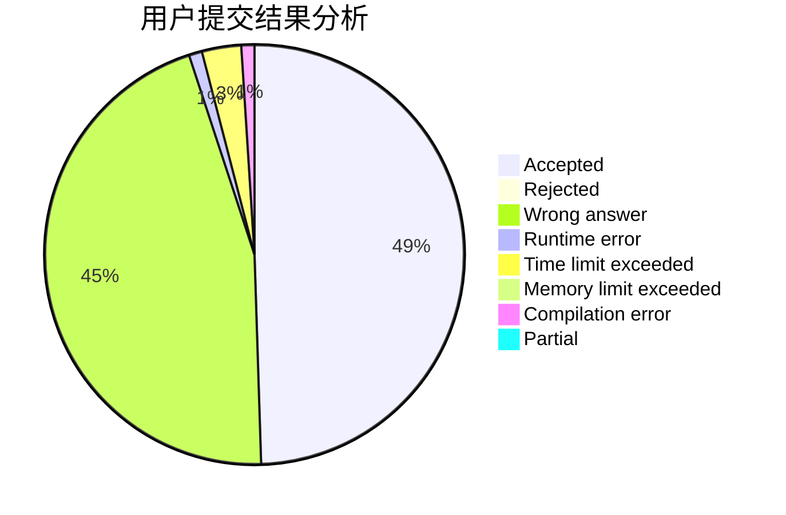
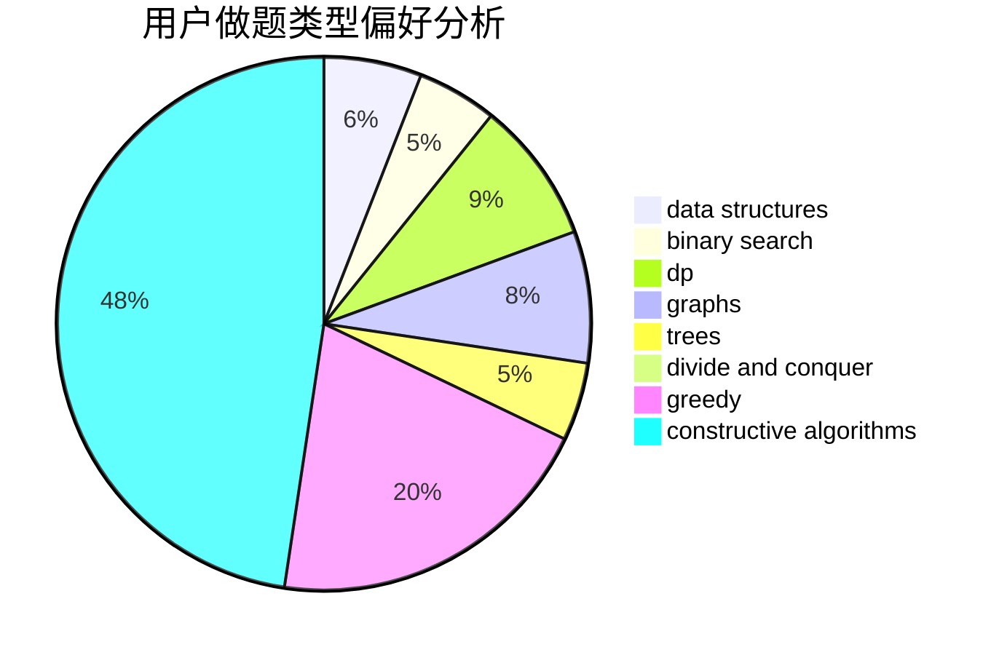
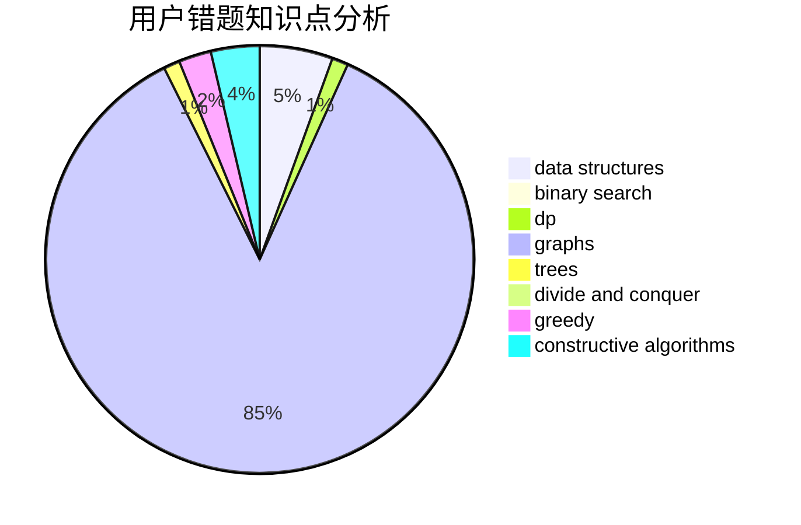

# chino123

<!-- tabs:start -->

#### **用户提交结果分析**

#### **用户做题类型偏好分析**

#### **用户错题知识点分析**

<!-- tabs:end -->
# 推荐题目
[437B](https://codeforces.com/contest/437/problem/B)		bitmasks,
                        greedy,
                        implementation,
                        sortings		  
[525C](https://codeforces.com/contest/525/problem/C)		greedy,
                        math,
                        sortings		  
[1046C](https://codeforces.com/contest/1046/problem/C)		greedy		  
[1109E](https://codeforces.com/contest/1109/problem/E)		data structures,
                        number theory		  
[1090D](https://codeforces.com/contest/1090/problem/D)		constructive algorithms		  
[317B](https://codeforces.com/contest/317/problem/B)		brute force,
                        implementation		  
[707E](https://codeforces.com/contest/707/problem/E)		data structures		  
[294D](https://codeforces.com/contest/294/problem/D)		brute force,
                        implementation,
                        number theory		  
[1166C](https://codeforces.com/contest/1166/problem/C)		binary search,
                        sortings,
                        two pointers		  
[1331E](https://codeforces.com/contest/1331/problem/E)		dfs and similar,
                        geometry,
                        implementation		  
