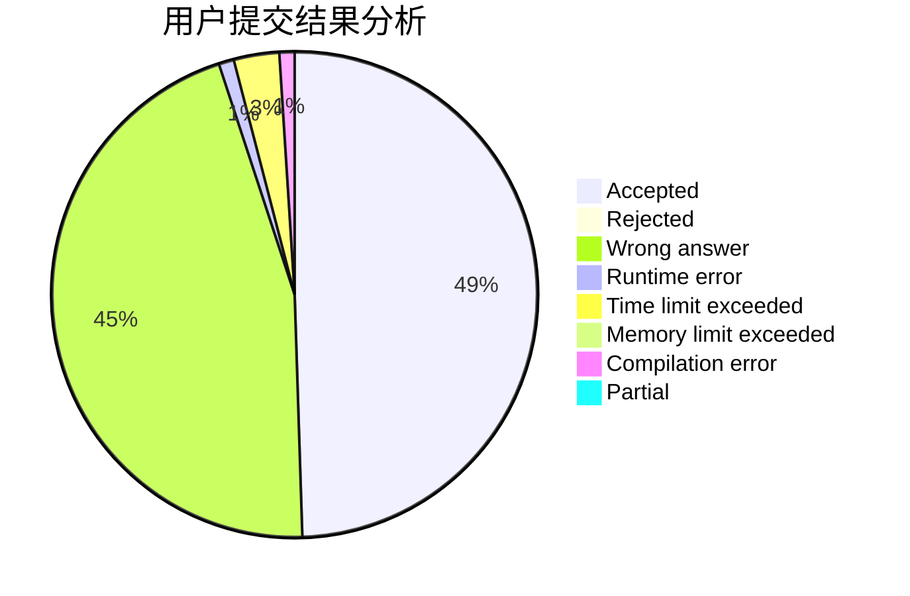
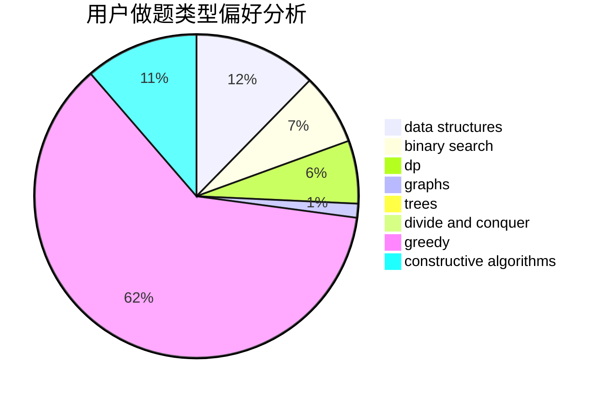
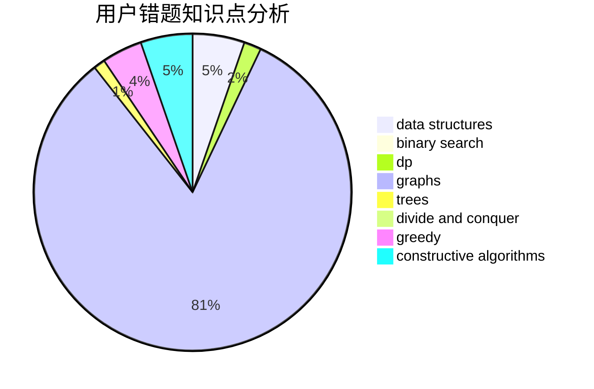

# chino123

<!-- tabs:start -->

#### **用户提交结果分析**

#### **用户做题类型偏好分析**

#### **用户错题知识点分析**

<!-- tabs:end -->
# 推荐题目
[409H](https://codeforces.com/contest/409/problem/H)		*special problem,
                        brute force,
                        constructive algorithms,
                        dsu,
                        implementation		  
[505A](https://codeforces.com/contest/505/problem/A)		brute force,
                        implementation,
                        strings		  
[1045H](https://codeforces.com/contest/1045/problem/H)		math		  
[1109A](https://codeforces.com/contest/1109/problem/A)		dp,
                        implementation		  
[108C](https://codeforces.com/contest/108/problem/C)		dsu,graphs,sortings,trees		  
[29C](https://codeforces.com/contest/29/problem/C)		data structures,
                        dfs and similar,
                        graphs,
                        implementation		  
[685C](https://codeforces.com/contest/685/problem/C)		binary search,
                        math		  
[279E](https://codeforces.com/contest/279/problem/E)		dp,
                        games,
                        greedy,
                        number theory		  
[1164K](https://codeforces.com/contest/1164/problem/K)		dsu,graphs,sortings,trees		  
[1325A](https://codeforces.com/contest/1325/problem/A)		constructive algorithms,
                        greedy,
                        number theory		  
