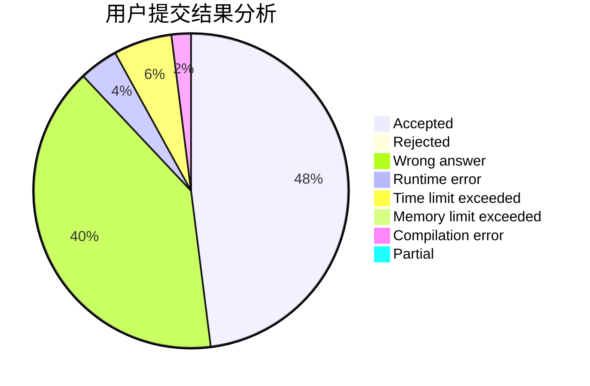
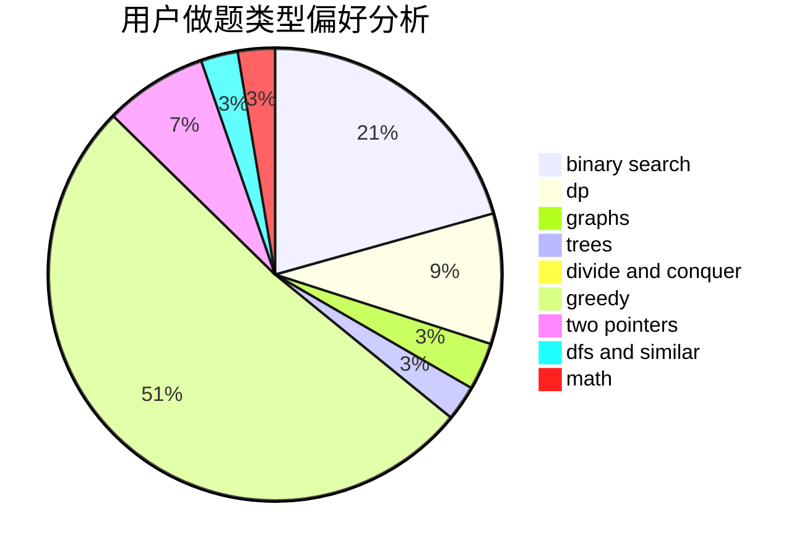

# Apoi2333

<!-- tabs:start -->

#### **用户提交结果分析**

#### **用户做题类型偏好分析**

<!-- tabs:end -->
# 推荐题目
[38A](https://codeforces.com/contest/38/problem/A)
[311A](https://codeforces.com/contest/311/problem/A)
[1312C](https://codeforces.com/contest/1312/problem/C)
[1166D](https://codeforces.com/contest/1166/problem/D)
[382E](https://codeforces.com/contest/382/problem/E)
[388D](https://codeforces.com/contest/388/problem/D)
[389B](https://codeforces.com/contest/389/problem/B)
[1314E](https://codeforces.com/contest/1314/problem/E)
[388B](https://codeforces.com/contest/388/problem/B)
[385E](https://codeforces.com/contest/385/problem/E)
