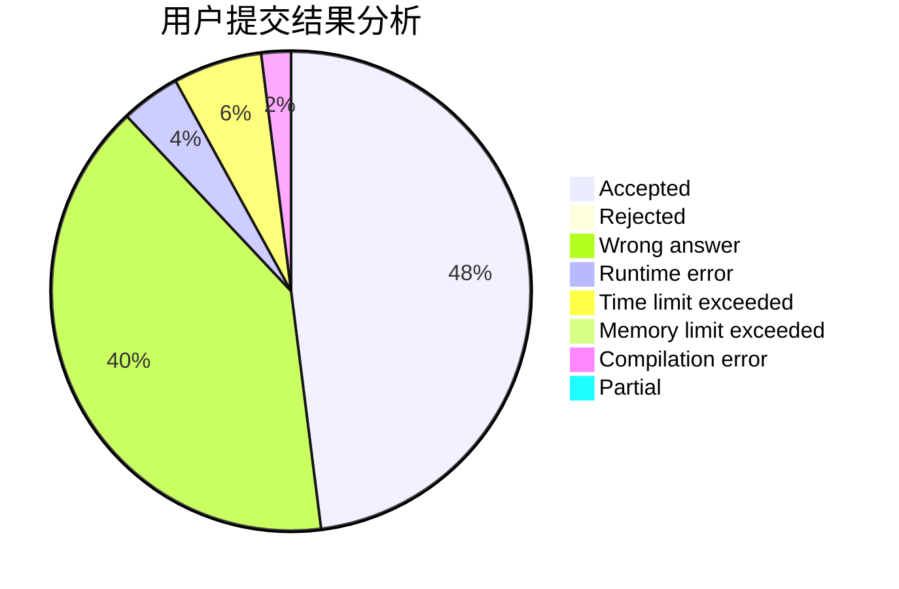
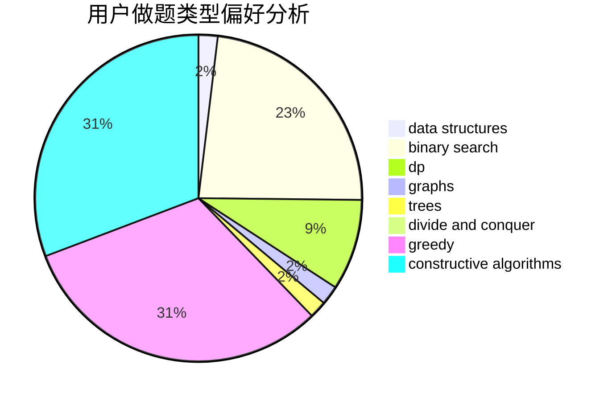

# Apoi2333

<!-- tabs:start -->

#### **用户提交结果分析**

#### **用户做题类型偏好分析**

#### **用户错题知识点分析**

<!-- tabs:end -->
# 推荐题目
[38A](https://codeforces.com/contest/38/problem/A)		implementation		  
[311A](https://codeforces.com/contest/311/problem/A)		constructive algorithms,
                        implementation		  
[1312C](https://codeforces.com/contest/1312/problem/C)		bitmasks,
                        greedy,
                        implementation,
                        math,
                        number theory,
                        ternary search		  
[1166D](https://codeforces.com/contest/1166/problem/D)		binary search,
                        brute force,
                        greedy,
                        math		  
[382E](https://codeforces.com/contest/382/problem/E)		combinatorics,
                        dp		  
[388D](https://codeforces.com/contest/388/problem/D)		math		  
[389B](https://codeforces.com/contest/389/problem/B)		greedy,
                        implementation		  
[1314E](https://codeforces.com/contest/1314/problem/E)		dsu,graphs,sortings,trees		  
[388B](https://codeforces.com/contest/388/problem/B)		bitmasks,
                        constructive algorithms,
                        graphs,
                        implementation,
                        math		  
[385E](https://codeforces.com/contest/385/problem/E)		math,
                        matrices		  
