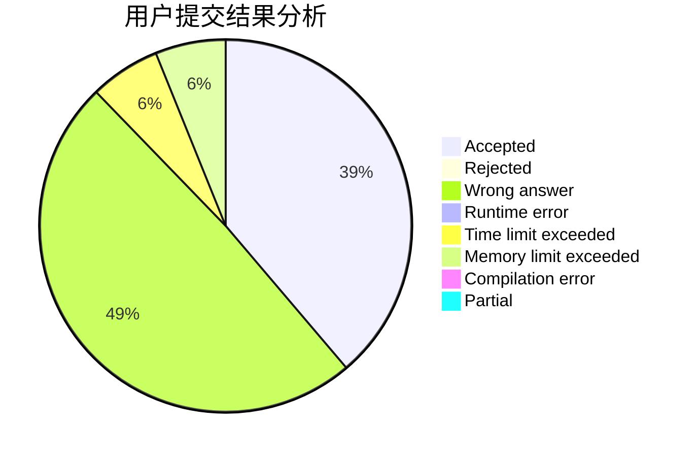
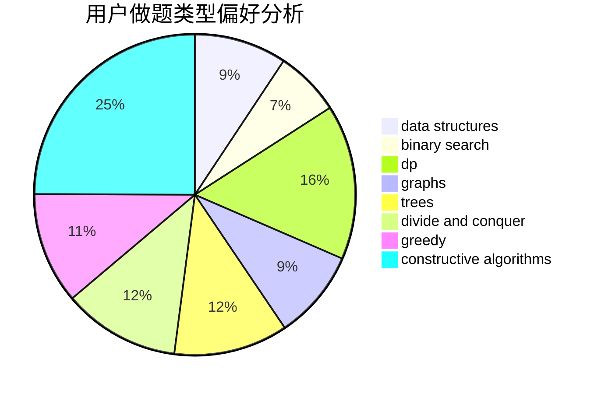

# chiyo

<!-- tabs:start -->

#### **用户提交结果分析**

#### **用户做题类型偏好分析**

#### **用户错题知识点分析**

<!-- tabs:end -->
# 推荐题目
[1447F1](https://codeforces.com/contest/1447F/problem/1)		dsu,graphs,sortings,trees		  
[7C](https://codeforces.com/contest/7/problem/C)		math,
                        number theory		  
[587D](https://codeforces.com/contest/587/problem/D)		2-sat,
                        binary search		  
[514D](https://codeforces.com/contest/514/problem/D)		binary search,
                        data structures,
                        two pointers		  
[667C](https://codeforces.com/contest/667/problem/C)		dsu,graphs,sortings,trees		  
[802N](https://codeforces.com/contest/802/problem/N)		binary search,
                        flows,
                        graphs		  
[1243D](https://codeforces.com/contest/1243/problem/D)		dsu,graphs,sortings,trees		  
[280E](https://codeforces.com/contest/280/problem/E)		data structures,
                        dp,
                        implementation,
                        math		  
[549F](https://codeforces.com/contest/549/problem/F)		data structures,
                        divide and conquer		  
[224B](https://codeforces.com/contest/224/problem/B)		bitmasks,
                        implementation,
                        two pointers		  
