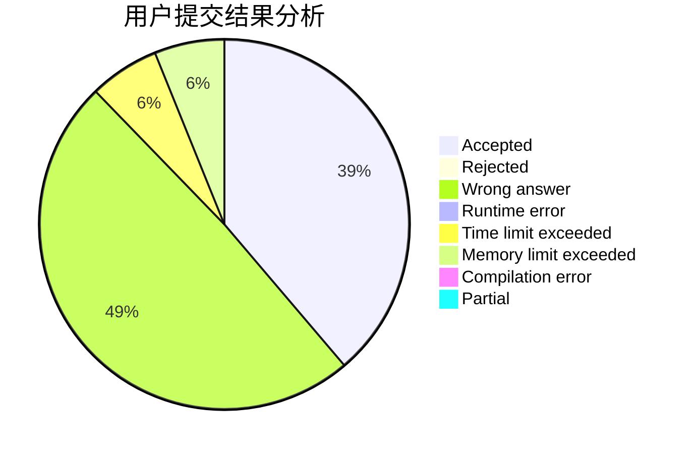
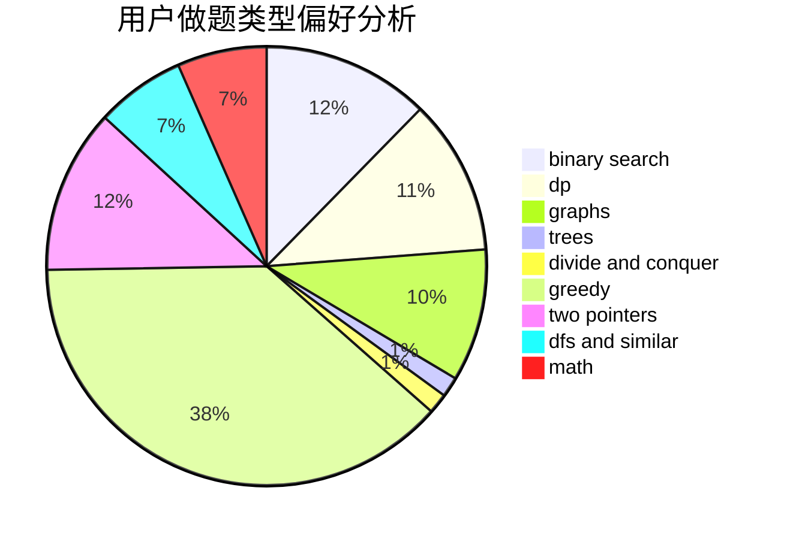

# chiyo

<!-- tabs:start -->

#### **用户提交结果分析**

#### **用户做题类型偏好分析**

<!-- tabs:end -->
# 推荐题目
[1457C](https://codeforces.com/contest/1457/problem/C)
[814D](https://codeforces.com/contest/814/problem/D)
[607E](https://codeforces.com/contest/607/problem/E)
[540B](https://codeforces.com/contest/540/problem/B)
[689D](https://codeforces.com/contest/689/problem/D)
[818D](https://codeforces.com/contest/818/problem/D)
[1248E](https://codeforces.com/contest/1248/problem/E)
[297B](https://codeforces.com/contest/297/problem/B)
[574D](https://codeforces.com/contest/574/problem/D)
[243B](https://codeforces.com/contest/243/problem/B)
