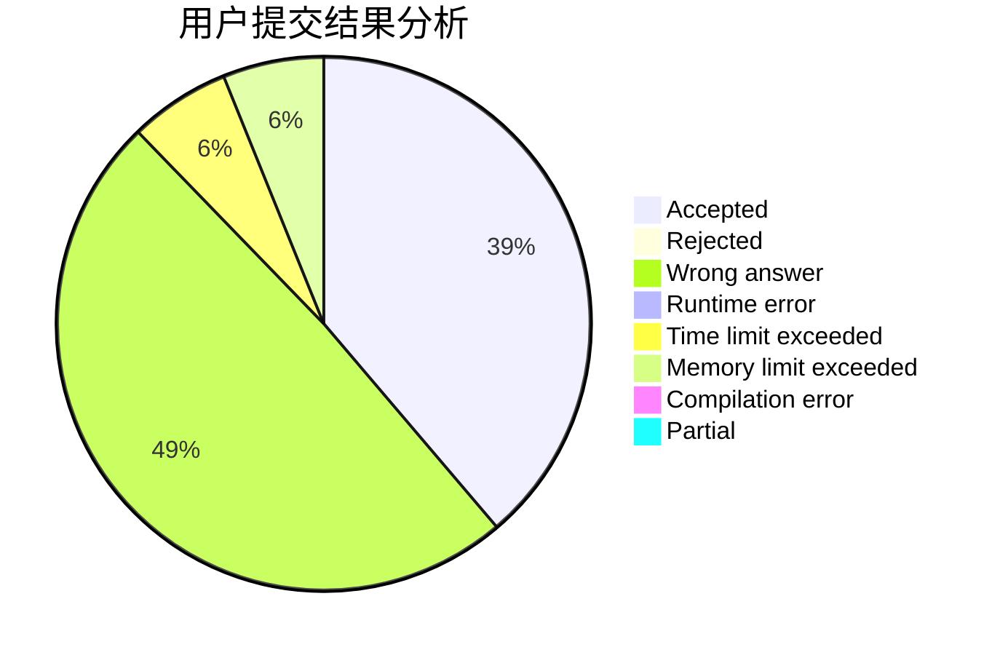
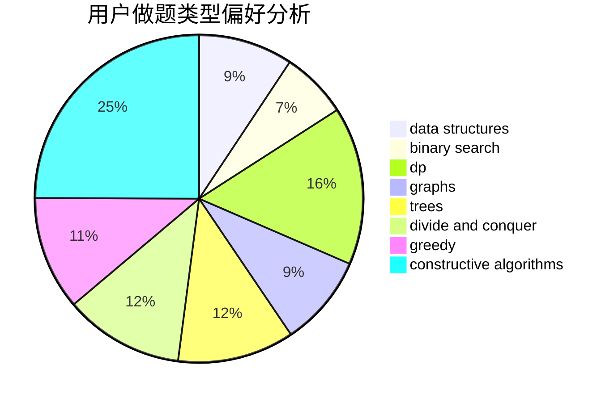

# chiyo
<!-- tabs:start -->
#### **用户提交结果分析**

#### **用户做题类型偏好分析**

#### **用户错题知识点分析**

<!-- tabs:end -->
# 推荐题目
[Johnny and Megan's Necklace](http://codeforces.com/problemset/problem/1361/C)		binary search,
                        bitmasks,
                        constructive algorithms,
                        dfs and similar,
                        dsu,
                        graphs		  
[Intersecting Subtrees](http://codeforces.com/problemset/problem/1044/B)		dfs and similar,
                        interactive,
                        trees		  
[Frequency Problem (Easy Version)](https://codeforces.com/contest/1447/problem/F1)		data structures,
                        greedy		  
[April Fools' Problem (medium)](http://codeforces.com/problemset/problem/802/N)		binary search,
                        flows,
                        graphs		  
[R2D2 and Droid Army](http://codeforces.com/problemset/problem/514/D)		binary search,
                        data structures,
                        two pointers		  
[Room Leader](http://codeforces.com/problemset/problem/74/A)		implementation		  
[0-1 MST](https://codeforces.com/contest/1243/problem/D)		dfs and similar,
                        dsu,
                        graphs,
                        sortings		  
[Forgetting Things](http://codeforces.com/problemset/problem/1225/A)		math		  
[Line](http://codeforces.com/problemset/problem/7/C)		math,
                        number theory		  
[Robot Bicorn Attack](http://codeforces.com/problemset/problem/175/A)		brute force,
                        implementation		  
<!-- tabs:start -->
#### **data structures**
[Johnny and Megan's Necklace](https://codeforces.com/contest/1447/problem/F1)		data structures,
                        greedy		  
[Intersecting Subtrees](http://codeforces.com/problemset/problem/514/D)		binary search,
                        data structures,
                        two pointers		  
[Frequency Problem (Easy Version)](http://codeforces.com/problemset/problem/722/F)		chinese remainder theorem,
                        data structures,
                        implementation,
                        number theory,
                        two pointers		  
[April Fools' Problem (medium)](http://codeforces.com/problemset/problem/338/E)		data structures		  
[R2D2 and Droid Army](http://codeforces.com/problemset/problem/1511/G)		bitmasks,
                        brute force,
                        data structures,
                        games,
                        two pointers		  
[Room Leader](http://codeforces.com/problemset/problem/280/E)		data structures,
                        dp,
                        implementation,
                        math		  
[0-1 MST](http://codeforces.com/problemset/problem/549/F)		data structures,
                        divide and conquer		  
[Forgetting Things](http://codeforces.com/problemset/problem/1492/C)		binary search,
                        data structures,
                        dp,
                        greedy,
                        two pointers		  
[Line](http://codeforces.com/problemset/problem/1490/G)		binary search,
                        data structures,
                        math		  
[Robot Bicorn Attack](http://codeforces.com/problemset/problem/1479/D)		binary search,
                        bitmasks,
                        brute force,
                        data structures,
                        probabilities,
                        trees		  
#### **binary search**
[Johnny and Megan's Necklace](http://codeforces.com/problemset/problem/1361/C)		binary search,
                        bitmasks,
                        constructive algorithms,
                        dfs and similar,
                        dsu,
                        graphs		  
[Intersecting Subtrees](http://codeforces.com/problemset/problem/802/N)		binary search,
                        flows,
                        graphs		  
[Frequency Problem (Easy Version)](http://codeforces.com/problemset/problem/514/D)		binary search,
                        data structures,
                        two pointers		  
[April Fools' Problem (medium)](http://codeforces.com/problemset/problem/587/D)		2-sat,
                        binary search		  
[R2D2 and Droid Army](http://codeforces.com/problemset/problem/518/F)		binary search,
                        brute force,
                        combinatorics,
                        dp,
                        implementation		  
[Room Leader](http://codeforces.com/problemset/problem/1326/D2)		binary search,
                        greedy,
                        hashing,
                        string suffix structures,
                        strings		  
[0-1 MST](http://codeforces.com/problemset/problem/1492/C)		binary search,
                        data structures,
                        dp,
                        greedy,
                        two pointers		  
[Forgetting Things](http://codeforces.com/problemset/problem/1463/D)		binary search,
                        constructive algorithms,
                        greedy,
                        two pointers		  
[Line](http://codeforces.com/problemset/problem/1490/G)		binary search,
                        data structures,
                        math		  
[Robot Bicorn Attack](http://codeforces.com/problemset/problem/1479/D)		binary search,
                        bitmasks,
                        brute force,
                        data structures,
                        probabilities,
                        trees		  
#### **dp**
[Johnny and Megan's Necklace](https://codeforces.com/contest/667/problem/C)		dp,
                        implementation,
                        strings		  
[Intersecting Subtrees](http://codeforces.com/problemset/problem/398/B)		dp,
                        probabilities		  
[Frequency Problem (Easy Version)](http://codeforces.com/problemset/problem/518/F)		binary search,
                        brute force,
                        combinatorics,
                        dp,
                        implementation		  
[April Fools' Problem (medium)](http://codeforces.com/problemset/problem/280/E)		data structures,
                        dp,
                        implementation,
                        math		  
[R2D2 and Droid Army](https://codeforces.com/contest/1405/problem/D)		dfs and similar,
                        dp,
                        games,
                        trees		  
[Room Leader](http://codeforces.com/problemset/problem/1492/C)		binary search,
                        data structures,
                        dp,
                        greedy,
                        two pointers		  
[0-1 MST](https://codeforces.com/contest/1457/problem/C)		brute force,
                        dp,
                        implementation		  
[Forgetting Things](http://codeforces.com/problemset/problem/1491/C)		brute force,
                        data structures,
                        dp,
                        greedy,
                        implementation		  
[Line](http://codeforces.com/problemset/problem/1437/C)		dp,
                        flows,
                        graph matchings,
                        greedy,
                        math,
                        sortings		  
[Robot Bicorn Attack](http://codeforces.com/problemset/problem/1499/B)		brute force,
                        dp,
                        greedy,
                        implementation		  
#### **graph**
[Johnny and Megan's Necklace](http://codeforces.com/problemset/problem/1361/C)		binary search,
                        bitmasks,
                        constructive algorithms,
                        dfs and similar,
                        dsu,
                        graphs		  
[Intersecting Subtrees](http://codeforces.com/problemset/problem/802/N)		binary search,
                        flows,
                        graphs		  
[Frequency Problem (Easy Version)](https://codeforces.com/contest/1243/problem/D)		dfs and similar,
                        dsu,
                        graphs,
                        sortings		  
[April Fools' Problem (medium)](https://codeforces.com/contest/1384/problem/C)		dsu,
                        graphs,
                        greedy,
                        sortings,
                        strings,
                        trees,
                        two pointers		  
[R2D2 and Droid Army](http://codeforces.com/problemset/problem/744/A)		dfs and similar,
                        graphs		  
[Room Leader](http://codeforces.com/problemset/problem/1487/C)		brute force,
                        constructive algorithms,
                        dfs and similar,
                        graphs,
                        greedy,
                        implementation,
                        math		  
[0-1 MST](http://codeforces.com/problemset/problem/1437/C)		dp,
                        flows,
                        graph matchings,
                        greedy,
                        math,
                        sortings		  
[Forgetting Things](http://codeforces.com/problemset/problem/1470/D)		constructive algorithms,
                        dfs and similar,
                        graph matchings,
                        graphs,
                        greedy		  
[Line](http://codeforces.com/problemset/problem/1476/C)		dp,
                        graphs,
                        greedy		  
[Robot Bicorn Attack](http://codeforces.com/problemset/problem/1304/D)		constructive algorithms,
                        graphs,
                        greedy,
                        two pointers		  
#### **trees**
[Johnny and Megan's Necklace](http://codeforces.com/problemset/problem/1044/B)		dfs and similar,
                        interactive,
                        trees		  
[Intersecting Subtrees](https://codeforces.com/contest/1384/problem/C)		dsu,
                        graphs,
                        greedy,
                        sortings,
                        strings,
                        trees,
                        two pointers		  
[Frequency Problem (Easy Version)](https://codeforces.com/contest/1405/problem/D)		dfs and similar,
                        dp,
                        games,
                        trees		  
[April Fools' Problem (medium)](http://codeforces.com/problemset/problem/1479/D)		binary search,
                        bitmasks,
                        brute force,
                        data structures,
                        probabilities,
                        trees		  
[R2D2 and Droid Army](http://codeforces.com/problemset/problem/1511/C)		brute force,
                        data structures,
                        implementation,
                        trees		  
[Room Leader](http://codeforces.com/problemset/problem/1499/F)		combinatorics,
                        dfs and similar,
                        dp,
                        trees		  
[0-1 MST](http://codeforces.com/problemset/problem/1491/E)		brute force,
                        dfs and similar,
                        divide and conquer,
                        number theory,
                        trees		  
[Forgetting Things](http://codeforces.com/problemset/problem/1466/D)		data structures,
                        greedy,
                        sortings,
                        trees		  
[Line](http://codeforces.com/problemset/problem/1495/D)		combinatorics,
                        dfs and similar,
                        graphs,
                        math,
                        shortest paths,
                        trees		  
[Robot Bicorn Attack](http://codeforces.com/problemset/problem/1303/G)		data structures,
                        divide and conquer,
                        geometry,
                        trees		  
#### **divide and conquer**
[Johnny and Megan's Necklace](http://codeforces.com/problemset/problem/549/F)		data structures,
                        divide and conquer		  
[Intersecting Subtrees](http://codeforces.com/problemset/problem/1461/D)		binary search,
                        brute force,
                        data structures,
                        divide and conquer,
                        implementation,
                        sortings		  
[Frequency Problem (Easy Version)](http://codeforces.com/problemset/problem/1466/G)		combinatorics,
                        divide and conquer,
                        hashing,
                        math,
                        string suffix structures,
                        strings		  
[April Fools' Problem (medium)](http://codeforces.com/problemset/problem/1490/D)		dfs and similar,
                        divide and conquer,
                        implementation		  
[R2D2 and Droid Army](https://codeforces.com/contest/1483/problem/C)		data structures,
                        divide and conquer,
                        dp		  
[Room Leader](http://codeforces.com/problemset/problem/1491/E)		brute force,
                        dfs and similar,
                        divide and conquer,
                        number theory,
                        trees		  
[0-1 MST](http://codeforces.com/problemset/problem/1303/G)		data structures,
                        divide and conquer,
                        geometry,
                        trees		  
[Forgetting Things](http://codeforces.com/problemset/problem/1494/D)		constructive algorithms,
                        data structures,
                        dfs and similar,
                        divide and conquer,
                        dsu,
                        greedy,
                        sortings,
                        trees		  
[Line](http://codeforces.com/problemset/problem/1482/E)		data structures,
                        divide and conquer,
                        dp		  
[Robot Bicorn Attack](http://codeforces.com/problemset/problem/566/C)		dfs and similar,
                        divide and conquer,
                        trees		  
#### **greedy**
[Johnny and Megan's Necklace](https://codeforces.com/contest/1447/problem/F1)		data structures,
                        greedy		  
[Intersecting Subtrees](https://codeforces.com/contest/1384/problem/C)		dsu,
                        graphs,
                        greedy,
                        sortings,
                        strings,
                        trees,
                        two pointers		  
[Frequency Problem (Easy Version)](http://codeforces.com/problemset/problem/1409/B)		brute force,
                        greedy,
                        math		  
[April Fools' Problem (medium)](http://codeforces.com/problemset/problem/976/C)		greedy,
                        implementation,
                        sortings		  
[R2D2 and Droid Army](http://codeforces.com/problemset/problem/1375/E)		constructive algorithms,
                        greedy,
                        sortings		  
[Room Leader](https://codeforces.com/contest/1298/problem/C)		greedy,
                        strings		  
[0-1 MST](https://codeforces.com/contest/841/problem/C)		combinatorics,
                        greedy,
                        math,
                        number theory,
                        sortings		  
[Forgetting Things](http://codeforces.com/problemset/problem/1393/C)		constructive algorithms,
                        greedy,
                        math,
                        sortings		  
[Line](https://codeforces.com/contest/1504/problem/C)		constructive algorithms,
                        greedy		  
[Robot Bicorn Attack](http://codeforces.com/problemset/problem/437/B)		bitmasks,
                        greedy,
                        implementation,
                        sortings		  
#### **constructive algorithms**
[Johnny and Megan's Necklace](http://codeforces.com/problemset/problem/1361/C)		binary search,
                        bitmasks,
                        constructive algorithms,
                        dfs and similar,
                        dsu,
                        graphs		  
[Intersecting Subtrees](http://codeforces.com/problemset/problem/430/A)		constructive algorithms,
                        sortings		  
[Frequency Problem (Easy Version)](http://codeforces.com/problemset/problem/1375/E)		constructive algorithms,
                        greedy,
                        sortings		  
[April Fools' Problem (medium)](http://codeforces.com/problemset/problem/1393/C)		constructive algorithms,
                        greedy,
                        math,
                        sortings		  
[R2D2 and Droid Army](https://codeforces.com/contest/1504/problem/C)		constructive algorithms,
                        greedy		  
[Room Leader](http://codeforces.com/problemset/problem/1254/B2)		constructive algorithms,
                        greedy,
                        math,
                        number theory,
                        ternary search,
                        two pointers		  
[0-1 MST](http://codeforces.com/problemset/problem/1493/A)		constructive algorithms,
                        greedy		  
[Forgetting Things](http://codeforces.com/problemset/problem/1463/D)		binary search,
                        constructive algorithms,
                        greedy,
                        two pointers		  
[Line](https://codeforces.com/contest/1456/problem/B)		bitmasks,
                        brute force,
                        constructive algorithms		  
[Robot Bicorn Attack](http://codeforces.com/problemset/problem/1492/D)		bitmasks,
                        constructive algorithms,
                        greedy,
                        math		  
#### **sortings**
[Johnny and Megan's Necklace](https://codeforces.com/contest/1243/problem/D)		dfs and similar,
                        dsu,
                        graphs,
                        sortings		  
[Intersecting Subtrees](http://codeforces.com/problemset/problem/1005/E1)		sortings		  
[Frequency Problem (Easy Version)](https://codeforces.com/contest/1384/problem/C)		dsu,
                        graphs,
                        greedy,
                        sortings,
                        strings,
                        trees,
                        two pointers		  
[April Fools' Problem (medium)](http://codeforces.com/problemset/problem/430/A)		constructive algorithms,
                        sortings		  
[R2D2 and Droid Army](http://codeforces.com/problemset/problem/976/C)		greedy,
                        implementation,
                        sortings		  
[Room Leader](http://codeforces.com/problemset/problem/1375/E)		constructive algorithms,
                        greedy,
                        sortings		  
[0-1 MST](https://codeforces.com/contest/841/problem/C)		combinatorics,
                        greedy,
                        math,
                        number theory,
                        sortings		  
[Forgetting Things](http://codeforces.com/problemset/problem/1393/C)		constructive algorithms,
                        greedy,
                        math,
                        sortings		  
[Line](http://codeforces.com/problemset/problem/437/B)		bitmasks,
                        greedy,
                        implementation,
                        sortings		  
[Robot Bicorn Attack](https://codeforces.com/contest/1496/problem/C)		geometry,
                        greedy,
                        math,
                        sortings		  
<!-- tabs:end -->
