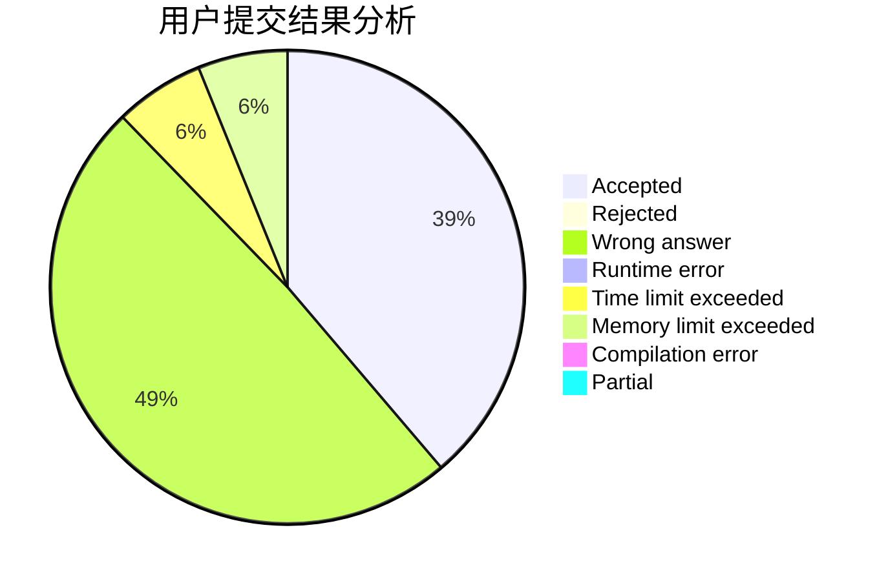
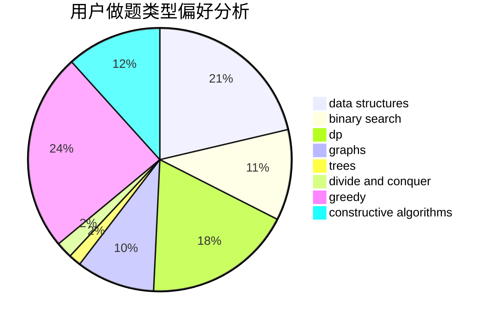

# chiyo

<!-- tabs:start -->

#### **用户提交结果分析**

#### **用户做题类型偏好分析**

#### **用户错题知识点分析**

<!-- tabs:end -->
# 推荐题目
[1457C](https://codeforces.com/contest/1457/problem/C)		dsu,graphs,sortings,trees		  
[814D](https://codeforces.com/contest/814/problem/D)		dfs and similar,
                        dp,
                        geometry,
                        greedy,
                        trees		  
[607E](https://codeforces.com/contest/607/problem/E)		binary search,
                        geometry		  
[540B](https://codeforces.com/contest/540/problem/B)		greedy,
                        implementation		  
[689D](https://codeforces.com/contest/689/problem/D)		binary search,
                        data structures		  
[818D](https://codeforces.com/contest/818/problem/D)		data structures,
                        implementation		  
[1248E](https://codeforces.com/contest/1248/problem/E)		dsu,graphs,sortings,trees		  
[297B](https://codeforces.com/contest/297/problem/B)		constructive algorithms,
                        greedy		  
[574D](https://codeforces.com/contest/574/problem/D)		dsu,graphs,sortings,trees		  
[243B](https://codeforces.com/contest/243/problem/B)		graphs,
                        sortings		  
