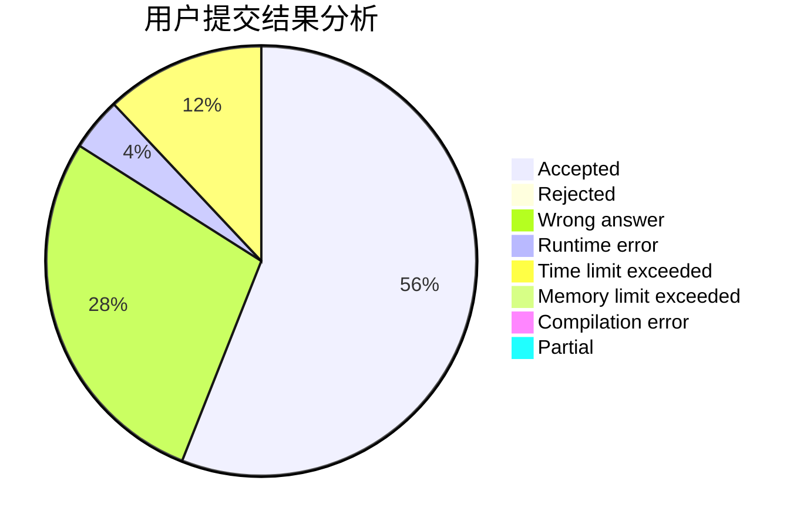
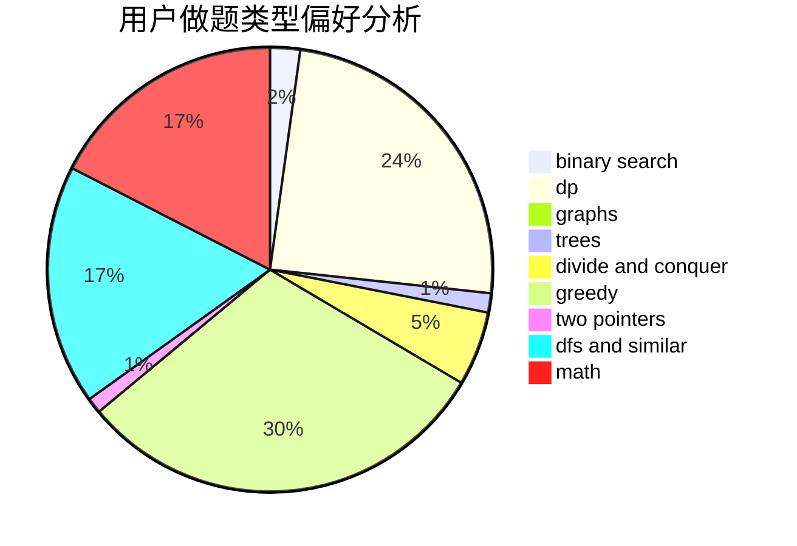

# chtholly_coder

<!-- tabs:start -->

#### **用户提交结果分析**

#### **用户做题类型偏好分析**

<!-- tabs:end -->
# 推荐题目
[1466G](https://codeforces.com/contest/1466/problem/G)
[729D](https://codeforces.com/contest/729/problem/D)
[1447D](https://codeforces.com/contest/1447/problem/D)
[349B](https://codeforces.com/contest/349/problem/B)
[1254E](https://codeforces.com/contest/1254/problem/E)
[996E](https://codeforces.com/contest/996/problem/E)
[1339C](https://codeforces.com/contest/1339/problem/C)
[986F](https://codeforces.com/contest/986/problem/F)
[743E](https://codeforces.com/contest/743/problem/E)
[548B](https://codeforces.com/contest/548/problem/B)
