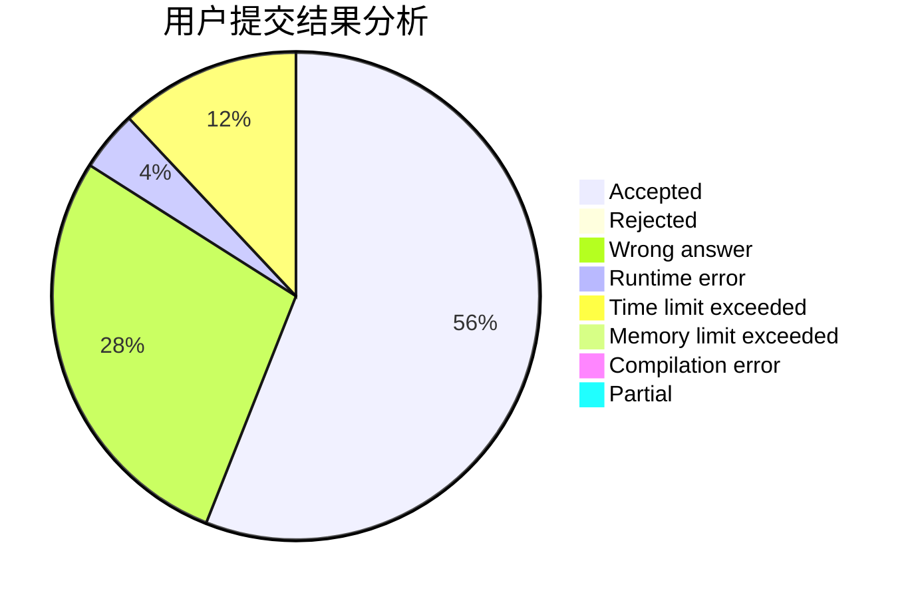
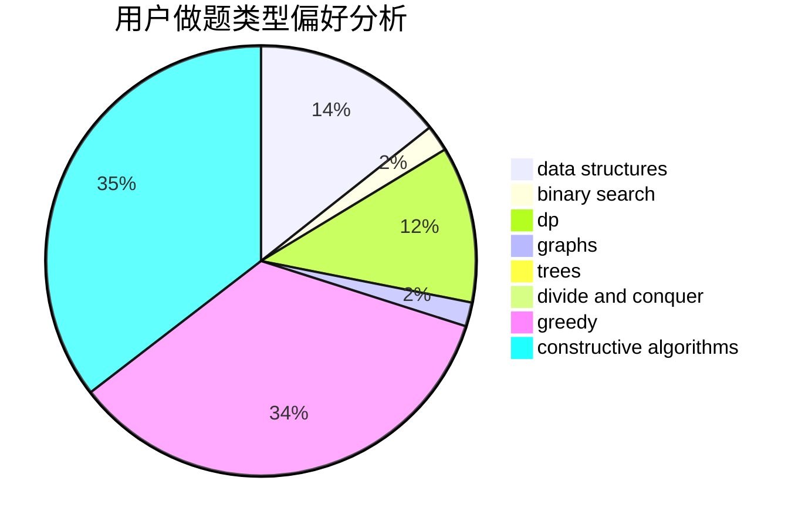
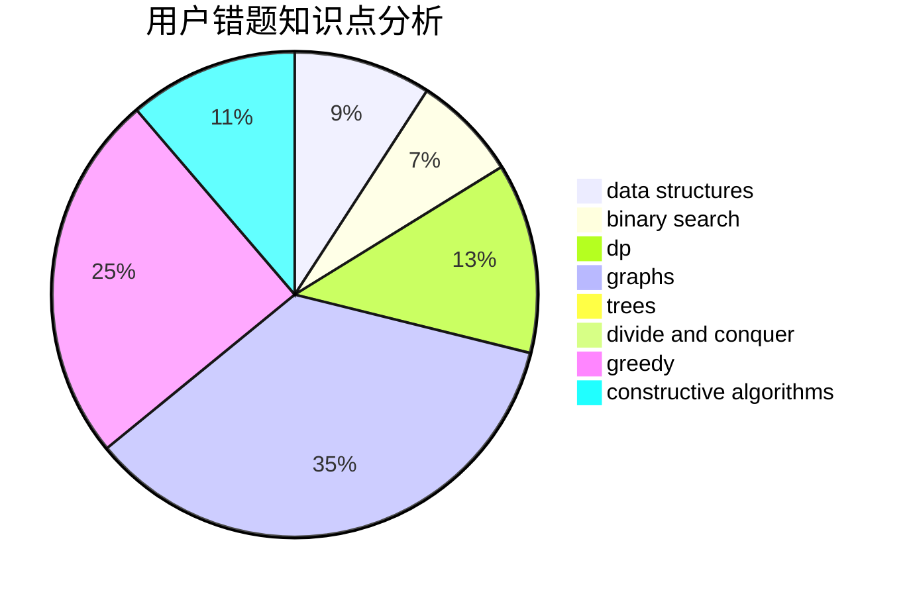

# chtholly_coder

<!-- tabs:start -->

#### **用户提交结果分析**

#### **用户做题类型偏好分析**

#### **用户错题知识点分析**

<!-- tabs:end -->
# 推荐题目
[1457D](https://codeforces.com/contest/1457/problem/D)		dsu,graphs,sortings,trees		  
[709C](https://codeforces.com/contest/709/problem/C)		dsu,graphs,sortings,trees		  
[1437G](https://codeforces.com/contest/1437/problem/G)		data structures,
                        string suffix structures,
                        strings,
                        trees		  
[319A](https://codeforces.com/contest/319/problem/A)		combinatorics,
                        math		  
[1250F](https://codeforces.com/contest/1250/problem/F)		brute force,
                        implementation		  
[981D](https://codeforces.com/contest/981/problem/D)		bitmasks,
                        dp,
                        greedy		  
[1332F](https://codeforces.com/contest/1332/problem/F)		dfs and similar,
                        dp,
                        trees		  
[964C](https://codeforces.com/contest/964/problem/C)		dsu,graphs,sortings,trees		  
[725E](https://codeforces.com/contest/725/problem/E)		brute force,
                        greedy		  
[523A](https://codeforces.com/contest/523/problem/A)		*special problem,
                        implementation		  
