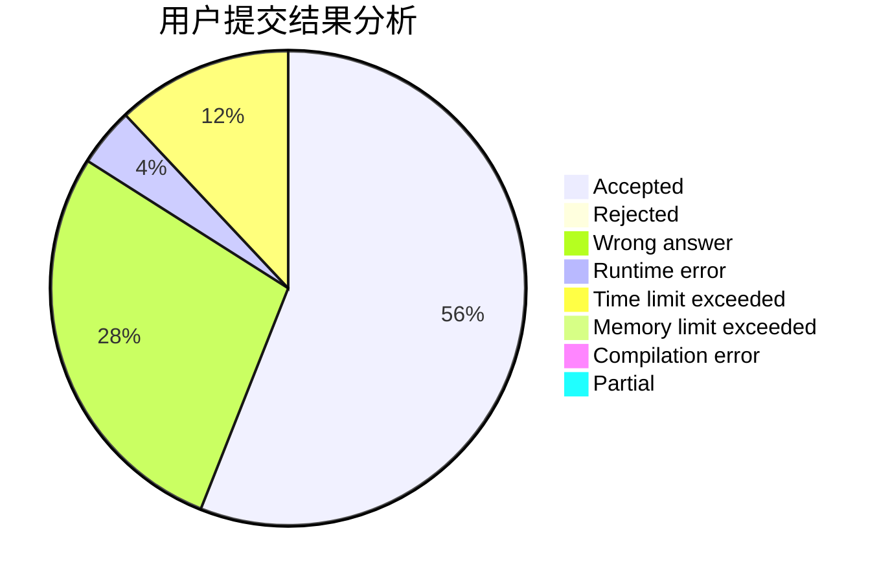
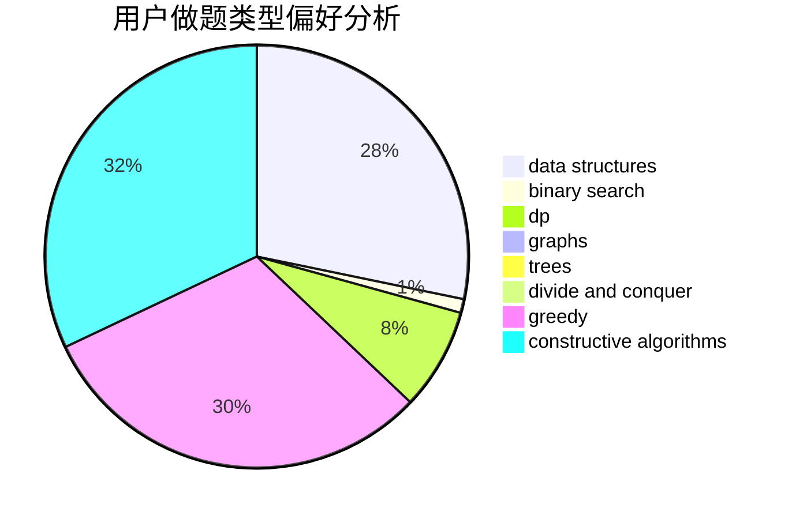
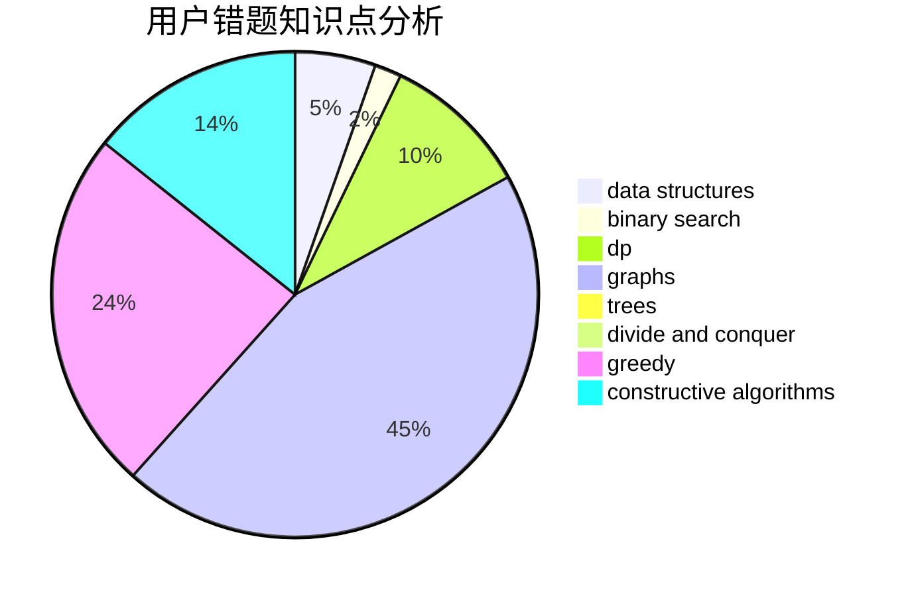

# chtholly_coder

<!-- tabs:start -->

#### **用户提交结果分析**

#### **用户做题类型偏好分析**

#### **用户错题知识点分析**

<!-- tabs:end -->
# 推荐题目
[1466G](https://codeforces.com/contest/1466/problem/G)		combinatorics,
                        divide and conquer,
                        hashing,
                        math,
                        string suffix structures,
                        strings		  
[729D](https://codeforces.com/contest/729/problem/D)		constructive algorithms,
                        greedy,
                        math		  
[1447D](https://codeforces.com/contest/1447/problem/D)		dsu,graphs,sortings,trees		  
[349B](https://codeforces.com/contest/349/problem/B)		data structures,
                        dp,
                        greedy,
                        implementation		  
[1254E](https://codeforces.com/contest/1254/problem/E)		combinatorics,
                        dfs and similar,
                        dsu,
                        trees		  
[996E](https://codeforces.com/contest/996/problem/E)		dsu,graphs,sortings,trees		  
[1339C](https://codeforces.com/contest/1339/problem/C)		dsu,graphs,sortings,trees		  
[986F](https://codeforces.com/contest/986/problem/F)		graphs,
                        math,
                        number theory,
                        shortest paths		  
[743E](https://codeforces.com/contest/743/problem/E)		binary search,
                        bitmasks,
                        brute force,
                        dp		  
[548B](https://codeforces.com/contest/548/problem/B)		brute force,
                        dp,
                        greedy,
                        implementation		  
