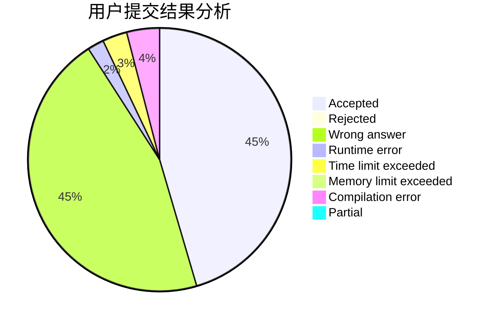
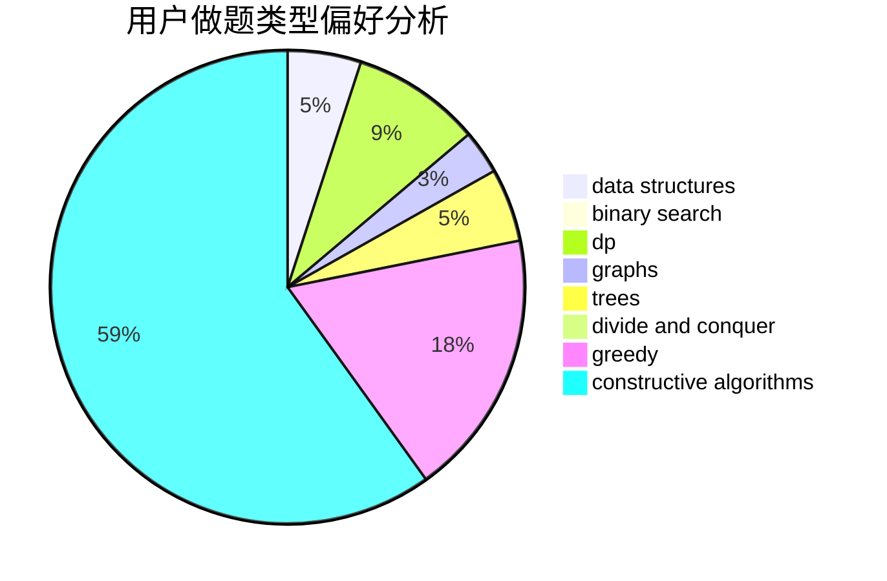

# chunzhen
<!-- tabs:start -->
#### **用户提交结果分析**

#### **用户做题类型偏好分析**

#### **用户错题知识点分析**

<!-- tabs:end -->
# 推荐题目
[AND Sequences](http://codeforces.com/problemset/problem/1513/B)		bitmasks,
                        combinatorics,
                        constructive algorithms,
                        math		  
[Palindrome Partition](http://codeforces.com/problemset/problem/932/G)		dp,
                        string suffix structures,
                        strings		  
[Fox And Polygon](http://codeforces.com/problemset/problem/512/E)		constructive algorithms,
                        divide and conquer		  
[King Moves](http://codeforces.com/problemset/problem/710/A)		implementation		  
[High Cry](https://codeforces.com/contest/876/problem/F)		binary search,
                        bitmasks,
                        combinatorics,
                        data structures,
                        divide and conquer		  
[Magic Numbers](http://codeforces.com/problemset/problem/320/A)		brute force,
                        greedy		  
[Bombs](http://codeforces.com/problemset/problem/1326/E)		data structures,
                        two pointers		  
[Worms](http://codeforces.com/problemset/problem/474/B)		binary search,
                        implementation		  
[Yaroslav and Points](http://codeforces.com/problemset/problem/295/E)		data structures		  
[GukiZ hates Boxes](http://codeforces.com/problemset/problem/551/C)		binary search,
                        greedy		  
<!-- tabs:start -->
#### **data structures**
[AND Sequences](https://codeforces.com/contest/876/problem/F)		binary search,
                        bitmasks,
                        combinatorics,
                        data structures,
                        divide and conquer		  
[Palindrome Partition](http://codeforces.com/problemset/problem/1326/E)		data structures,
                        two pointers		  
[Fox And Polygon](http://codeforces.com/problemset/problem/295/E)		data structures		  
[King Moves](http://codeforces.com/problemset/problem/855/B)		brute force,
                        data structures,
                        dp		  
[High Cry](http://codeforces.com/problemset/problem/1154/E)		data structures,
                        implementation,
                        sortings		  
[Magic Numbers](http://codeforces.com/problemset/problem/746/F)		data structures,
                        greedy,
                        two pointers		  
[Bombs](http://codeforces.com/problemset/problem/1470/E)		binary search,
                        combinatorics,
                        data structures,
                        dp,
                        graphs,
                        implementation,
                        two pointers		  
[Worms](https://codeforces.com/contest/1315/problem/D)		data structures,
                        greedy,
                        sortings		  
[Yaroslav and Points](http://codeforces.com/problemset/problem/650/A)		data structures,
                        geometry,
                        math		  
[GukiZ hates Boxes](http://codeforces.com/problemset/problem/1286/D)		data structures,
                        math,
                        matrices,
                        probabilities		  
#### **binary search**
[AND Sequences](https://codeforces.com/contest/876/problem/F)		binary search,
                        bitmasks,
                        combinatorics,
                        data structures,
                        divide and conquer		  
[Palindrome Partition](http://codeforces.com/problemset/problem/474/B)		binary search,
                        implementation		  
[Fox And Polygon](http://codeforces.com/problemset/problem/551/C)		binary search,
                        greedy		  
[King Moves](http://codeforces.com/problemset/problem/778/A)		binary search,
                        greedy,
                        strings		  
[High Cry](http://codeforces.com/problemset/problem/696/F)		binary search,
                        geometry,
                        two pointers		  
[Magic Numbers](http://codeforces.com/problemset/problem/1470/E)		binary search,
                        combinatorics,
                        data structures,
                        dp,
                        graphs,
                        implementation,
                        two pointers		  
[Bombs](http://codeforces.com/problemset/problem/1492/C)		binary search,
                        data structures,
                        dp,
                        greedy,
                        two pointers		  
[Worms](http://codeforces.com/problemset/problem/1463/D)		binary search,
                        constructive algorithms,
                        greedy,
                        two pointers		  
[Yaroslav and Points](http://codeforces.com/problemset/problem/1490/G)		binary search,
                        data structures,
                        math		  
[GukiZ hates Boxes](http://codeforces.com/problemset/problem/1479/D)		binary search,
                        bitmasks,
                        brute force,
                        data structures,
                        probabilities,
                        trees		  
#### **dp**
[AND Sequences](http://codeforces.com/problemset/problem/932/G)		dp,
                        string suffix structures,
                        strings		  
[Palindrome Partition](http://codeforces.com/problemset/problem/855/B)		brute force,
                        data structures,
                        dp		  
[Fox And Polygon](http://codeforces.com/problemset/problem/1354/F)		constructive algorithms,
                        dp,
                        flows,
                        graph matchings,
                        greedy,
                        sortings		  
[King Moves](http://codeforces.com/problemset/problem/319/C)		dp,
                        geometry		  
[High Cry](http://codeforces.com/problemset/problem/441/E)		bitmasks,
                        dp,
                        math,
                        probabilities		  
[Magic Numbers](http://codeforces.com/problemset/problem/1470/E)		binary search,
                        combinatorics,
                        data structures,
                        dp,
                        graphs,
                        implementation,
                        two pointers		  
[Bombs](http://codeforces.com/problemset/problem/914/H)		combinatorics,
                        dp,
                        games,
                        trees		  
[Worms](http://codeforces.com/problemset/problem/1500/F)		dp		  
[Yaroslav and Points](https://codeforces.com/contest/934/problem/C)		dp		  
[GukiZ hates Boxes](http://codeforces.com/problemset/problem/1492/C)		binary search,
                        data structures,
                        dp,
                        greedy,
                        two pointers		  
#### **graph**
[AND Sequences](http://codeforces.com/problemset/problem/1354/F)		constructive algorithms,
                        dp,
                        flows,
                        graph matchings,
                        greedy,
                        sortings		  
[Palindrome Partition](http://codeforces.com/problemset/problem/1065/B)		constructive algorithms,
                        graphs		  
[Fox And Polygon](http://codeforces.com/problemset/problem/1470/E)		binary search,
                        combinatorics,
                        data structures,
                        dp,
                        graphs,
                        implementation,
                        two pointers		  
[King Moves](http://codeforces.com/problemset/problem/1487/C)		brute force,
                        constructive algorithms,
                        dfs and similar,
                        graphs,
                        greedy,
                        implementation,
                        math		  
[High Cry](http://codeforces.com/problemset/problem/1437/C)		dp,
                        flows,
                        graph matchings,
                        greedy,
                        math,
                        sortings		  
[Magic Numbers](http://codeforces.com/problemset/problem/1470/D)		constructive algorithms,
                        dfs and similar,
                        graph matchings,
                        graphs,
                        greedy		  
[Bombs](http://codeforces.com/problemset/problem/1476/C)		dp,
                        graphs,
                        greedy		  
[Worms](http://codeforces.com/problemset/problem/1304/D)		constructive algorithms,
                        graphs,
                        greedy,
                        two pointers		  
[Yaroslav and Points](http://codeforces.com/problemset/problem/1475/C)		combinatorics,
                        graphs,
                        math		  
[GukiZ hates Boxes](http://codeforces.com/problemset/problem/553/E)		dp,
                        fft,
                        graphs,
                        math,
                        probabilities		  
#### **trees**
[AND Sequences](http://codeforces.com/problemset/problem/914/H)		combinatorics,
                        dp,
                        games,
                        trees		  
[Palindrome Partition](http://codeforces.com/problemset/problem/1479/D)		binary search,
                        bitmasks,
                        brute force,
                        data structures,
                        probabilities,
                        trees		  
[Fox And Polygon](http://codeforces.com/problemset/problem/1511/C)		brute force,
                        data structures,
                        implementation,
                        trees		  
[King Moves](http://codeforces.com/problemset/problem/1499/F)		combinatorics,
                        dfs and similar,
                        dp,
                        trees		  
[High Cry](http://codeforces.com/problemset/problem/1491/E)		brute force,
                        dfs and similar,
                        divide and conquer,
                        number theory,
                        trees		  
[Magic Numbers](http://codeforces.com/problemset/problem/1466/D)		data structures,
                        greedy,
                        sortings,
                        trees		  
[Bombs](http://codeforces.com/problemset/problem/1495/D)		combinatorics,
                        dfs and similar,
                        graphs,
                        math,
                        shortest paths,
                        trees		  
[Worms](http://codeforces.com/problemset/problem/1303/G)		data structures,
                        divide and conquer,
                        geometry,
                        trees		  
[Yaroslav and Points](http://codeforces.com/problemset/problem/1454/E)		combinatorics,
                        dfs and similar,
                        graphs,
                        trees		  
[GukiZ hates Boxes](http://codeforces.com/problemset/problem/1494/D)		constructive algorithms,
                        data structures,
                        dfs and similar,
                        divide and conquer,
                        dsu,
                        greedy,
                        sortings,
                        trees		  
#### **divide and conquer**
[AND Sequences](http://codeforces.com/problemset/problem/512/E)		constructive algorithms,
                        divide and conquer		  
[Palindrome Partition](https://codeforces.com/contest/876/problem/F)		binary search,
                        bitmasks,
                        combinatorics,
                        data structures,
                        divide and conquer		  
[Fox And Polygon](http://codeforces.com/problemset/problem/768/B)		constructive algorithms,
                        dfs and similar,
                        divide and conquer		  
[King Moves](http://codeforces.com/problemset/problem/1408/F)		constructive algorithms,
                        divide and conquer		  
[High Cry](http://codeforces.com/problemset/problem/1461/D)		binary search,
                        brute force,
                        data structures,
                        divide and conquer,
                        implementation,
                        sortings		  
[Magic Numbers](http://codeforces.com/problemset/problem/1466/G)		combinatorics,
                        divide and conquer,
                        hashing,
                        math,
                        string suffix structures,
                        strings		  
[Bombs](http://codeforces.com/problemset/problem/1490/D)		dfs and similar,
                        divide and conquer,
                        implementation		  
[Worms](https://codeforces.com/contest/1483/problem/C)		data structures,
                        divide and conquer,
                        dp		  
[Yaroslav and Points](http://codeforces.com/problemset/problem/1491/E)		brute force,
                        dfs and similar,
                        divide and conquer,
                        number theory,
                        trees		  
[GukiZ hates Boxes](http://codeforces.com/problemset/problem/1303/G)		data structures,
                        divide and conquer,
                        geometry,
                        trees		  
#### **greedy**
[AND Sequences](http://codeforces.com/problemset/problem/320/A)		brute force,
                        greedy		  
[Palindrome Partition](http://codeforces.com/problemset/problem/551/C)		binary search,
                        greedy		  
[Fox And Polygon](http://codeforces.com/problemset/problem/12/C)		greedy,
                        implementation,
                        sortings		  
[King Moves](http://codeforces.com/problemset/problem/778/A)		binary search,
                        greedy,
                        strings		  
[High Cry](http://codeforces.com/problemset/problem/1354/F)		constructive algorithms,
                        dp,
                        flows,
                        graph matchings,
                        greedy,
                        sortings		  
[Magic Numbers](http://codeforces.com/problemset/problem/746/F)		data structures,
                        greedy,
                        two pointers		  
[Bombs](https://codeforces.com/contest/1315/problem/D)		data structures,
                        greedy,
                        sortings		  
[Worms](http://codeforces.com/problemset/problem/1329/A)		constructive algorithms,
                        greedy,
                        implementation,
                        math		  
[Yaroslav and Points](http://codeforces.com/problemset/problem/1492/C)		binary search,
                        data structures,
                        dp,
                        greedy,
                        two pointers		  
[GukiZ hates Boxes](https://codeforces.com/contest/1496/problem/C)		geometry,
                        greedy,
                        math,
                        sortings		  
#### **constructive algorithms**
[AND Sequences](http://codeforces.com/problemset/problem/1513/B)		bitmasks,
                        combinatorics,
                        constructive algorithms,
                        math		  
[Palindrome Partition](http://codeforces.com/problemset/problem/512/E)		constructive algorithms,
                        divide and conquer		  
[Fox And Polygon](http://codeforces.com/problemset/problem/1354/F)		constructive algorithms,
                        dp,
                        flows,
                        graph matchings,
                        greedy,
                        sortings		  
[King Moves](http://codeforces.com/problemset/problem/1065/B)		constructive algorithms,
                        graphs		  
[High Cry](http://codeforces.com/problemset/problem/1196/B)		constructive algorithms,
                        math		  
[Magic Numbers](http://codeforces.com/problemset/problem/1063/E)		constructive algorithms,
                        math		  
[Bombs](http://codeforces.com/problemset/problem/768/B)		constructive algorithms,
                        dfs and similar,
                        divide and conquer		  
[Worms](http://codeforces.com/problemset/problem/1174/D)		bitmasks,
                        constructive algorithms		  
[Yaroslav and Points](http://codeforces.com/problemset/problem/1408/F)		constructive algorithms,
                        divide and conquer		  
[GukiZ hates Boxes](http://codeforces.com/problemset/problem/1329/A)		constructive algorithms,
                        greedy,
                        implementation,
                        math		  
#### **sortings**
[AND Sequences](http://codeforces.com/problemset/problem/12/C)		greedy,
                        implementation,
                        sortings		  
[Palindrome Partition](http://codeforces.com/problemset/problem/1354/F)		constructive algorithms,
                        dp,
                        flows,
                        graph matchings,
                        greedy,
                        sortings		  
[Fox And Polygon](http://codeforces.com/problemset/problem/1154/E)		data structures,
                        implementation,
                        sortings		  
[King Moves](https://codeforces.com/contest/1315/problem/D)		data structures,
                        greedy,
                        sortings		  
[High Cry](https://codeforces.com/contest/1496/problem/C)		geometry,
                        greedy,
                        math,
                        sortings		  
[Magic Numbers](http://codeforces.com/problemset/problem/1495/A)		geometry,
                        greedy,
                        math,
                        sortings		  
[Bombs](http://codeforces.com/problemset/problem/1497/A)		brute force,
                        data structures,
                        greedy,
                        sortings		  
[Worms](http://codeforces.com/problemset/problem/1427/A)		math,
                        sortings		  
[Yaroslav and Points](http://codeforces.com/problemset/problem/1461/D)		binary search,
                        brute force,
                        data structures,
                        divide and conquer,
                        implementation,
                        sortings		  
[GukiZ hates Boxes](http://codeforces.com/problemset/problem/1437/C)		dp,
                        flows,
                        graph matchings,
                        greedy,
                        math,
                        sortings		  
<!-- tabs:end -->
