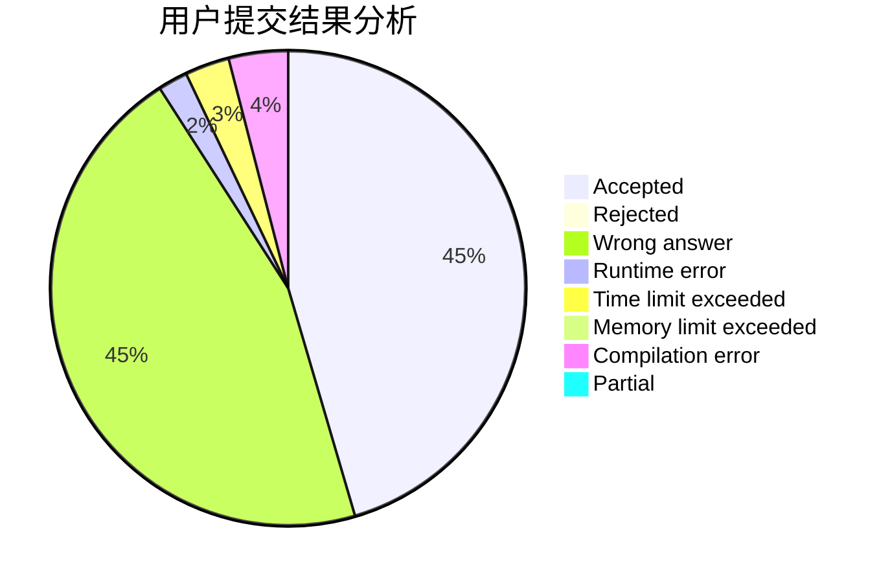
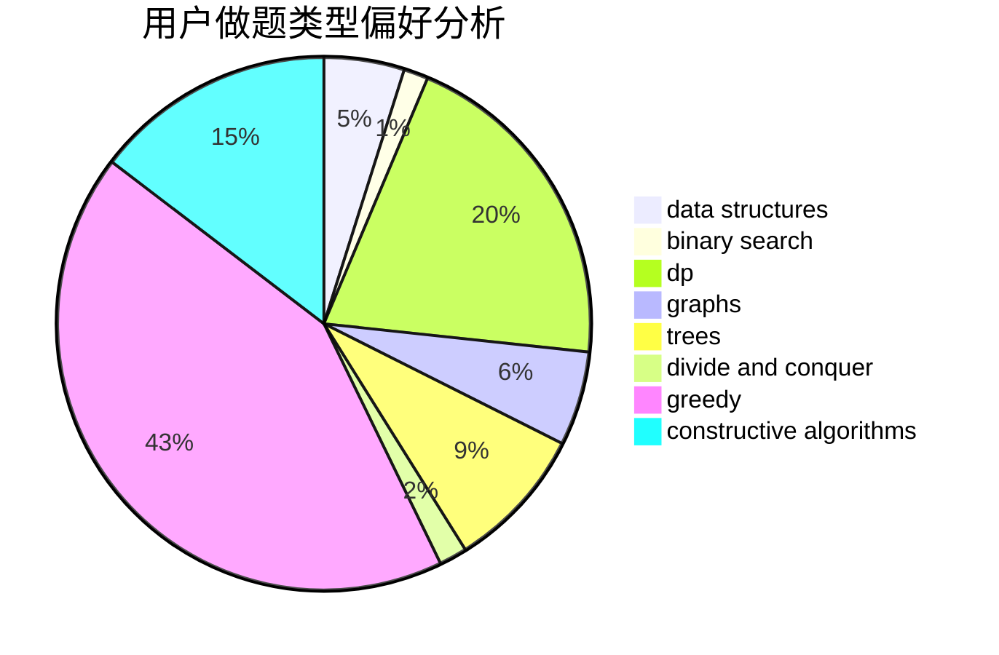

# chunzhen

<!-- tabs:start -->

#### **用户提交结果分析**

#### **用户做题类型偏好分析**

#### **用户错题知识点分析**

<!-- tabs:end -->
# 推荐题目
[535E](https://codeforces.com/contest/535/problem/E)		geometry,
                        math		  
[1065F](https://codeforces.com/contest/1065/problem/F)		dfs and similar,
                        dp,
                        trees		  
[11C](https://codeforces.com/contest/11/problem/C)		implementation		  
[954I](https://codeforces.com/contest/954/problem/I)		fft,
                        math		  
[766B](https://codeforces.com/contest/766/problem/B)		constructive algorithms,
                        geometry,
                        greedy,
                        math,
                        number theory,
                        sortings		  
[492C](https://codeforces.com/contest/492/problem/C)		greedy,
                        sortings		  
[1156E](https://codeforces.com/contest/1156/problem/E)		data structures,
                        divide and conquer,
                        dsu,
                        two pointers		  
[233C](https://codeforces.com/contest/233/problem/C)		dsu,graphs,sortings,trees		  
[172A](https://codeforces.com/contest/172/problem/A)		*special problem,
                        brute force,
                        implementation		  
[34C](https://codeforces.com/contest/34/problem/C)		expression parsing,
                        implementation,
                        sortings,
                        strings		  
