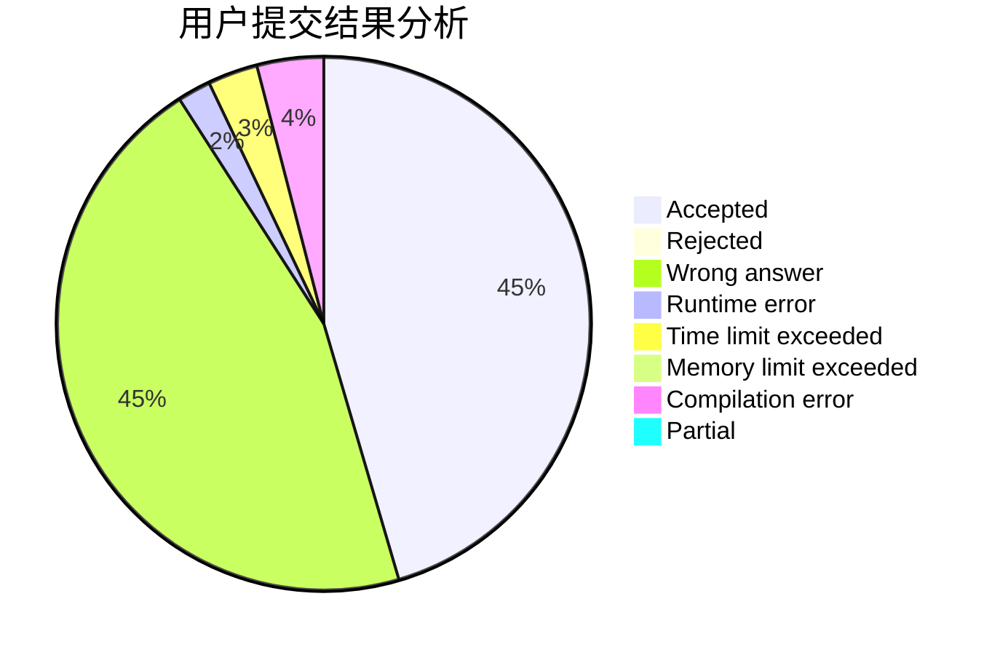
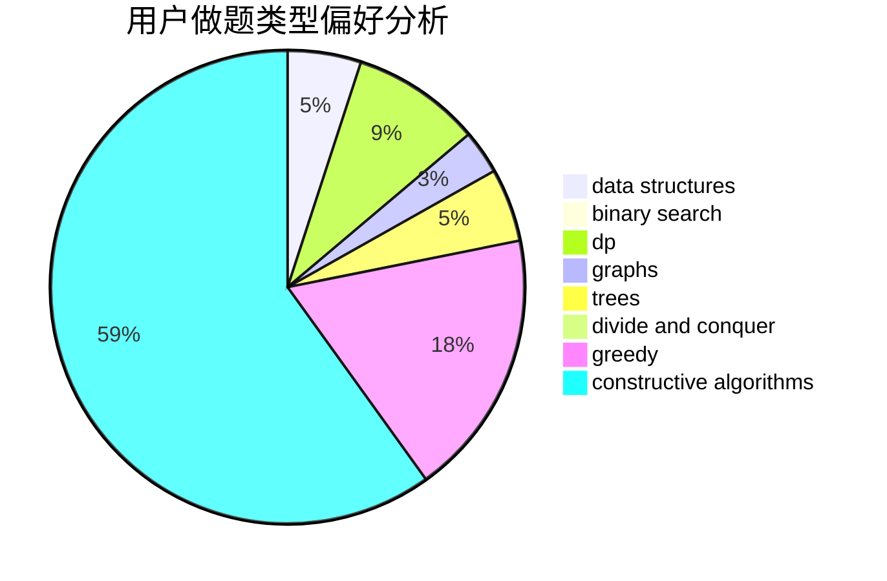

# chunzhen

<!-- tabs:start -->

#### **用户提交结果分析**

#### **用户做题类型偏好分析**

#### **用户错题知识点分析**

<!-- tabs:end -->
# 推荐题目
[512E](https://codeforces.com/contest/512/problem/E)		constructive algorithms,
                        divide and conquer		  
[1065B](https://codeforces.com/contest/1065/problem/B)		constructive algorithms,
                        graphs		  
[1196B](https://codeforces.com/contest/1196/problem/B)		constructive algorithms,
                        math		  
[932G](https://codeforces.com/contest/932/problem/G)		dp,
                        string suffix structures,
                        strings		  
[746F](https://codeforces.com/contest/746/problem/F)		data structures,
                        greedy,
                        two pointers		  
[474B](https://codeforces.com/contest/474/problem/B)		binary search,
                        implementation		  
[1154E](https://codeforces.com/contest/1154/problem/E)		data structures,
                        implementation,
                        sortings		  
[215A](https://codeforces.com/contest/215/problem/A)		brute force,
                        implementation		  
[1513B](https://codeforces.com/contest/1513/problem/B)		bitmasks,
                        combinatorics,
                        constructive algorithms,
                        math		  
[319C](https://codeforces.com/contest/319/problem/C)		dp,
                        geometry		  
