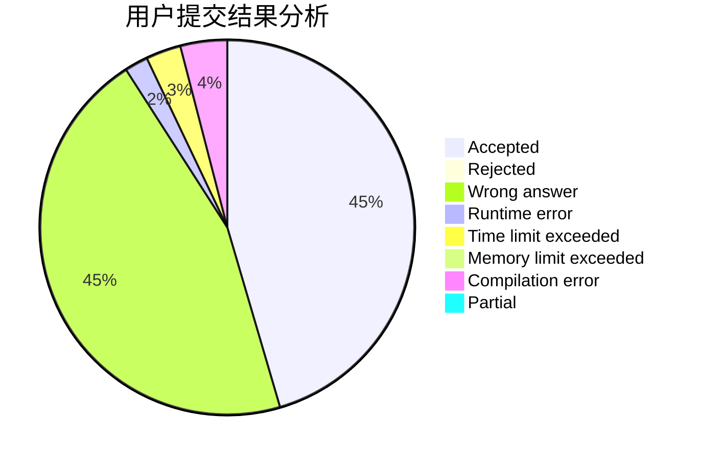
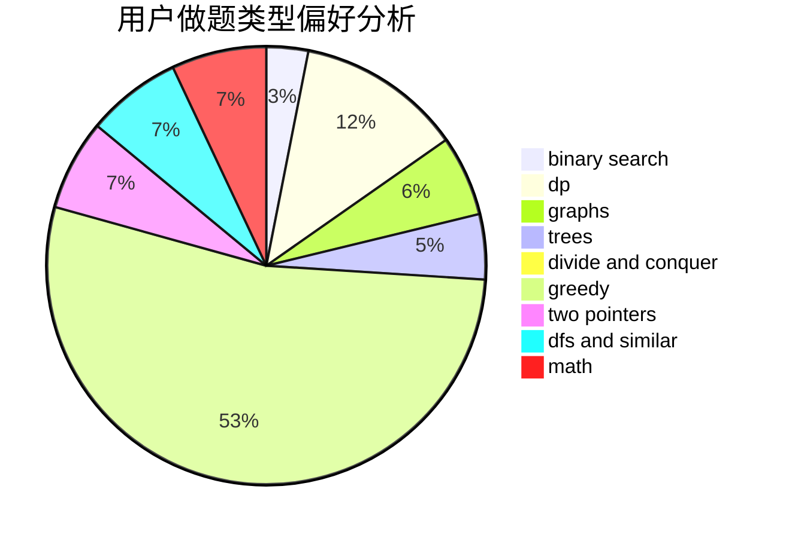

# chunzhen

<!-- tabs:start -->

#### **用户提交结果分析**

#### **用户做题类型偏好分析**

<!-- tabs:end -->
# 推荐题目
[535E](https://codeforces.com/contest/535/problem/E)
[1065F](https://codeforces.com/contest/1065/problem/F)
[11C](https://codeforces.com/contest/11/problem/C)
[954I](https://codeforces.com/contest/954/problem/I)
[766B](https://codeforces.com/contest/766/problem/B)
[492C](https://codeforces.com/contest/492/problem/C)
[1156E](https://codeforces.com/contest/1156/problem/E)
[233C](https://codeforces.com/contest/233/problem/C)
[172A](https://codeforces.com/contest/172/problem/A)
[34C](https://codeforces.com/contest/34/problem/C)
