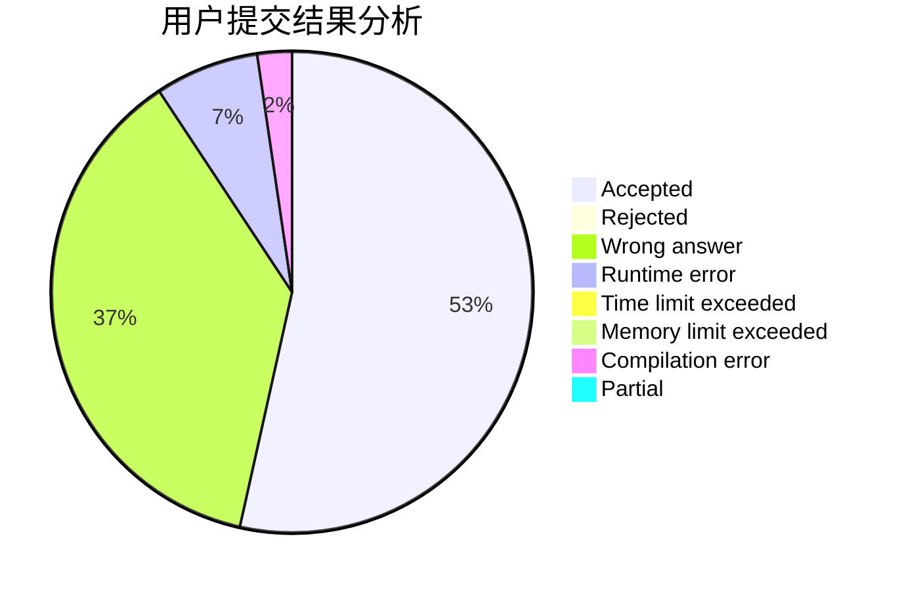
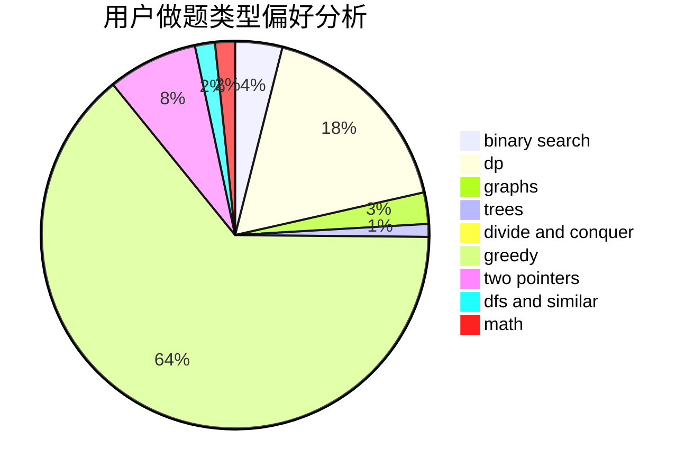

# chuochuo

<!-- tabs:start -->

#### **用户提交结果分析**

#### **用户做题类型偏好分析**

<!-- tabs:end -->
# 推荐题目
[835C](https://codeforces.com/contest/835/problem/C)
[560E](https://codeforces.com/contest/560/problem/E)
[160D](https://codeforces.com/contest/160/problem/D)
[120H](https://codeforces.com/contest/120/problem/H)
[962C](https://codeforces.com/contest/962/problem/C)
[536D](https://codeforces.com/contest/536/problem/D)
[979E](https://codeforces.com/contest/979/problem/E)
[291B](https://codeforces.com/contest/291/problem/B)
[159D](https://codeforces.com/contest/159/problem/D)
[225D](https://codeforces.com/contest/225/problem/D)
