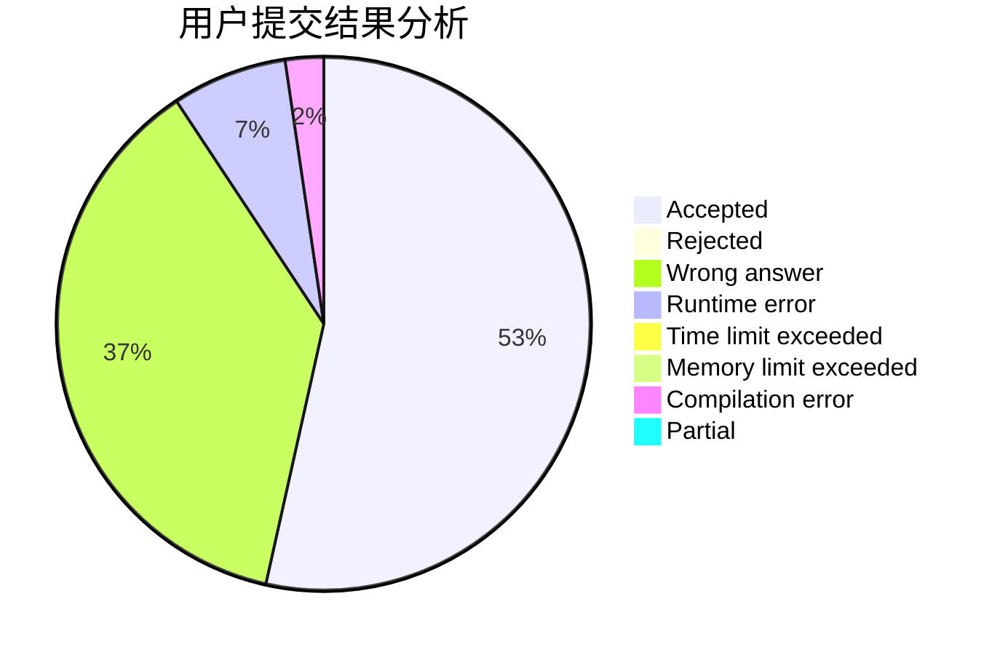
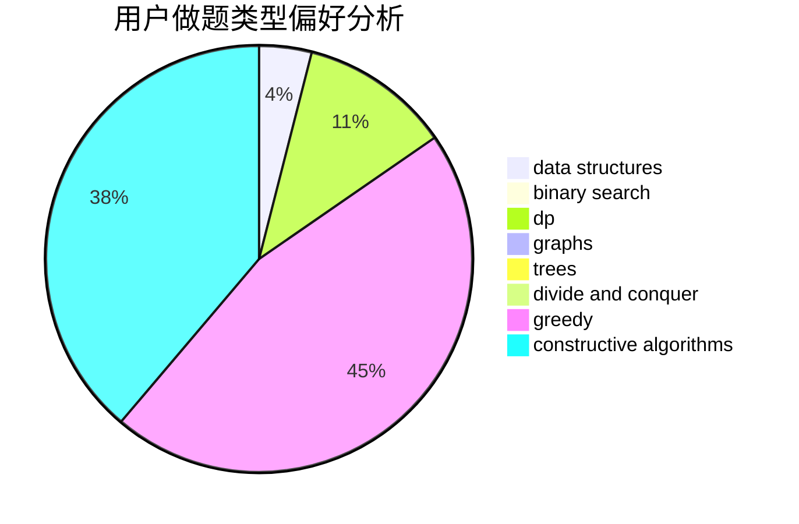

# chuochuo

<!-- tabs:start -->

#### **用户提交结果分析**

#### **用户做题类型偏好分析**

#### **用户错题知识点分析**

<!-- tabs:end -->
# 推荐题目
[835C](https://codeforces.com/contest/835/problem/C)		dp,
                        implementation		  
[560E](https://codeforces.com/contest/560/problem/E)		dsu,graphs,sortings,trees		  
[160D](https://codeforces.com/contest/160/problem/D)		dfs and similar,
                        dsu,
                        graphs,
                        sortings		  
[120H](https://codeforces.com/contest/120/problem/H)		graph matchings		  
[962C](https://codeforces.com/contest/962/problem/C)		brute force,
                        implementation,
                        math		  
[536D](https://codeforces.com/contest/536/problem/D)		dp,
                        games		  
[979E](https://codeforces.com/contest/979/problem/E)		dp		  
[291B](https://codeforces.com/contest/291/problem/B)		*special problem,
                        implementation,
                        strings		  
[159D](https://codeforces.com/contest/159/problem/D)		*special problem,
                        brute force,
                        dp,
                        strings		  
[225D](https://codeforces.com/contest/225/problem/D)		bitmasks,
                        dfs and similar,
                        graphs,
                        implementation		  
