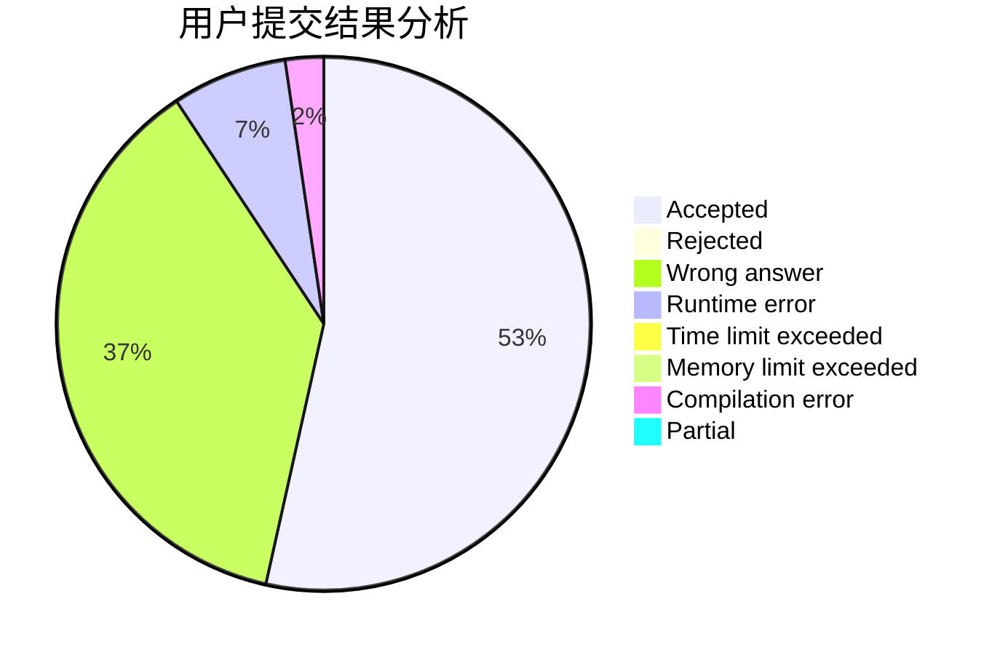
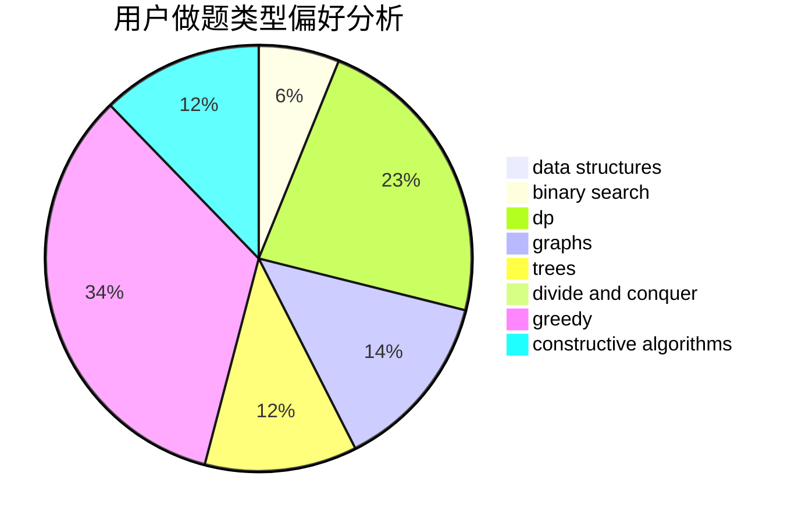

# chuochuo

<!-- tabs:start -->

#### **用户提交结果分析**

#### **用户做题类型偏好分析**

#### **用户错题知识点分析**

<!-- tabs:end -->
# 推荐题目
[816B](https://codeforces.com/contest/816/problem/B)		binary search,
                        data structures,
                        implementation		  
[53E](https://codeforces.com/contest/53/problem/E)		bitmasks,
                        dp		  
[1509F](https://codeforces.com/contest/1509/problem/F)		dsu,graphs,sortings,trees		  
[1205E](https://codeforces.com/contest/1205/problem/E)		combinatorics,
                        strings		  
[940F](https://codeforces.com/contest/940/problem/F)		brute force,
                        data structures		  
[513A](https://codeforces.com/contest/513/problem/A)		constructive algorithms,
                        math		  
[958B2](https://codeforces.com/contest/958B/problem/2)		data structures,
                        dfs and similar,
                        graphs,
                        greedy,
                        trees		  
[276E](https://codeforces.com/contest/276/problem/E)		data structures,
                        graphs,
                        trees		  
[1508B](https://codeforces.com/contest/1508/problem/B)		binary search,
                        bitmasks,
                        combinatorics,
                        constructive algorithms,
                        implementation,
                        math		  
[200B](https://codeforces.com/contest/200/problem/B)		implementation,
                        math		  
