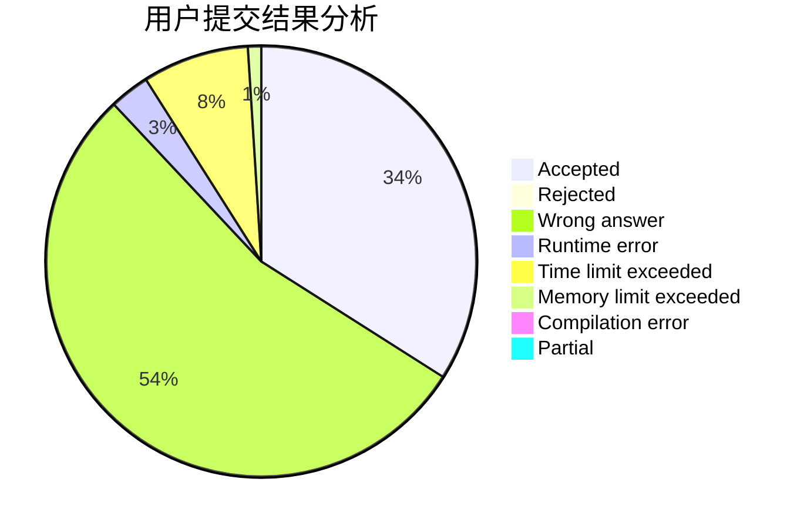
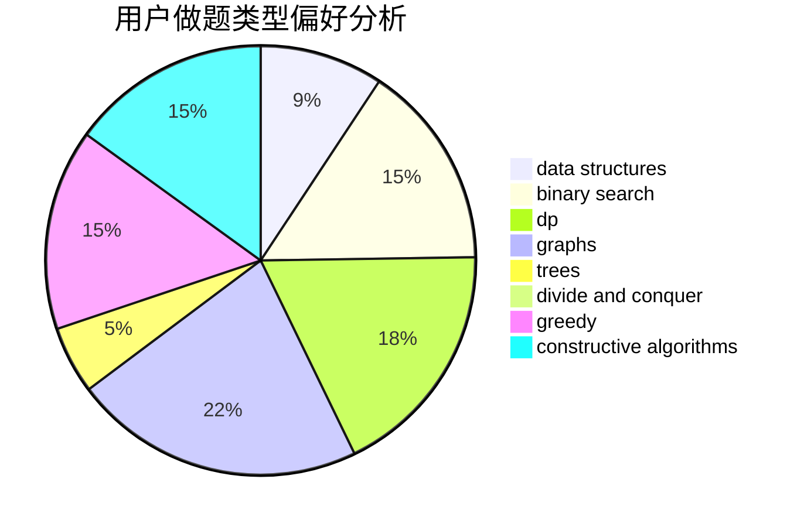
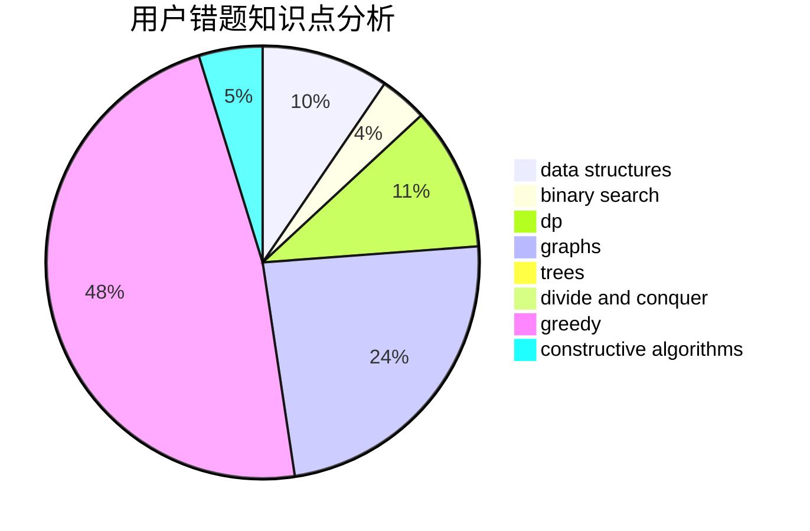

# chychy

<!-- tabs:start -->

#### **用户提交结果分析**

#### **用户做题类型偏好分析**

#### **用户错题知识点分析**

<!-- tabs:end -->
# 推荐题目
[1474E](https://codeforces.com/contest/1474/problem/E)		constructive algorithms,
                        greedy		  
[33A](https://codeforces.com/contest/33/problem/A)		greedy,
                        implementation		  
[1133A](https://codeforces.com/contest/1133/problem/A)		implementation		  
[1371E1](https://codeforces.com/contest/1371E/problem/1)		binary search,
                        brute force,
                        combinatorics,
                        math,
                        number theory,
                        sortings		  
[495B](https://codeforces.com/contest/495/problem/B)		math,
                        number theory		  
[958B1](https://codeforces.com/contest/958B/problem/1)		implementation		  
[1017D](https://codeforces.com/contest/1017/problem/D)		bitmasks,
                        brute force,
                        data structures		  
[1303C](https://codeforces.com/contest/1303/problem/C)		dfs and similar,
                        greedy,
                        implementation		  
[982F](https://codeforces.com/contest/982/problem/F)		dfs and similar,
                        graphs		  
[575A](https://codeforces.com/contest/575/problem/A)		data structures,
                        math,
                        matrices		  
