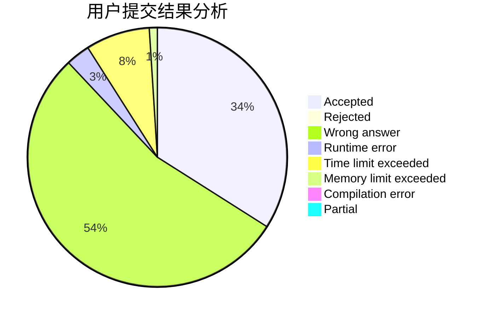
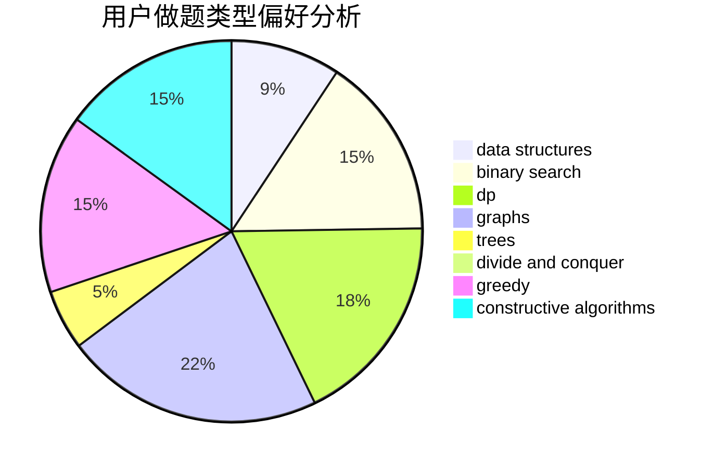
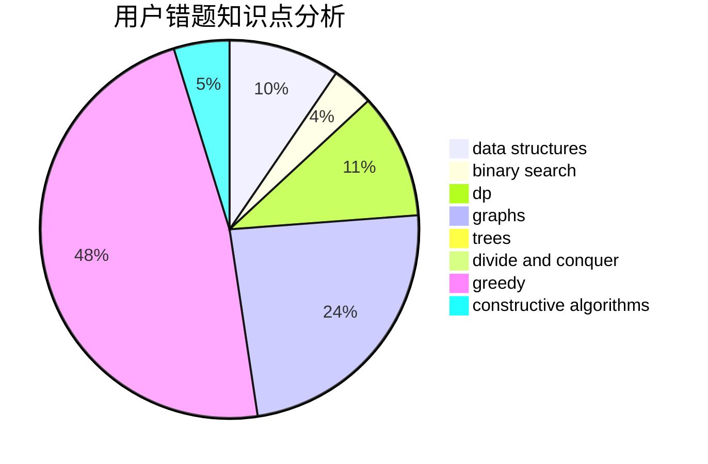

# chychy
<!-- tabs:start -->
#### **用户提交结果分析**

#### **用户做题类型偏好分析**

#### **用户错题知识点分析**

<!-- tabs:end -->
# 推荐题目
[Limericks](http://codeforces.com/problemset/problem/1331/B)		math,
                        number theory		  
[Row GCD](http://codeforces.com/problemset/problem/1458/A)		math,
                        number theory		  
[Minimum Value Rectangle](http://codeforces.com/problemset/problem/1027/C)		greedy		  
[Data Center Drama](http://codeforces.com/problemset/problem/527/E)		dfs and similar,
                        graphs		  
[As Simple as One and Two](http://codeforces.com/problemset/problem/1276/A)		dp,
                        greedy		  
[Neko and Aki's Prank](http://codeforces.com/problemset/problem/1152/D)		dp,
                        greedy,
                        trees		  
[Middle of the Contest](http://codeforces.com/problemset/problem/1133/A)		implementation		  
[Fibonotci](http://codeforces.com/problemset/problem/575/A)		data structures,
                        math,
                        matrices		  
[What is for dinner?](http://codeforces.com/problemset/problem/33/A)		greedy,
                        implementation		  
[Views Matter](http://codeforces.com/problemset/problem/1061/B)		greedy,
                        implementation,
                        sortings		  
<!-- tabs:start -->
#### **data structures**
[Limericks](http://codeforces.com/problemset/problem/575/A)		data structures,
                        math,
                        matrices		  
[Row GCD](http://codeforces.com/problemset/problem/1017/D)		bitmasks,
                        brute force,
                        data structures		  
[Minimum Value Rectangle](https://codeforces.com/contest/737/problem/C)		constructive algorithms,
                        data structures,
                        graphs,
                        greedy,
                        sortings		  
[Data Center Drama](https://codeforces.com/contest/1382/problem/C1)		constructive algorithms,
                        data structures,
                        strings		  
[As Simple as One and Two](http://codeforces.com/problemset/problem/1324/D)		binary search,
                        data structures,
                        sortings,
                        two pointers		  
[Neko and Aki's Prank](http://codeforces.com/problemset/problem/1257/D)		binary search,
                        data structures,
                        dp,
                        greedy,
                        sortings,
                        two pointers		  
[Middle of the Contest](http://codeforces.com/problemset/problem/1492/C)		binary search,
                        data structures,
                        dp,
                        greedy,
                        two pointers		  
[Fibonotci](http://codeforces.com/problemset/problem/1490/G)		binary search,
                        data structures,
                        math		  
[What is for dinner?](http://codeforces.com/problemset/problem/1479/D)		binary search,
                        bitmasks,
                        brute force,
                        data structures,
                        probabilities,
                        trees		  
[Views Matter](http://codeforces.com/problemset/problem/1497/A)		brute force,
                        data structures,
                        greedy,
                        sortings		  
#### **binary search**
[Limericks](http://codeforces.com/problemset/problem/607/A)		binary search,
                        dp		  
[Row GCD](http://codeforces.com/problemset/problem/1371/E1)		binary search,
                        brute force,
                        combinatorics,
                        math,
                        number theory,
                        sortings		  
[Minimum Value Rectangle](http://codeforces.com/problemset/problem/125/E)		binary search,
                        graphs		  
[Data Center Drama](http://codeforces.com/problemset/problem/1324/D)		binary search,
                        data structures,
                        sortings,
                        two pointers		  
[As Simple as One and Two](http://codeforces.com/problemset/problem/1257/D)		binary search,
                        data structures,
                        dp,
                        greedy,
                        sortings,
                        two pointers		  
[Neko and Aki's Prank](http://codeforces.com/problemset/problem/1492/C)		binary search,
                        data structures,
                        dp,
                        greedy,
                        two pointers		  
[Middle of the Contest](http://codeforces.com/problemset/problem/1463/D)		binary search,
                        constructive algorithms,
                        greedy,
                        two pointers		  
[Fibonotci](http://codeforces.com/problemset/problem/1490/G)		binary search,
                        data structures,
                        math		  
[What is for dinner?](http://codeforces.com/problemset/problem/1479/D)		binary search,
                        bitmasks,
                        brute force,
                        data structures,
                        probabilities,
                        trees		  
[Views Matter](http://codeforces.com/problemset/problem/1436/E)		binary search,
                        data structures,
                        two pointers		  
#### **dp**
[Limericks](http://codeforces.com/problemset/problem/1276/A)		dp,
                        greedy		  
[Row GCD](http://codeforces.com/problemset/problem/1152/D)		dp,
                        greedy,
                        trees		  
[Minimum Value Rectangle](http://codeforces.com/problemset/problem/1149/B)		dp,
                        implementation,
                        strings		  
[Data Center Drama](http://codeforces.com/problemset/problem/607/A)		binary search,
                        dp		  
[As Simple as One and Two](http://codeforces.com/problemset/problem/1225/G)		bitmasks,
                        constructive algorithms,
                        dp,
                        greedy,
                        number theory		  
[Neko and Aki's Prank](http://codeforces.com/problemset/problem/1140/D)		dp,
                        greedy,
                        math		  
[Middle of the Contest](http://codeforces.com/problemset/problem/893/E)		combinatorics,
                        dp,
                        math,
                        number theory		  
[Fibonotci](http://codeforces.com/problemset/problem/1404/B)		dfs and similar,
                        dp,
                        games,
                        trees		  
[What is for dinner?](http://codeforces.com/problemset/problem/581/F)		dp,
                        trees,
                        two pointers		  
[Views Matter](http://codeforces.com/problemset/problem/1257/D)		binary search,
                        data structures,
                        dp,
                        greedy,
                        sortings,
                        two pointers		  
#### **graph**
[Limericks](http://codeforces.com/problemset/problem/527/E)		dfs and similar,
                        graphs		  
[Row GCD](http://codeforces.com/problemset/problem/982/F)		dfs and similar,
                        graphs		  
[Minimum Value Rectangle](http://codeforces.com/problemset/problem/899/C)		constructive algorithms,
                        graphs,
                        math		  
[Data Center Drama](http://codeforces.com/problemset/problem/762/F)		combinatorics,
                        graphs,
                        trees		  
[As Simple as One and Two](http://codeforces.com/problemset/problem/1255/B)		graphs,
                        implementation		  
[Neko and Aki's Prank](http://codeforces.com/problemset/problem/1037/E)		graphs		  
[Middle of the Contest](https://codeforces.com/contest/737/problem/C)		constructive algorithms,
                        data structures,
                        graphs,
                        greedy,
                        sortings		  
[Fibonotci](http://codeforces.com/problemset/problem/125/E)		binary search,
                        graphs		  
[What is for dinner?](https://codeforces.com/contest/1440/problem/C2)		constructive algorithms,
                        graphs,
                        greedy,
                        implementation		  
[Views Matter](http://codeforces.com/problemset/problem/1487/C)		brute force,
                        constructive algorithms,
                        dfs and similar,
                        graphs,
                        greedy,
                        implementation,
                        math		  
#### **trees**
[Limericks](http://codeforces.com/problemset/problem/1152/D)		dp,
                        greedy,
                        trees		  
[Row GCD](http://codeforces.com/problemset/problem/762/F)		combinatorics,
                        graphs,
                        trees		  
[Minimum Value Rectangle](http://codeforces.com/problemset/problem/1404/B)		dfs and similar,
                        dp,
                        games,
                        trees		  
[Data Center Drama](http://codeforces.com/problemset/problem/581/F)		dp,
                        trees,
                        two pointers		  
[As Simple as One and Two](http://codeforces.com/problemset/problem/1479/D)		binary search,
                        bitmasks,
                        brute force,
                        data structures,
                        probabilities,
                        trees		  
[Neko and Aki's Prank](http://codeforces.com/problemset/problem/1511/C)		brute force,
                        data structures,
                        implementation,
                        trees		  
[Middle of the Contest](http://codeforces.com/problemset/problem/1499/F)		combinatorics,
                        dfs and similar,
                        dp,
                        trees		  
[Fibonotci](http://codeforces.com/problemset/problem/1491/E)		brute force,
                        dfs and similar,
                        divide and conquer,
                        number theory,
                        trees		  
[What is for dinner?](http://codeforces.com/problemset/problem/1466/D)		data structures,
                        greedy,
                        sortings,
                        trees		  
[Views Matter](http://codeforces.com/problemset/problem/1495/D)		combinatorics,
                        dfs and similar,
                        graphs,
                        math,
                        shortest paths,
                        trees		  
#### **divide and conquer**
[Limericks](http://codeforces.com/problemset/problem/1461/D)		binary search,
                        brute force,
                        data structures,
                        divide and conquer,
                        implementation,
                        sortings		  
[Row GCD](http://codeforces.com/problemset/problem/1466/G)		combinatorics,
                        divide and conquer,
                        hashing,
                        math,
                        string suffix structures,
                        strings		  
[Minimum Value Rectangle](http://codeforces.com/problemset/problem/1490/D)		dfs and similar,
                        divide and conquer,
                        implementation		  
[Data Center Drama](https://codeforces.com/contest/1483/problem/C)		data structures,
                        divide and conquer,
                        dp		  
[As Simple as One and Two](http://codeforces.com/problemset/problem/1491/E)		brute force,
                        dfs and similar,
                        divide and conquer,
                        number theory,
                        trees		  
[Neko and Aki's Prank](http://codeforces.com/problemset/problem/1303/G)		data structures,
                        divide and conquer,
                        geometry,
                        trees		  
[Middle of the Contest](http://codeforces.com/problemset/problem/1494/D)		constructive algorithms,
                        data structures,
                        dfs and similar,
                        divide and conquer,
                        dsu,
                        greedy,
                        sortings,
                        trees		  
[Fibonotci](http://codeforces.com/problemset/problem/1482/E)		data structures,
                        divide and conquer,
                        dp		  
[What is for dinner?](http://codeforces.com/problemset/problem/566/C)		dfs and similar,
                        divide and conquer,
                        trees		  
[Views Matter](http://codeforces.com/problemset/problem/1428/F)		binary search,
                        data structures,
                        divide and conquer,
                        dp,
                        two pointers		  
#### **greedy**
[Limericks](http://codeforces.com/problemset/problem/1027/C)		greedy		  
[Row GCD](http://codeforces.com/problemset/problem/1276/A)		dp,
                        greedy		  
[Minimum Value Rectangle](http://codeforces.com/problemset/problem/1152/D)		dp,
                        greedy,
                        trees		  
[Data Center Drama](http://codeforces.com/problemset/problem/33/A)		greedy,
                        implementation		  
[As Simple as One and Two](http://codeforces.com/problemset/problem/1061/B)		greedy,
                        implementation,
                        sortings		  
[Neko and Aki's Prank](http://codeforces.com/problemset/problem/660/A)		greedy,
                        implementation,
                        math,
                        number theory		  
[Middle of the Contest](http://codeforces.com/problemset/problem/757/B)		greedy,
                        math,
                        number theory		  
[Fibonotci](http://codeforces.com/problemset/problem/1139/B)		greedy,
                        implementation		  
[What is for dinner?](http://codeforces.com/problemset/problem/1225/G)		bitmasks,
                        constructive algorithms,
                        dp,
                        greedy,
                        number theory		  
[Views Matter](https://codeforces.com/contest/737/problem/C)		constructive algorithms,
                        data structures,
                        graphs,
                        greedy,
                        sortings		  
#### **constructive algorithms**
[Limericks](http://codeforces.com/problemset/problem/899/C)		constructive algorithms,
                        graphs,
                        math		  
[Row GCD](http://codeforces.com/problemset/problem/1225/G)		bitmasks,
                        constructive algorithms,
                        dp,
                        greedy,
                        number theory		  
[Minimum Value Rectangle](https://codeforces.com/contest/737/problem/C)		constructive algorithms,
                        data structures,
                        graphs,
                        greedy,
                        sortings		  
[Data Center Drama](http://codeforces.com/problemset/problem/1474/E)		constructive algorithms,
                        greedy		  
[As Simple as One and Two](https://codeforces.com/contest/1382/problem/C1)		constructive algorithms,
                        data structures,
                        strings		  
[Neko and Aki's Prank](https://codeforces.com/contest/1440/problem/C2)		constructive algorithms,
                        graphs,
                        greedy,
                        implementation		  
[Middle of the Contest](http://codeforces.com/problemset/problem/1493/A)		constructive algorithms,
                        greedy		  
[Fibonotci](http://codeforces.com/problemset/problem/1463/D)		binary search,
                        constructive algorithms,
                        greedy,
                        two pointers		  
[What is for dinner?](https://codeforces.com/contest/1456/problem/B)		bitmasks,
                        brute force,
                        constructive algorithms		  
[Views Matter](http://codeforces.com/problemset/problem/1492/D)		bitmasks,
                        constructive algorithms,
                        greedy,
                        math		  
#### **sortings**
[Limericks](http://codeforces.com/problemset/problem/1061/B)		greedy,
                        implementation,
                        sortings		  
[Row GCD](https://codeforces.com/contest/737/problem/C)		constructive algorithms,
                        data structures,
                        graphs,
                        greedy,
                        sortings		  
[Minimum Value Rectangle](http://codeforces.com/problemset/problem/1371/E1)		binary search,
                        brute force,
                        combinatorics,
                        math,
                        number theory,
                        sortings		  
[Data Center Drama](http://codeforces.com/problemset/problem/1324/D)		binary search,
                        data structures,
                        sortings,
                        two pointers		  
[As Simple as One and Two](http://codeforces.com/problemset/problem/1445/A)		greedy,
                        sortings		  
[Neko and Aki's Prank](http://codeforces.com/problemset/problem/1257/D)		binary search,
                        data structures,
                        dp,
                        greedy,
                        sortings,
                        two pointers		  
[Middle of the Contest](https://codeforces.com/contest/1496/problem/C)		geometry,
                        greedy,
                        math,
                        sortings		  
[Fibonotci](http://codeforces.com/problemset/problem/1495/A)		geometry,
                        greedy,
                        math,
                        sortings		  
[What is for dinner?](http://codeforces.com/problemset/problem/1497/A)		brute force,
                        data structures,
                        greedy,
                        sortings		  
[Views Matter](http://codeforces.com/problemset/problem/1427/A)		math,
                        sortings		  
<!-- tabs:end -->
