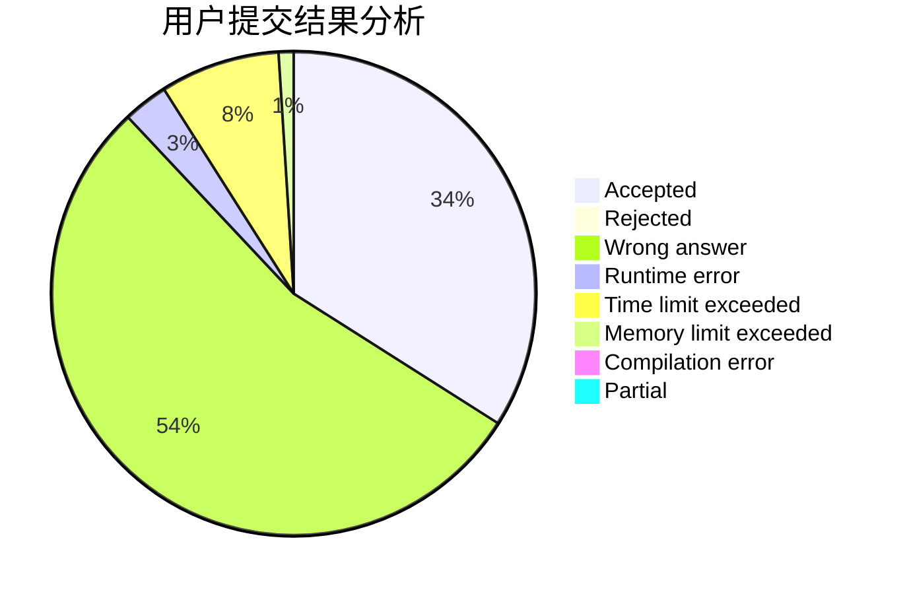
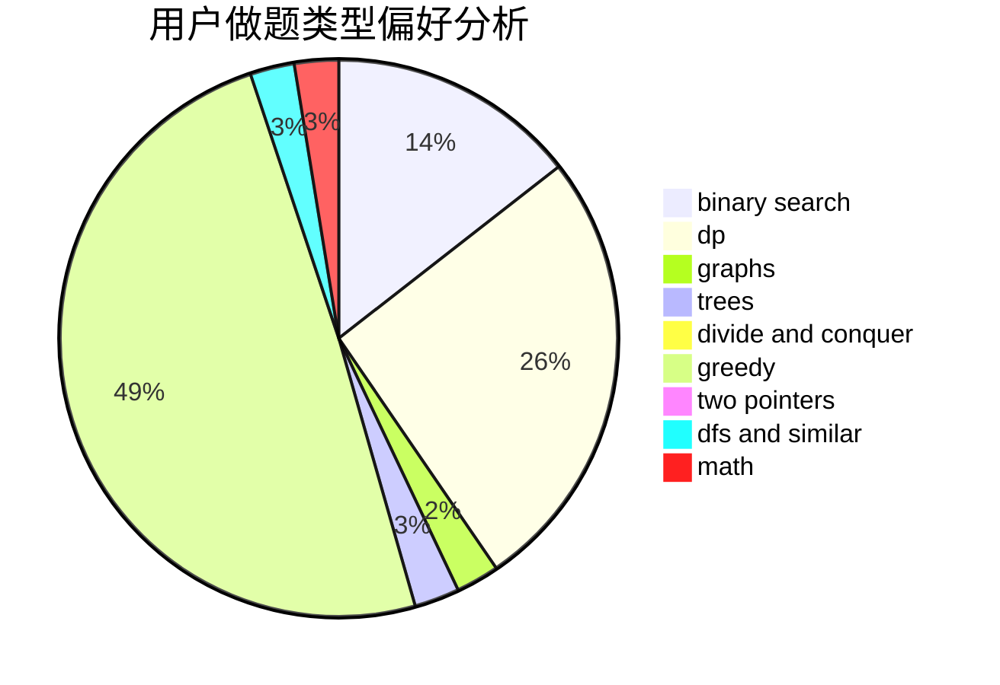

# chychy

<!-- tabs:start -->

#### **用户提交结果分析**

#### **用户做题类型偏好分析**

<!-- tabs:end -->
# 推荐题目
[1483B](https://codeforces.com/contest/1483/problem/B)
[367B](https://codeforces.com/contest/367/problem/B)
[1137B](https://codeforces.com/contest/1137/problem/B)
[1380C](https://codeforces.com/contest/1380/problem/C)
[515C](https://codeforces.com/contest/515/problem/C)
[979D](https://codeforces.com/contest/979/problem/D)
[1017G](https://codeforces.com/contest/1017/problem/G)
[1312A](https://codeforces.com/contest/1312/problem/A)
[998D](https://codeforces.com/contest/998/problem/D)
[596A](https://codeforces.com/contest/596/problem/A)
