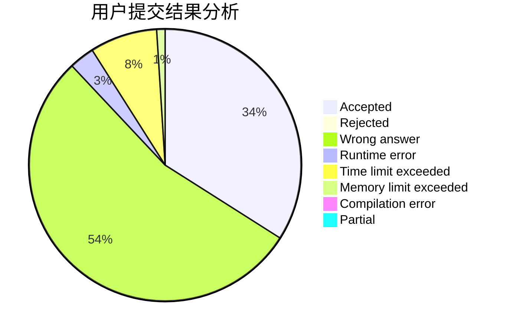
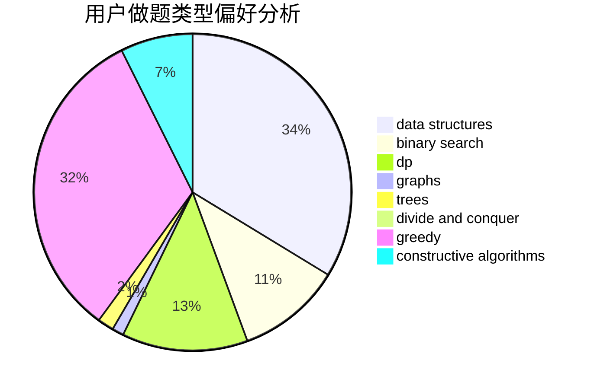
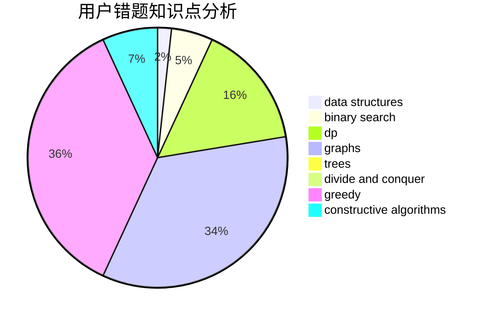

# chychy

<!-- tabs:start -->

#### **用户提交结果分析**

#### **用户做题类型偏好分析**

#### **用户错题知识点分析**

<!-- tabs:end -->
# 推荐题目
[1483B](https://codeforces.com/contest/1483/problem/B)		dsu,graphs,sortings,trees		  
[367B](https://codeforces.com/contest/367/problem/B)		binary search,
                        data structures		  
[1137B](https://codeforces.com/contest/1137/problem/B)		greedy,
                        hashing,
                        strings		  
[1380C](https://codeforces.com/contest/1380/problem/C)		brute force,
                        dp,
                        greedy,
                        implementation,
                        sortings		  
[515C](https://codeforces.com/contest/515/problem/C)		greedy,
                        math,
                        sortings		  
[979D](https://codeforces.com/contest/979/problem/D)		binary search,
                        bitmasks,
                        brute force,
                        data structures,
                        dp,
                        dsu,
                        greedy,
                        math,
                        number theory,
                        strings,
                        trees		  
[1017G](https://codeforces.com/contest/1017/problem/G)		data structures		  
[1312A](https://codeforces.com/contest/1312/problem/A)		geometry,
                        greedy,
                        math,
                        number theory		  
[998D](https://codeforces.com/contest/998/problem/D)		dsu,graphs,sortings,trees		  
[596A](https://codeforces.com/contest/596/problem/A)		geometry,
                        implementation		  
