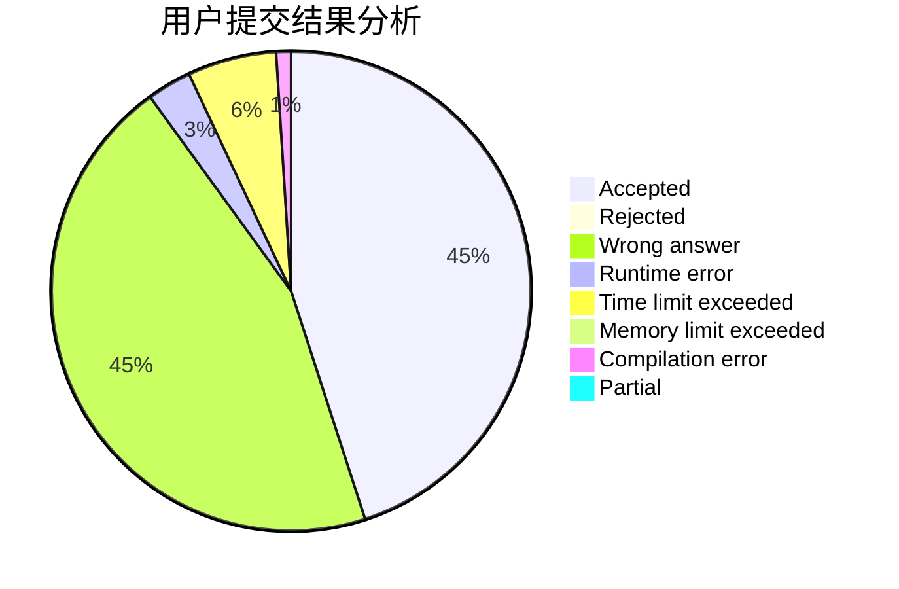
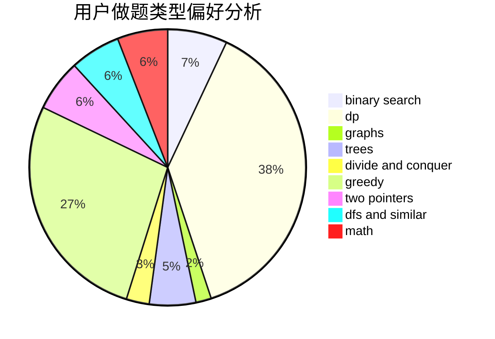

# ciwomuli

<!-- tabs:start -->

#### **用户提交结果分析**

#### **用户做题类型偏好分析**

<!-- tabs:end -->
# 推荐题目
[45G](https://codeforces.com/contest/45/problem/G)
[527C](https://codeforces.com/contest/527/problem/C)
[933B](https://codeforces.com/contest/933/problem/B)
[912E](https://codeforces.com/contest/912/problem/E)
[249E](https://codeforces.com/contest/249/problem/E)
[1107C](https://codeforces.com/contest/1107/problem/C)
[742E](https://codeforces.com/contest/742/problem/E)
[35A](https://codeforces.com/contest/35/problem/A)
[931A](https://codeforces.com/contest/931/problem/A)
[1245C](https://codeforces.com/contest/1245/problem/C)
