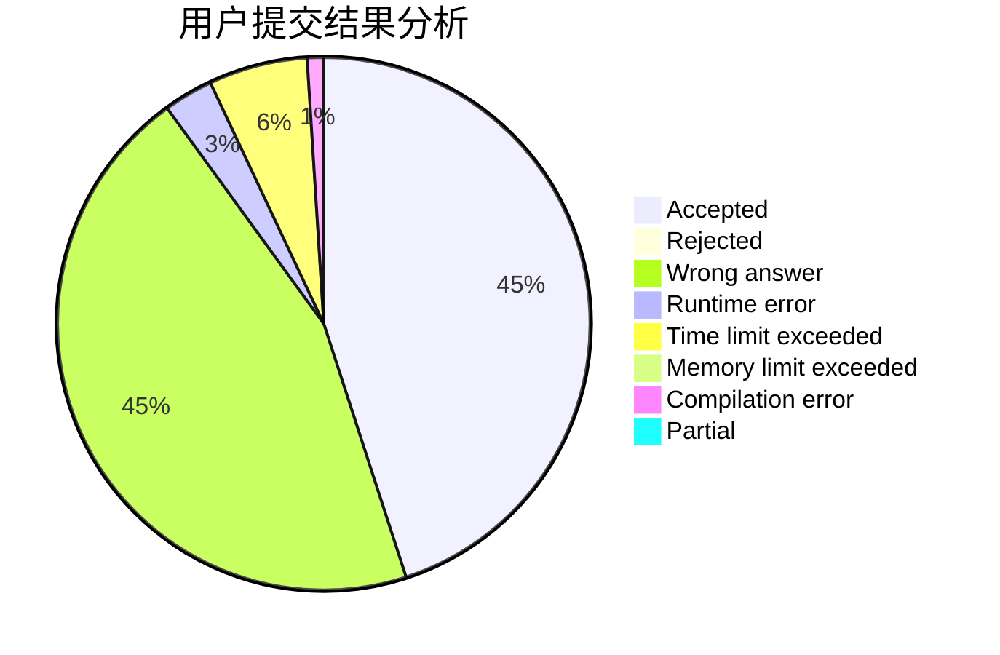
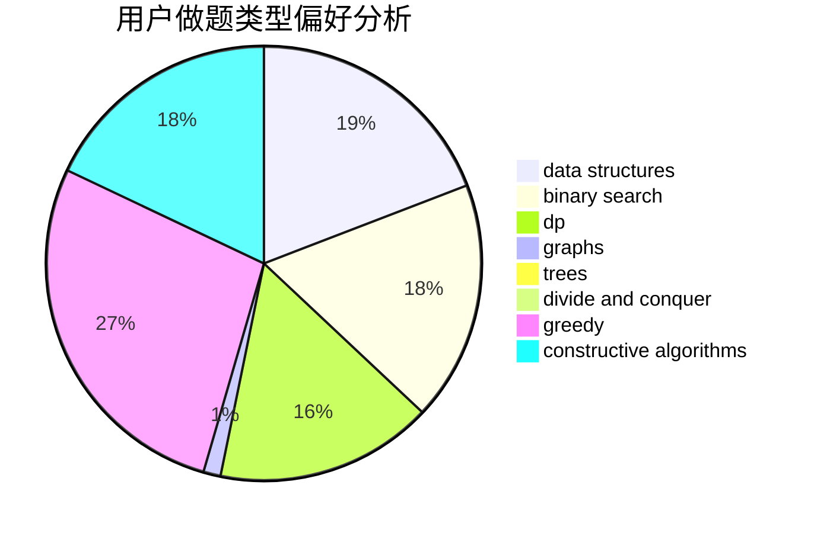
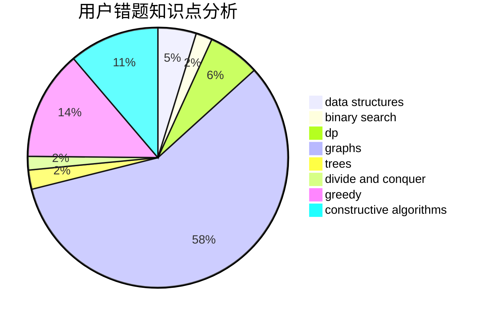

# ciwomuli

<!-- tabs:start -->

#### **用户提交结果分析**

#### **用户做题类型偏好分析**

#### **用户错题知识点分析**

<!-- tabs:end -->
# 推荐题目
[438B](https://codeforces.com/contest/438/problem/B)		dsu,graphs,sortings,trees		  
[507B](https://codeforces.com/contest/507/problem/B)		geometry,
                        math		  
[914C](https://codeforces.com/contest/914/problem/C)		brute force,
                        combinatorics,
                        dp		  
[895B](https://codeforces.com/contest/895/problem/B)		binary search,
                        math,
                        sortings,
                        two pointers		  
[229D](https://codeforces.com/contest/229/problem/D)		dp,
                        greedy,
                        two pointers		  
[1106F](https://codeforces.com/contest/1106/problem/F)		math,
                        matrices,
                        number theory		  
[725A](https://codeforces.com/contest/725/problem/A)		implementation		  
[331E1](https://codeforces.com/contest/331E/problem/1)		constructive algorithms,
                        graphs,
                        implementation		  
[912C](https://codeforces.com/contest/912/problem/C)		brute force,
                        greedy,
                        sortings		  
[123E](https://codeforces.com/contest/123/problem/E)		dfs and similar,
                        dp,
                        probabilities,
                        trees		  
