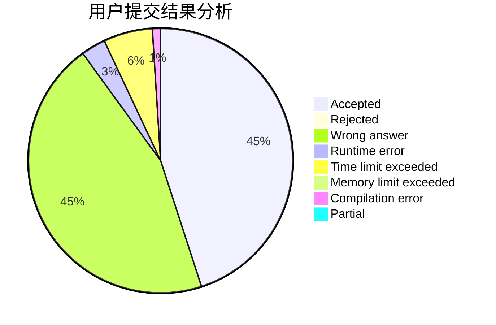
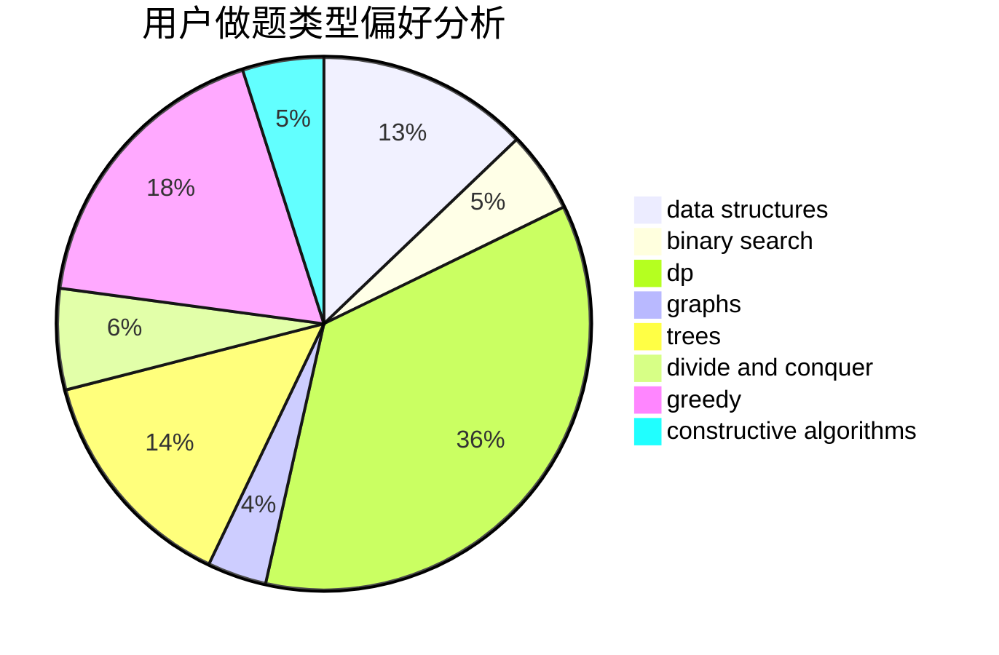
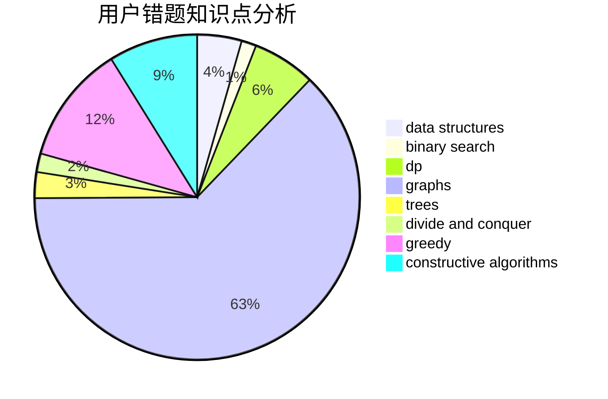

# ciwomuli

<!-- tabs:start -->

#### **用户提交结果分析**

#### **用户做题类型偏好分析**

#### **用户错题知识点分析**

<!-- tabs:end -->
# 推荐题目
[45G](https://codeforces.com/contest/45/problem/G)		number theory		  
[527C](https://codeforces.com/contest/527/problem/C)		binary search,
                        data structures,
                        implementation		  
[933B](https://codeforces.com/contest/933/problem/B)		math		  
[912E](https://codeforces.com/contest/912/problem/E)		binary search,
                        dfs and similar,
                        math,
                        meet-in-the-middle,
                        number theory,
                        two pointers		  
[249E](https://codeforces.com/contest/249/problem/E)		math		  
[1107C](https://codeforces.com/contest/1107/problem/C)		greedy,
                        sortings,
                        two pointers		  
[742E](https://codeforces.com/contest/742/problem/E)		dsu,graphs,sortings,trees		  
[35A](https://codeforces.com/contest/35/problem/A)		implementation		  
[931A](https://codeforces.com/contest/931/problem/A)		brute force,
                        greedy,
                        implementation,
                        math		  
[1245C](https://codeforces.com/contest/1245/problem/C)		dp		  
