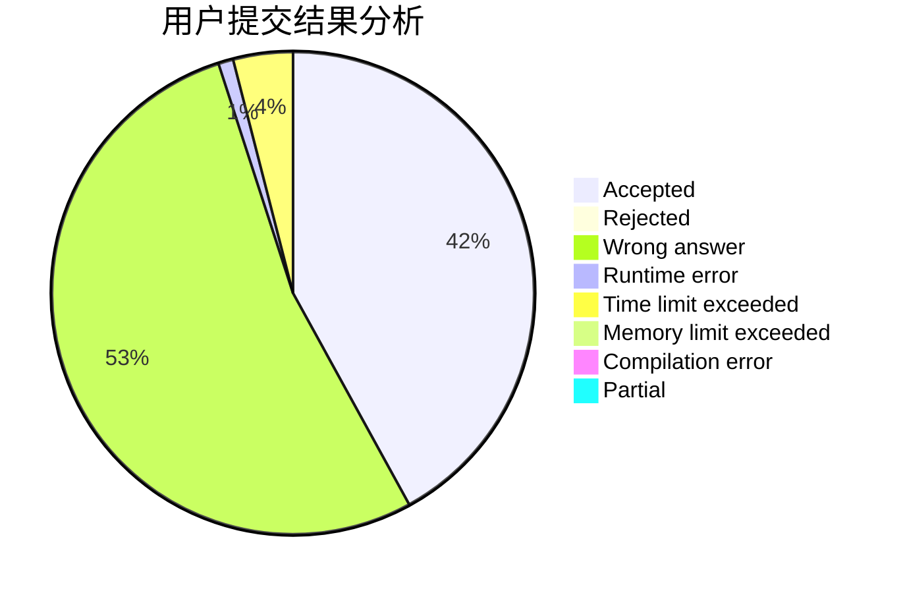
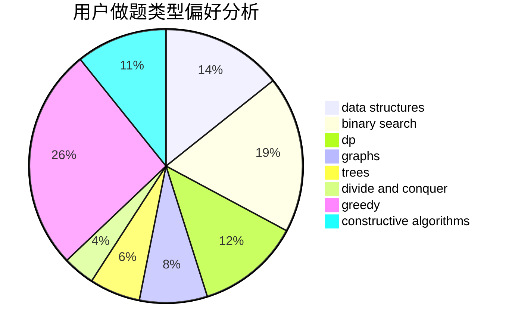

# cjc

<!-- tabs:start -->

#### **用户提交结果分析**

#### **用户做题类型偏好分析**

#### **用户错题知识点分析**

<!-- tabs:end -->
# 推荐题目
[12861](https://codeforces.com/contest/1286/problem/1)		dsu,graphs,sortings,trees		  
[547B](https://codeforces.com/contest/547/problem/B)		binary search,
                        data structures,
                        dp,
                        dsu		  
[840A](https://codeforces.com/contest/840/problem/A)		combinatorics,
                        greedy,
                        math,
                        number theory,
                        sortings		  
[1137A](https://codeforces.com/contest/1137/problem/A)		implementation,
                        sortings		  
[485A](https://codeforces.com/contest/485/problem/A)		implementation,
                        math,
                        matrices		  
[618E](https://codeforces.com/contest/618/problem/E)		data structures,
                        geometry		  
[928B](https://codeforces.com/contest/928/problem/B)		*special problem,
                        dp		  
[1070D](https://codeforces.com/contest/1070/problem/D)		greedy		  
[1268E](https://codeforces.com/contest/1268/problem/E)		dp		  
[750A](https://codeforces.com/contest/750/problem/A)		binary search,
                        brute force,
                        implementation,
                        math		  
