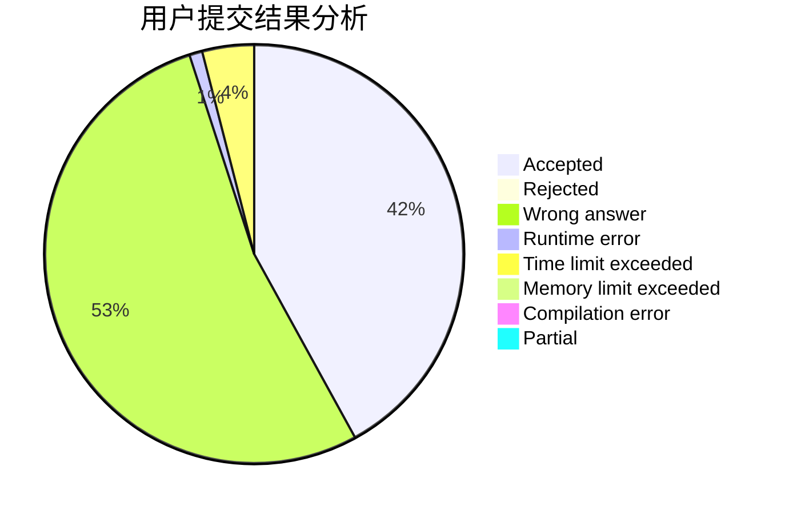
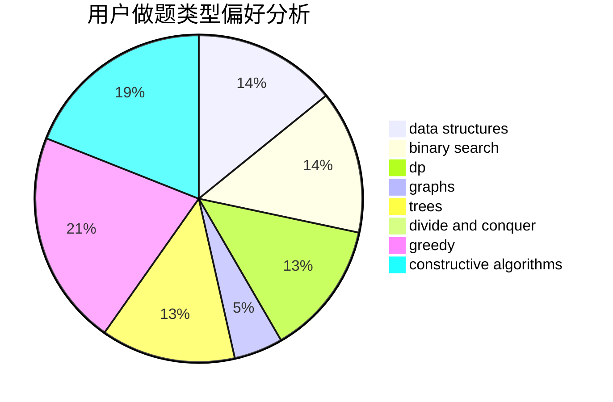

# cjc
<!-- tabs:start -->
#### **用户提交结果分析**

#### **用户做题类型偏好分析**

#### **用户错题知识点分析**

<!-- tabs:end -->
# 推荐题目
[A+B (Trial Problem)](http://codeforces.com/problemset/problem/1351/A)		implementation		  
[Cheap Travel](http://codeforces.com/problemset/problem/466/A)		implementation		  
[Pluses everywhere](https://codeforces.com/contest/521/problem/C)		combinatorics,
                        dp,
                        math,
                        number theory		  
[Gourmet choice](http://codeforces.com/problemset/problem/1131/D)		dfs and similar,
                        dp,
                        dsu,
                        graphs,
                        greedy		  
[Lookup Tables](http://codeforces.com/problemset/problem/1423/I)		bitmasks		  
[BareLee](http://codeforces.com/problemset/problem/1369/F)		dfs and similar,
                        dp,
                        games		  
[Stock Arbitraging](http://codeforces.com/problemset/problem/1150/A)		greedy,
                        implementation		  
[k-String](http://codeforces.com/problemset/problem/219/A)		implementation,
                        strings		  
[Cormen --- The Best Friend Of a Man](http://codeforces.com/problemset/problem/732/B)		dp,
                        greedy		  
[Cookie Clicker](http://codeforces.com/problemset/problem/377/E)		dp,
                        geometry		  
<!-- tabs:start -->
#### **data structures**
[A+B (Trial Problem)](http://codeforces.com/problemset/problem/1119/F)		data structures,
                        dp,
                        trees		  
[Cheap Travel](http://codeforces.com/problemset/problem/1132/G)		data structures,
                        dp,
                        trees		  
[Pluses everywhere](http://codeforces.com/problemset/problem/1403/B)		*special problem,
                        data structures,
                        dfs and similar,
                        graphs,
                        trees		  
[Gourmet choice](http://codeforces.com/problemset/problem/238/D)		data structures,
                        implementation		  
[Lookup Tables](http://codeforces.com/problemset/problem/1385/F)		data structures,
                        greedy,
                        implementation,
                        trees		  
[BareLee](http://codeforces.com/problemset/problem/671/C)		data structures,
                        number theory		  
[Stock Arbitraging](https://codeforces.com/contest/957/problem/D)		data structures,
                        dp,
                        greedy		  
[k-String](http://codeforces.com/problemset/problem/587/C)		data structures,
                        trees		  
[Cormen --- The Best Friend Of a Man](http://codeforces.com/problemset/problem/845/E)		binary search,
                        data structures		  
[Cookie Clicker](http://codeforces.com/problemset/problem/1056/E)		brute force,
                        data structures,
                        hashing,
                        strings		  
#### **binary search**
[A+B (Trial Problem)](http://codeforces.com/problemset/problem/1279/F)		binary search,
                        dp		  
[Cheap Travel](http://codeforces.com/problemset/problem/845/E)		binary search,
                        data structures		  
[Pluses everywhere](http://codeforces.com/problemset/problem/519/E)		binary search,
                        data structures,
                        dfs and similar,
                        dp,
                        trees		  
[Gourmet choice](http://codeforces.com/problemset/problem/1492/C)		binary search,
                        data structures,
                        dp,
                        greedy,
                        two pointers		  
[Lookup Tables](http://codeforces.com/problemset/problem/1463/D)		binary search,
                        constructive algorithms,
                        greedy,
                        two pointers		  
[BareLee](http://codeforces.com/problemset/problem/1490/G)		binary search,
                        data structures,
                        math		  
[Stock Arbitraging](http://codeforces.com/problemset/problem/1479/D)		binary search,
                        bitmasks,
                        brute force,
                        data structures,
                        probabilities,
                        trees		  
[k-String](http://codeforces.com/problemset/problem/1436/E)		binary search,
                        data structures,
                        two pointers		  
[Cormen --- The Best Friend Of a Man](http://codeforces.com/problemset/problem/1461/D)		binary search,
                        brute force,
                        data structures,
                        divide and conquer,
                        implementation,
                        sortings		  
[Cookie Clicker](http://codeforces.com/problemset/problem/1493/C)		binary search,
                        brute force,
                        constructive algorithms,
                        greedy,
                        strings		  
#### **dp**
[A+B (Trial Problem)](https://codeforces.com/contest/521/problem/C)		combinatorics,
                        dp,
                        math,
                        number theory		  
[Cheap Travel](http://codeforces.com/problemset/problem/1131/D)		dfs and similar,
                        dp,
                        dsu,
                        graphs,
                        greedy		  
[Pluses everywhere](http://codeforces.com/problemset/problem/1369/F)		dfs and similar,
                        dp,
                        games		  
[Gourmet choice](http://codeforces.com/problemset/problem/732/B)		dp,
                        greedy		  
[Lookup Tables](http://codeforces.com/problemset/problem/377/E)		dp,
                        geometry		  
[BareLee](http://codeforces.com/problemset/problem/1119/F)		data structures,
                        dp,
                        trees		  
[Stock Arbitraging](http://codeforces.com/problemset/problem/1132/G)		data structures,
                        dp,
                        trees		  
[k-String](http://codeforces.com/problemset/problem/106/C)		dp		  
[Cormen --- The Best Friend Of a Man](http://codeforces.com/problemset/problem/1070/A)		dp,
                        graphs,
                        number theory,
                        shortest paths		  
[Cookie Clicker](http://codeforces.com/problemset/problem/1279/F)		binary search,
                        dp		  
#### **graph**
[A+B (Trial Problem)](http://codeforces.com/problemset/problem/1131/D)		dfs and similar,
                        dp,
                        dsu,
                        graphs,
                        greedy		  
[Cheap Travel](http://codeforces.com/problemset/problem/1403/B)		*special problem,
                        data structures,
                        dfs and similar,
                        graphs,
                        trees		  
[Pluses everywhere](http://codeforces.com/problemset/problem/1176/E)		dfs and similar,
                        dsu,
                        graphs,
                        shortest paths,
                        trees		  
[Gourmet choice](http://codeforces.com/problemset/problem/1070/A)		dp,
                        graphs,
                        number theory,
                        shortest paths		  
[Lookup Tables](http://codeforces.com/problemset/problem/1038/E)		bitmasks,
                        brute force,
                        dfs and similar,
                        dp,
                        graphs		  
[BareLee](http://codeforces.com/problemset/problem/715/E)		combinatorics,
                        fft,
                        graphs,
                        math		  
[Stock Arbitraging](http://codeforces.com/problemset/problem/387/D)		graph matchings		  
[k-String](http://codeforces.com/problemset/problem/862/B)		dfs and similar,
                        graphs,
                        trees		  
[Cormen --- The Best Friend Of a Man](http://codeforces.com/problemset/problem/1487/C)		brute force,
                        constructive algorithms,
                        dfs and similar,
                        graphs,
                        greedy,
                        implementation,
                        math		  
[Cookie Clicker](http://codeforces.com/problemset/problem/1437/C)		dp,
                        flows,
                        graph matchings,
                        greedy,
                        math,
                        sortings		  
#### **trees**
[A+B (Trial Problem)](http://codeforces.com/problemset/problem/1119/F)		data structures,
                        dp,
                        trees		  
[Cheap Travel](http://codeforces.com/problemset/problem/277/E)		flows,
                        trees		  
[Pluses everywhere](http://codeforces.com/problemset/problem/1132/G)		data structures,
                        dp,
                        trees		  
[Gourmet choice](http://codeforces.com/problemset/problem/1403/B)		*special problem,
                        data structures,
                        dfs and similar,
                        graphs,
                        trees		  
[Lookup Tables](http://codeforces.com/problemset/problem/1385/F)		data structures,
                        greedy,
                        implementation,
                        trees		  
[BareLee](http://codeforces.com/problemset/problem/1176/E)		dfs and similar,
                        dsu,
                        graphs,
                        shortest paths,
                        trees		  
[Stock Arbitraging](http://codeforces.com/problemset/problem/587/C)		data structures,
                        trees		  
[k-String](http://codeforces.com/problemset/problem/1044/B)		dfs and similar,
                        interactive,
                        trees		  
[Cormen --- The Best Friend Of a Man](http://codeforces.com/problemset/problem/862/B)		dfs and similar,
                        graphs,
                        trees		  
[Cookie Clicker](http://codeforces.com/problemset/problem/519/E)		binary search,
                        data structures,
                        dfs and similar,
                        dp,
                        trees		  
#### **divide and conquer**
[A+B (Trial Problem)](http://codeforces.com/problemset/problem/117/D)		divide and conquer,
                        math		  
[Cheap Travel](http://codeforces.com/problemset/problem/1461/D)		binary search,
                        brute force,
                        data structures,
                        divide and conquer,
                        implementation,
                        sortings		  
[Pluses everywhere](http://codeforces.com/problemset/problem/1466/G)		combinatorics,
                        divide and conquer,
                        hashing,
                        math,
                        string suffix structures,
                        strings		  
[Gourmet choice](http://codeforces.com/problemset/problem/1490/D)		dfs and similar,
                        divide and conquer,
                        implementation		  
[Lookup Tables](https://codeforces.com/contest/1483/problem/C)		data structures,
                        divide and conquer,
                        dp		  
[BareLee](http://codeforces.com/problemset/problem/1491/E)		brute force,
                        dfs and similar,
                        divide and conquer,
                        number theory,
                        trees		  
[Stock Arbitraging](http://codeforces.com/problemset/problem/1303/G)		data structures,
                        divide and conquer,
                        geometry,
                        trees		  
[k-String](http://codeforces.com/problemset/problem/1494/D)		constructive algorithms,
                        data structures,
                        dfs and similar,
                        divide and conquer,
                        dsu,
                        greedy,
                        sortings,
                        trees		  
[Cormen --- The Best Friend Of a Man](http://codeforces.com/problemset/problem/1482/E)		data structures,
                        divide and conquer,
                        dp		  
[Cookie Clicker](http://codeforces.com/problemset/problem/566/C)		dfs and similar,
                        divide and conquer,
                        trees		  
#### **greedy**
[A+B (Trial Problem)](http://codeforces.com/problemset/problem/1131/D)		dfs and similar,
                        dp,
                        dsu,
                        graphs,
                        greedy		  
[Cheap Travel](http://codeforces.com/problemset/problem/1150/A)		greedy,
                        implementation		  
[Pluses everywhere](http://codeforces.com/problemset/problem/732/B)		dp,
                        greedy		  
[Gourmet choice](http://codeforces.com/problemset/problem/1385/F)		data structures,
                        greedy,
                        implementation,
                        trees		  
[Lookup Tables](http://codeforces.com/problemset/problem/833/C)		brute force,
                        combinatorics,
                        greedy,
                        math		  
[BareLee](https://codeforces.com/contest/957/problem/D)		data structures,
                        dp,
                        greedy		  
[Stock Arbitraging](http://codeforces.com/problemset/problem/733/C)		constructive algorithms,
                        dp,
                        greedy,
                        two pointers		  
[k-String](http://codeforces.com/problemset/problem/862/A)		greedy,
                        implementation		  
[Cormen --- The Best Friend Of a Man](http://codeforces.com/problemset/problem/1263/B)		greedy,
                        implementation		  
[Cookie Clicker](http://codeforces.com/problemset/problem/5/C)		constructive algorithms,
                        data structures,
                        dp,
                        greedy,
                        sortings,
                        strings		  
#### **constructive algorithms**
[A+B (Trial Problem)](http://codeforces.com/problemset/problem/1415/D)		bitmasks,
                        brute force,
                        constructive algorithms		  
[Cheap Travel](http://codeforces.com/problemset/problem/911/C)		brute force,
                        constructive algorithms		  
[Pluses everywhere](http://codeforces.com/problemset/problem/1081/F)		constructive algorithms,
                        implementation,
                        interactive		  
[Gourmet choice](http://codeforces.com/problemset/problem/733/C)		constructive algorithms,
                        dp,
                        greedy,
                        two pointers		  
[Lookup Tables](http://codeforces.com/problemset/problem/5/C)		constructive algorithms,
                        data structures,
                        dp,
                        greedy,
                        sortings,
                        strings		  
[BareLee](http://codeforces.com/problemset/problem/1227/G)		constructive algorithms		  
[Stock Arbitraging](http://codeforces.com/problemset/problem/1493/A)		constructive algorithms,
                        greedy		  
[k-String](http://codeforces.com/problemset/problem/1463/D)		binary search,
                        constructive algorithms,
                        greedy,
                        two pointers		  
[Cormen --- The Best Friend Of a Man](https://codeforces.com/contest/1456/problem/B)		bitmasks,
                        brute force,
                        constructive algorithms		  
[Cookie Clicker](http://codeforces.com/problemset/problem/1492/D)		bitmasks,
                        constructive algorithms,
                        greedy,
                        math		  
#### **sortings**
[A+B (Trial Problem)](http://codeforces.com/problemset/problem/5/C)		constructive algorithms,
                        data structures,
                        dp,
                        greedy,
                        sortings,
                        strings		  
[Cheap Travel](http://codeforces.com/problemset/problem/739/E)		brute force,
                        data structures,
                        dp,
                        flows,
                        math,
                        probabilities,
                        sortings		  
[Pluses everywhere](https://codeforces.com/contest/1496/problem/C)		geometry,
                        greedy,
                        math,
                        sortings		  
[Gourmet choice](http://codeforces.com/problemset/problem/1495/A)		geometry,
                        greedy,
                        math,
                        sortings		  
[Lookup Tables](http://codeforces.com/problemset/problem/1497/A)		brute force,
                        data structures,
                        greedy,
                        sortings		  
[BareLee](http://codeforces.com/problemset/problem/1427/A)		math,
                        sortings		  
[Stock Arbitraging](http://codeforces.com/problemset/problem/1461/D)		binary search,
                        brute force,
                        data structures,
                        divide and conquer,
                        implementation,
                        sortings		  
[k-String](http://codeforces.com/problemset/problem/1437/C)		dp,
                        flows,
                        graph matchings,
                        greedy,
                        math,
                        sortings		  
[Cormen --- The Best Friend Of a Man](http://codeforces.com/problemset/problem/1473/A)		greedy,
                        implementation,
                        math,
                        sortings		  
[Cookie Clicker](http://codeforces.com/problemset/problem/1486/B)		binary search,
                        geometry,
                        shortest paths,
                        sortings		  
<!-- tabs:end -->
