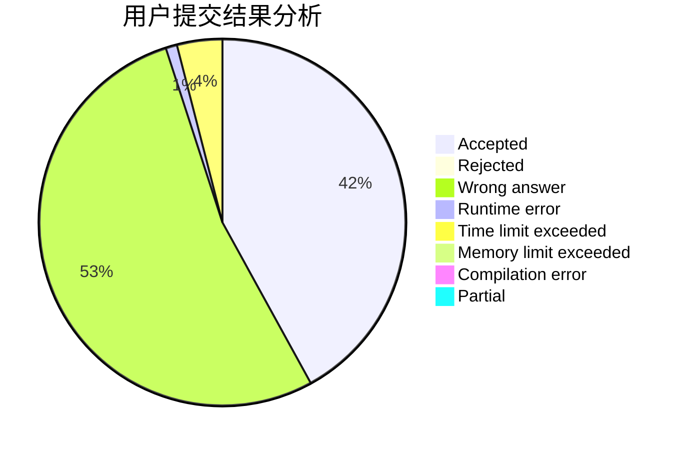
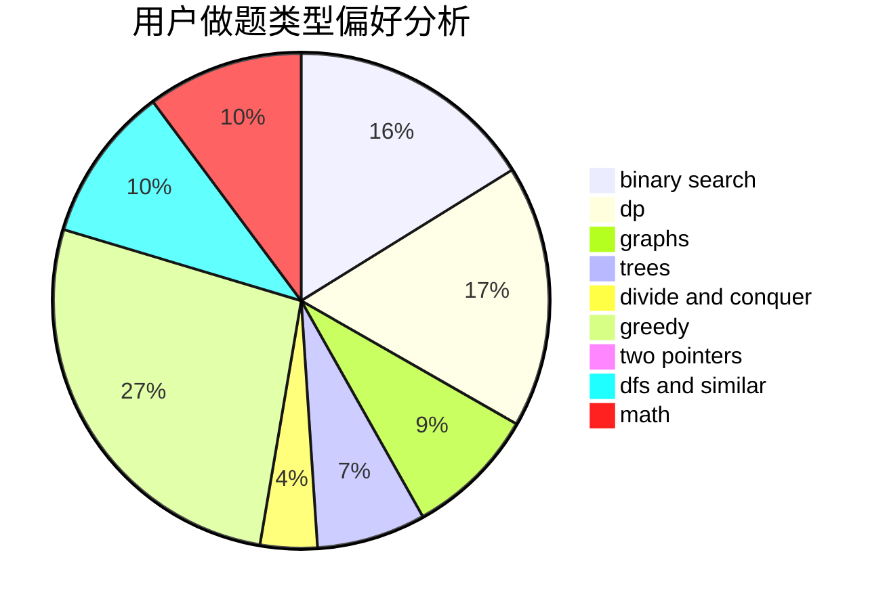

# cjc

<!-- tabs:start -->

#### **用户提交结果分析**

#### **用户做题类型偏好分析**

<!-- tabs:end -->
# 推荐题目
[12861](https://codeforces.com/contest/1286/problem/1)
[547B](https://codeforces.com/contest/547/problem/B)
[840A](https://codeforces.com/contest/840/problem/A)
[1137A](https://codeforces.com/contest/1137/problem/A)
[485A](https://codeforces.com/contest/485/problem/A)
[618E](https://codeforces.com/contest/618/problem/E)
[928B](https://codeforces.com/contest/928/problem/B)
[1070D](https://codeforces.com/contest/1070/problem/D)
[1268E](https://codeforces.com/contest/1268/problem/E)
[750A](https://codeforces.com/contest/750/problem/A)
