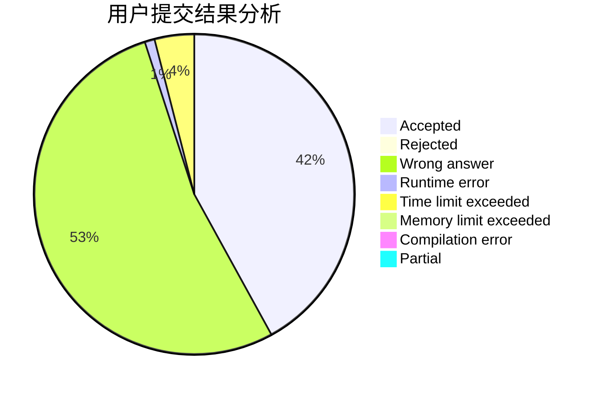
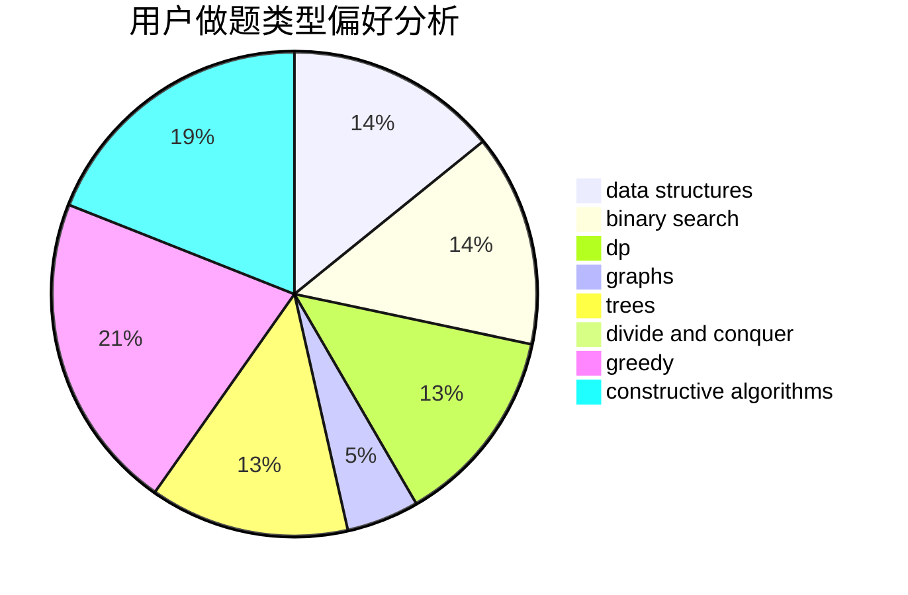

# cjc

<!-- tabs:start -->

#### **用户提交结果分析**

#### **用户做题类型偏好分析**

#### **用户错题知识点分析**

<!-- tabs:end -->
# 推荐题目
[1279F](https://codeforces.com/contest/1279/problem/F)		binary search,
                        dp		  
[521C](https://codeforces.com/contest/521/problem/C)		dsu,graphs,sortings,trees		  
[820A](https://codeforces.com/contest/820/problem/A)		implementation		  
[1132G](https://codeforces.com/contest/1132/problem/G)		data structures,
                        dp,
                        trees		  
[466A](https://codeforces.com/contest/466/problem/A)		implementation		  
[5C](https://codeforces.com/contest/5/problem/C)		constructive algorithms,
                        data structures,
                        dp,
                        greedy,
                        sortings,
                        strings		  
[911C](https://codeforces.com/contest/911/problem/C)		brute force,
                        constructive algorithms		  
[1070A](https://codeforces.com/contest/1070/problem/A)		dp,
                        graphs,
                        number theory,
                        shortest paths		  
[1263B](https://codeforces.com/contest/1263/problem/B)		greedy,
                        implementation		  
[732B](https://codeforces.com/contest/732/problem/B)		dp,
                        greedy		  
