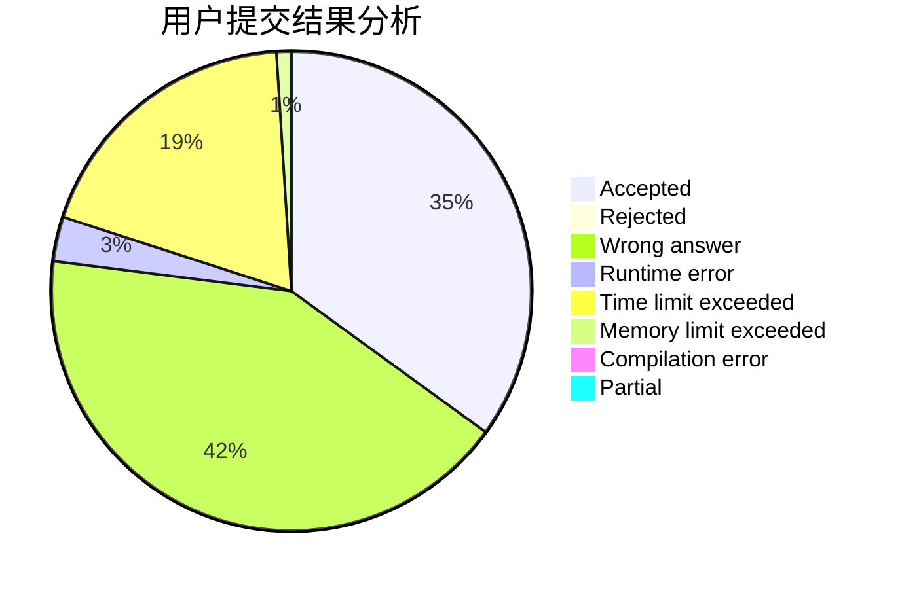
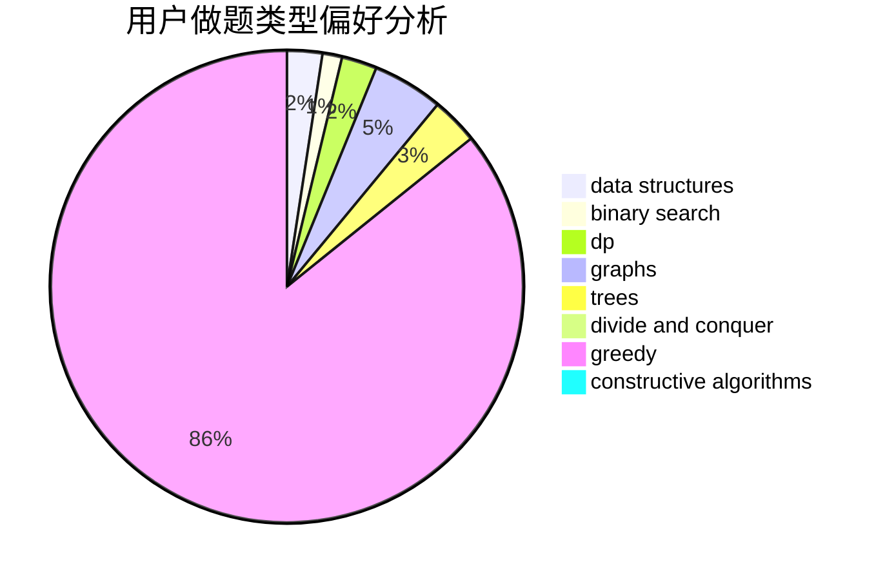
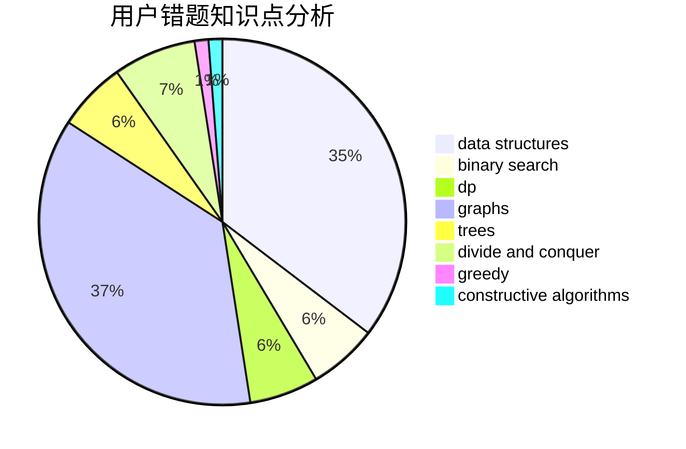

# cjj490168650

<!-- tabs:start -->

#### **用户提交结果分析**

#### **用户做题类型偏好分析**

#### **用户错题知识点分析**

<!-- tabs:end -->
# 推荐题目
[1388A](https://codeforces.com/contest/1388/problem/A)		brute force,
                        greedy,
                        math,
                        number theory		  
[1381E](https://codeforces.com/contest/1381/problem/E)		geometry,
                        math,
                        sortings		  
[482D](https://codeforces.com/contest/482/problem/D)		combinatorics,
                        dp,
                        trees		  
[571C](https://codeforces.com/contest/571/problem/C)		constructive algorithms,
                        dfs and similar,
                        graphs,
                        greedy		  
[1248D2](https://codeforces.com/contest/1248D/problem/2)		dsu,graphs,sortings,trees		  
[1167D](https://codeforces.com/contest/1167/problem/D)		constructive algorithms,
                        greedy		  
[50D](https://codeforces.com/contest/50/problem/D)		binary search,
                        dp,
                        probabilities		  
[118A](https://codeforces.com/contest/118/problem/A)		implementation,
                        strings		  
[947B](https://codeforces.com/contest/947/problem/B)		dsu,graphs,sortings,trees		  
[671E](https://codeforces.com/contest/671/problem/E)		data structures,
                        greedy		  
