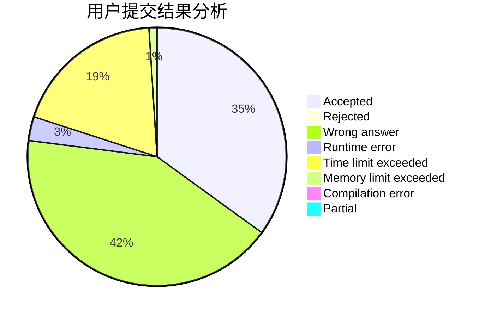
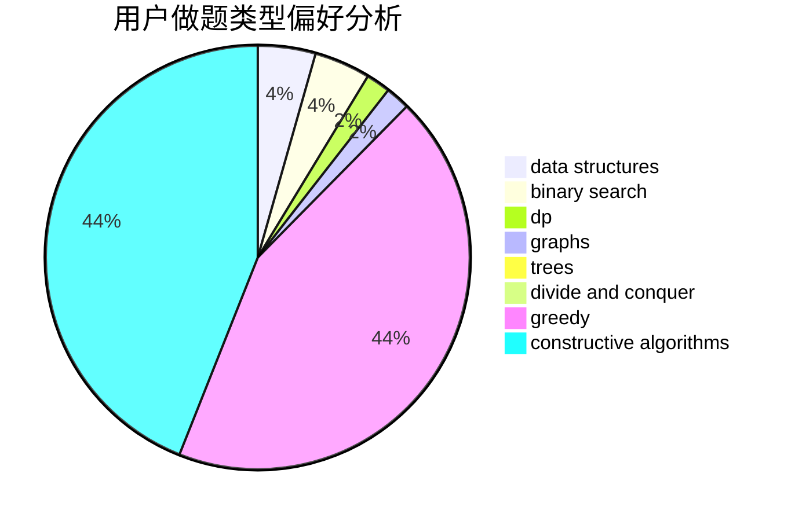
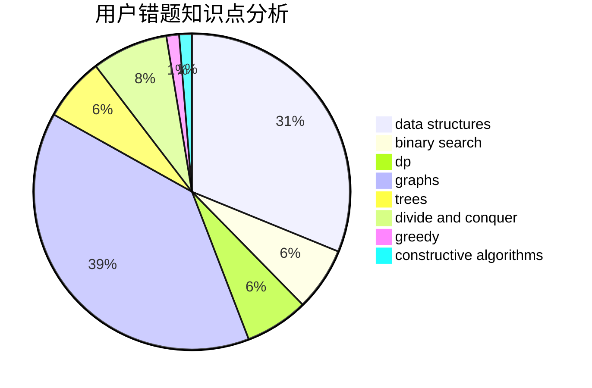

# cjj490168650

<!-- tabs:start -->

#### **用户提交结果分析**

#### **用户做题类型偏好分析**

#### **用户错题知识点分析**

<!-- tabs:end -->
# 推荐题目
[1397D](https://codeforces.com/contest/1397/problem/D)		dsu,graphs,sortings,trees		  
[1392B](https://codeforces.com/contest/1392/problem/B)		implementation,
                        math		  
[501C](https://codeforces.com/contest/501/problem/C)		constructive algorithms,
                        data structures,
                        greedy,
                        sortings,
                        trees		  
[591D](https://codeforces.com/contest/591/problem/D)		dsu,graphs,sortings,trees		  
[1252F](https://codeforces.com/contest/1252/problem/F)		hashing,
                        trees		  
[1172A](https://codeforces.com/contest/1172/problem/A)		greedy,
                        implementation		  
[533B](https://codeforces.com/contest/533/problem/B)		dfs and similar,
                        dp,
                        graphs,
                        strings,
                        trees		  
[1195A](https://codeforces.com/contest/1195/problem/A)		greedy,
                        math		  
[964A](https://codeforces.com/contest/964/problem/A)		math		  
[698A](https://codeforces.com/contest/698/problem/A)		dp		  
